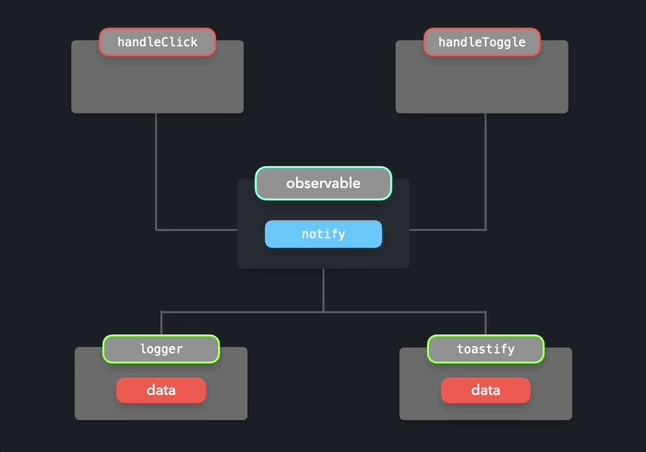

# 옵저버 패턴

옵저버 패턴은 대표적인 디자인 패턴 중 하나로, tanstack query 등 여러 상태 라이브러리의 구현에서 쉽게 찾아볼 수 있습니다.

이 패턴은 간단히 “이벤트가 발생하면 구독자들에게 알림을 보내는 형태의 코드 작성 방식”이라고 이해할 수 있는데요.

`구독하기`, `이벤트 감지하기`, `알림 보내기`와 같은 액션이 어떻게 이루어지는 것인지 코드를 통해 이해해보려 합니다.

# 구독하는 주체와 구독 가능한 객체

먼저 옵저버 패턴의 개념에 대해 살펴보겠습니다.

패턴의 이름에서 알 수 있듯이 옵저버 패턴은 **관찰한다**는 개념을 가진 패턴이기 때문에, **관찰을 하는 것**과 **관찰을 당하는 것** 이렇게 두 가지 개념이 등장합니다.

이때 관찰을 하는 것은 구독을 하는 것을 의미하고, 이를 **구독하는 주체(Observer)** 라고 합니다.

반대로 관찰을 당하는 것은 구독이 가능한 것을 의미하고, 이를 **구독 가능한 객체(Observable)** 라고 합니다.

유튜브에 비유하자면 채널이 Observable, 구독자가 Observer라고 볼 수 있겠네요.

## 구독 가능한 객체의 주요 개념

만약 제가 유튜브 채널주라 했을 때, (비)구독자에게 어떤 기능을 제공해야할 지 생각해봤더니 다음 기능들을 떠올릴 수 있었어요.

- 나를 구독할 수 있는 기능
- 나를 구독 취소할 수 있는 기능
- 구독자 목록
- 구독자에게 알림을 보내는 기능

단순 유튜브에 빗대어 떠올린 이 기능들이 옵저버 패턴에서 구독 가능한 객체가 갖는 주요 개념과 일맥상통합니다.

즉, 구독 가능한 객체는 다음과 같은 주요 개념을 가집니다.

- `observers`: 이벤트가 발생할 때마다 전파할 구독자(observer)들의 배열
- `subscribe()`: 구독자(observer)를 observers 배열에 추가하는 것
- `unsubscribe()`: 구독자(observer)를 observers 배열에서 제거하는 것
- `notify()`: 등록된 구독자(observer)들에게 이벤트를 전파하는 것

위 개념을 코드로 옮기면 이렇습니다.

```tsx
class Observable {
  constructor() {
    this.observers = [];
  }

  subscribe(func) {
    this.observers.push(func);
  }

  unsubscribe(func) {
    this.observers = this.observers.filter((observer) => observer !== func);
  }

  notify(data) {
    this.observers.forEach((observer) => observer(data));
  }
}
```

\*위 코드에서 구독자(observer)는 **이벤트가 발생했을 때 호출할 함수**를 의미합니다.

# 코드로 이해하기

클릭이나 토글 이벤트가 발생했을 때, 타임스탬프를 로깅하고 토스트알림을 띄우려는 상황을 구현하려 합니다.

```tsx
export default function App() {
  return (
    <div className="App">
      <Button>Click me!</Button>
      <FormControlLabel control={<Switch />} />
    </div>
  );
}
```

구현해야하는 것은 클릭 또는 토글 이벤트의 발생을 관찰하고 로깅 함수와 토스트 알림 함수에 알림을 보내는 것입니다.



이 상황에 대한 구독 가능한 객체와 구독하는 주체가 무엇인지 정리하면 다음과 같습니다.

- `구독 가능한 객체(observable)`: 클릭(토글)이벤트를 감지하면 구독자들에게 알리기
- `구독하는 주체(observer)`: 알림 받기를 기다리기

즉, 구독하는 주체는 이벤트 발생 알림을 필요로 하는 `logger`와 `toastify`가 되겠네요!

따라서 `logger`와 `toastify`는 나에게 이벤트를 보내줄 객체를 구독해야 합니다. 즉, `subscribe()` 함수 호출이 필요합니다.

```tsx
function logger(data) {
  console.log(`${Date.now()} ${data}`);
}

function toastify(data) {
  toast(data);
}

observable.subscribe(logger); // 구독자 목록에 logger가 추가된다 == logger는 옵저버블을 구독한다
observable.subscribe(toastify); // 구독자 목록에 toastify가 추가된다 == toastify는 옵저버블을 구독한다
```

그리고 클릭(토글) 이벤트 핸들러는 알림을 보내는 액션을 수행해야 합니다. 즉, `notify()` 함수를 호출하면 됩니다.

```tsx
export default function App() {
  function handleClick() {
    observable.notify('User clicked button!'); // 구독자들에게 클릭 이벤트가 발생했다고 알리기
  }

  function handleToggle() {
    observable.notify('User toggled switch!'); // 구독자들에게 토글 이벤트가 발생했다고 알리기
  }

  return (
    <div className="App">
      <Button>Click me!</Button>
      <FormControlLabel control={<Switch />} />
      <ToastContainer />
    </div>
  );
}
```

# 결론

결론적으로 `구독하기`, `이벤트 감지하기`, `알림 보내기`와 같은 액션은 적절한 때에 함수 호출을 통해 수행된다는 것을 알 수 있습니다.

- 구독하기
  - 의미: 이벤트 발생 시 실행할 함수 등록하기
  - 코드: `observable.subscribe(call_when_event_trigger);`
- 이벤트 감지하기 & 알림 보내기
  - 의미: 해당 이벤트 핸들러(=이벤트 감지)에서, 이벤트 발생 시 실행할 함수 호출(=알림 보내기)하기
  - 코드: `observable.notify();`
    - notify의 세부 구현은 이벤트 발생 시 실행할 함수를 호출하는 것

“이벤트가 발생하면 구독자들에게 알림을 보낸다”라는 말이 마법처럼 느껴졌는데, 역시 마법이 아니었습니다. 개념이 생각보다 단순해서 이번에 공부한걸로 앞으로 옵저버 패턴을 기반으로 구현된 무언가를 이해하는 데에 많은 도움이 될 것이라 생각됩니다.

이해하는 데에 도움이 됐다면 좋겠습니다!

# 참고

[https://www.patterns.dev/vanilla/observer-pattern](https://www.patterns.dev/vanilla/observer-pattern)
