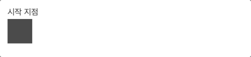
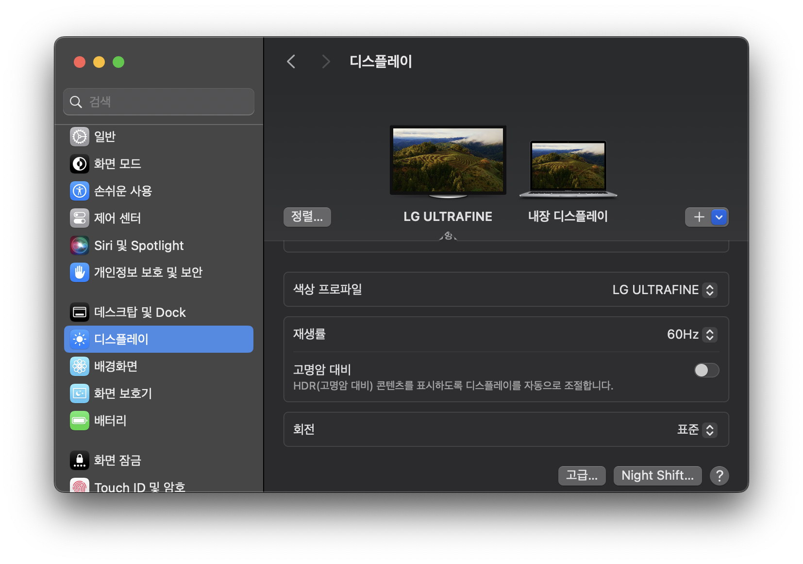
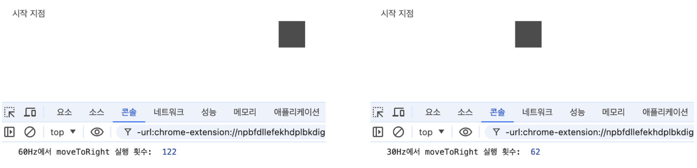
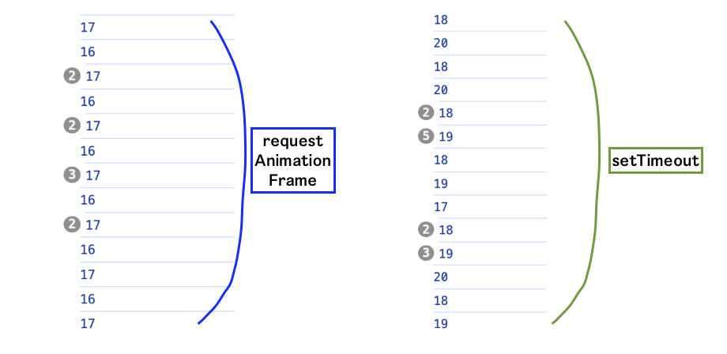

# requestAnimationFrame

`requestAnimationFrame`은 `window` 객체의 메서드로, 다음 **Repaint** 전에 브라우저가 특정 함수를 호출하도록 요청하는 메서드입니다.

이때 “특정 함수”는 주로 애니메이션을 위한 로직을 담고 있는 콜백 함수이며, 이 콜백 함수를 실행함으로써 그려진 찰나의 화면이 바로 메서드 이름에 있는 Animation Frame(프레임)이 됩니다.

## 간단한 예시

다음은 **사각형을 오른쪽으로 이동시키는 애니메이션**을 실행하는 예시 코드입니다.

```html
<body>
  <div>시작 지점</div>
  <div class="box" style="width: 36px; height: 36px; background-color: black"></div>
  <script>
    const box = document.querySelector('.box');

    let xPos = 0;
    const moveToRight = () => {
      // 애니메이션 로직
      box.style.transform = `translateX(${xPos}px)`;
      xPos += 3;

      // 다음 프레임 요청
      requestAnimationFrame(moveToRight);
    };

    // 첫 번째 프레임 요청
    moveToRight();
  </script>
</body>
```



\*gif가 아닌 실제 웹에서는 매우 부드럽게 이동합니다!

처음으로 `moveToRight` 함수를 호출하면 애니메이션 로직이 실행되어 첫 프레임이 그려지고, 함수 내부에서 다시 `requestAnimationFrame`을 호출하여 다음 프레임을 요청합니다. 즉, 이 프레임들이 연속적으로 보여짐으로써 애니메이션처럼 느껴지게 됩니다.

이때 애니메이션을 중지하려면 `requestAnimationFrame`이 리턴하는 `id` 값을 `cancelAnimationFrame` 함수에게 인수로 주어 호출하면 됩니다.

```jsx
let xPos = 0;
let rafId;
const moveToRight = () => {
	box.style.transform = `translateX(${xPos}px)`;
	xPos += 3;

	if(애니메이션 종료 조건) {
		cancelAnimationFrame(rafId); // 애니메이션 종료
		return;
	}

	rafId = requestAnimationFrame(moveToRight);
};
```

`cancelAnimationFrame`을 호출하면 다음 실행할 함수의 등록을 해제함으로써 애니메이션이 중지됩니다.

## 콜백 함수가 실행되는 주기

`requestAnimationFrame`으로 예약한 콜백은 **1초에 60회** 호출(60FPS)을 목표로 합니다. 그러나 이는 고정 값이 아니며 일반적으로 대부분의 웹 브라우저에서는 W3C 권장사항에 따라 **디스플레이 주사율과 일치됩니다.**

### 디스플레이 주사율이란?

주사율이란 **모니터가 1초동안 화면을 그리는 횟수**를 의미합니다.

지금 제가 사용하는 디스플레이는 60Hz기 때문에, 초당 약 60번 화면이 그려집니다.



참고로 1초에 60회라는 숫자가 일반적으로 “애니메이션이 부드럽다”고 느껴지는 횟수라고 합니다.

### 디스플레이의 주사율을 따라가는 이유

예를 들어 60FPS에 60Hz라면, 60개의 프레임을 모두 보여줄 수 있어 리소스가 낭비되지 않기 때문입니다.

만약 FPS가 주사율보다 높다면 디스플레이가 표시할 수 있는 범위를 벗어나는 프레임은 낭비될 것이고, 주사율이 FPS보다 높다면 디스플레이의 성능 이점을 누릴 수 없게 되겠죠.

### 결론: 16.6ms마다 실행하는 것을 목표로 한다

(\*단, 60Hz 디스플레이인 경우)

결론적으로 콜백 함수가 한 번 실행되는 것이 하나의 프레임을 만들기 때문에, 60Hz의 디스플레이라면 1초에 60개의 프레임을 만들기 위해서 1000ms/60fps=**16.6ms** 간격으로 함수를 호출해야 합니다.

따라서 `requestAnimationFrame`으로 예약한 콜백은 16.6ms마다 실행됩니다.

### 가변주사율로 인한 주의할 점

`requestAnimationFrame`은 디스플레이의 주사율을 따라가기 때문에, **같은 코드더라도 디스플레이에 따라 콜백 함수의 실행 횟수가 달라질 수 있습니다.**

다음과 같이 `moveToRight` 함수를 2초동안만 실행되도록 코드를 변경하고, 30Hz와 60Hz 디스플레이에서 실행했습니다.

```jsx
const moveToRight = () => {
  count++;
  box.style.transform = `translateX(${xPos}px)`;
  xPos += 3;

  if (Date.now() - startTime > 2000) {
    // 2초가 지나면 애니메이션 멈추기
    console.log('60Hz에서 moveToRight 실행 횟수: ', count);
    cancelAnimationFrame(id);
    return;
  }

  id = requestAnimationFrame(moveToRight);
};

startTime = Date.now();
moveToRight();
```



60Hz 모니터에서는 2초동안 122회 실행되어 더 많은 거리(122*3px)를 이동했지만, 30Hz 모니터에서는 62회 실행되어 더 적은 거리(62*3px)를 이동한다는 차이가 발생합니다.

따라서 애니메이션 코드를 작성할 때 사용자 환경에 따라 애니메이션이 다르게 실행되지 않도록 주의해야 합니다. (참고: [MDN 문서 예시](https://developer.mozilla.org/ko/docs/Web/API/Window/requestAnimationFrame#예시))

# requestAnimationFrame이 등장한 이유

16.6ms 간격으로 애니메이션을 호출하는 것이 `requestAnimationFrame`의 역할이라면, `setTimeout`이나 `setInterval` 같은 타이머 함수로도 충분히 구현되는 것 아닐까요?

## 타이머 함수의 문제점

```jsx
console.log('시작');

setTimeout(() => {
  console.log('0초 지났음'); // 정확히 0초 뒤에 실행되는 것을 보장하지 않음
}, 0);

console.log('끝');
```

익히 알고 있듯이 자바스크립트는 싱글 스레드로 동작하기 때문에, `setTimeout`으로 설정한 시간이 지났다고 해서 콜백 함수가 반드시 실행되지 않습니다.

즉, 현재 실행 중인 실행 컨텍스트의 코드가 모두 실행되기 전까지 타이머 함수의 콜백 함수의 실행은 계속 미뤄집니다(만약 `setTimeout` 호출 전후로 매우 오래 걸리는 연산의 코드가 있다면 실행은 더욱 더 미뤄지겠지요🤔).

결론적으로 타이머 함수를 사용한다면 16.6ms 마다 실행됨을 보장할 수 없기 때문에 프레임을 놓쳐 버벅거림이 발생할 수 있습니다.

또한, 16.6ms라는 숫자는 개발자가 직접 지정한 숫자가 아닙니다. 만약 `setTimeout`을 사용한다면 직접 시간을 지정해줘야 할 텐데, 자연스러운 애니메이션을 위해서는 현재 기기의 주사율을 알아내야 합니다.

## 위 문제점을 해결할 메서드

반면 `requestAnimationFrame`은 프레임 단위로 **프레임 시작 시간에 맞춰 실행되는 것을 보장**합니다. 즉, 콜 스택에 있는 코드의 실행이 끝나기를 기다리지 않고 정해진 시간(ex. 16.6ms)이 지나면 바로 실행합니다. (물론 실행 환경에 의해 오차가 발생할 수 있어 **항상 정확한 간격으로 실행되진 않습니다.** 목표로 할 뿐!)

다음은 `requestAnimationFrame`과 `setTimeout`으로 콜백 함수가 실행되는 시간 차를 출력한 것입니다.



### Animation Frames

`requestAnimationFrame`으로 예약한 콜백 함수는 **Repaint**가 시작되기 직전에 호출되어야 하므로 해당 시점에는 다른 비동기 함수들보다 높은 우선순위를 가져야 합니다. 따라서 기존 비동기 함수가 쌓이는 태스크/마이크로태스크 큐와는 다른 공간인 **Animation Frames**에 푸시됩니다.

# 정리

- 디스플레이의 주사율에 맞춰 실행됨
- Repaint 전에 콜백 함수를 실행하도록 함
- 타이머 함수를 사용했을 때와 다르게 프레임 누락이 발생하지 않음
- 주기적으로 실행되기 때문에 애니메이션 같은 화면 업데이트를 다루기에 적합

이 정도로 요약할 수 있겠습니다. `requestAnimationFrame`에 대해 알아보고자 하는 분들께 도움이 되었으면 좋겠습니다.

# 참고

[https://developer.mozilla.org/ko/docs/Web/API/Window/requestAnimationFrame](https://developer.mozilla.org/ko/docs/Web/API/Window/requestAnimationFrame)

[https://inpa.tistory.com/entry/🌐-requestAnimationFrame-가이드](https://inpa.tistory.com/entry/%F0%9F%8C%90-requestAnimationFrame-%EA%B0%80%EC%9D%B4%EB%93%9C)
