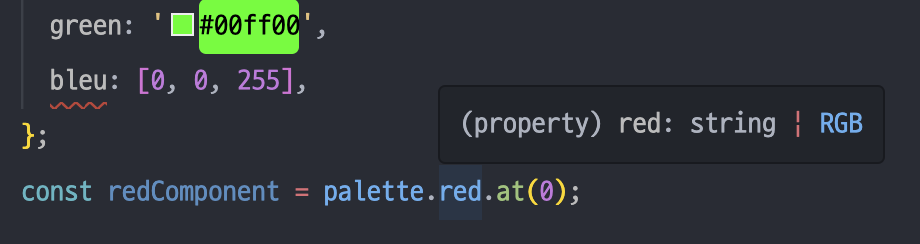
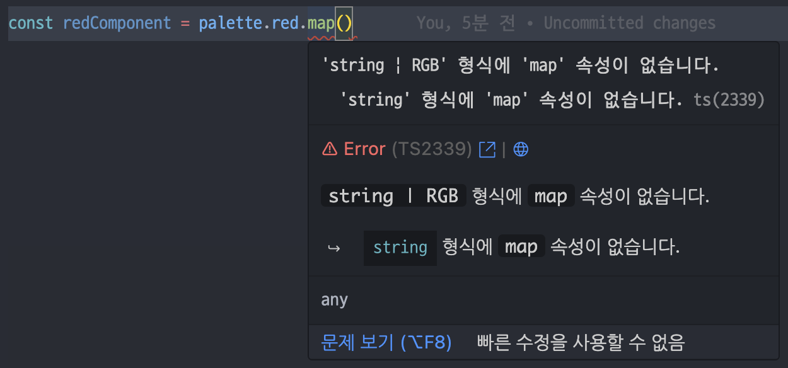
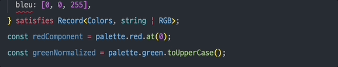
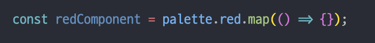
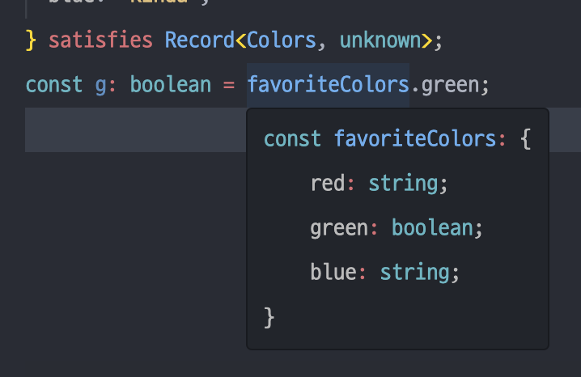

# 타입스크립트로 Story를 작성하는 두 가지 방법

Storybook 공식 문서의 [Writing stories in Typescript](https://storybook.js.org/docs/writing-stories/typescript) 문서를 살펴보면 타입스크립트로 Story를 작성하는 예시 코드를 확인할 수 있는데요.

**타입스크립트의 버전**에 따라 두 가지의 예시 코드를 제시하고 있습니다.

- Typescript

  ```tsx
  // Replace your-renderer with the renderer you are using (e.g., react, vue3, etc.)
  import type { Meta, StoryObj } from '@storybook/your-renderer';

  import { Button } from './Button';

  const meta: Meta<typeof Button> = {
    component: Button,
  };
  export default meta;

  type Story = StoryObj<typeof Button>;

  export const Basic: Story = {};

  export const Primary: Story = {
    args: {
      primary: true,
    },
  };
  ```

- Typescript 4.9

  ```tsx
  // Replace your-renderer with the renderer you are using (e.g., react, vue3, etc.)
  import type { Meta, StoryObj } from '@storybook/your-renderer';

  import { Button } from './Button';

  const meta = {
    component: Button,
  } satisfies Meta<typeof Button>;
  export default meta;

  type Story = StoryObj<typeof meta>;

  export const Basic = {} satisfies Story;

  export const Primary = {
    args: {
      primary: true,
    },
  } satisfies Story;
  ```

두 코드의 차이점은 **타입의 위치**에 있는데요.

4.9 버전 아래의 타입스크립트에서는 변수에 `타입 선언`을 붙여서 그 값이 선언된 타입임을 명시하고 있고, 4.9 버전 이상의 타입스크립트에서는 `satisfies` 키워드를 사용해 타입을 명시하고 있습니다.

```tsx
// 변수에 타입 선언 붙이기 (타입스크립트 4.9 아래)
const meta : Meta<typeof Button> = { ... }

// satisfies 키워드 사용 (타입스크립트 4.9 이상)
const meta = { ... } satisfies Meta<typeof Button>
```

그럼 두 방법의 차이는 무엇이고, 어떤 방식을 사용하면 좋을까요?

# satisfies 키워드

먼저 `satisfies` 키워드가 무엇인지 알아보겠습니다.

## 도입 배경

공식 문서에서 `satisfies` 키워드 도입 이전 개발자들이 겪었던 딜레마를 소개하고 있습니다.

> TypeScript developers are often faced with a dilemma: we want to ensure that some expression *matches* some type, but also want to keep the *most specific* type of that expression for inference purposes.
> TypeScript 개발자들은 종종 딜레마에 직면합니다: 우리는 일부 표현식이 어떤 유형과 일치하는지 확인하고 싶지만, 추론 목적으로 그 표현의 가장 구체적인 유형을 유지하고 싶습니다.

글만 보고서는 와닿지 않으니 공식 문서에서 소개하는 예제와 함께 `satisfies`가 도입된 배경을 이해해 보겠습니다.

### 색깔을 key로 가지고, 색깔 값을 value로 갖는 객체를 만들자

색깔명과 색깔 값의 쌍을 속성으로 갖는 `palette` 객체를 만들었습니다.

```tsx
const palette = {
  red: [255, 0, 0],
  green: '#00ff00',
  bleu: [0, 0, 255],
};

const redComponent = palette.red.at(0);
const greenNormalized = palette.green.toUpperCase();
```

그런데 위 코드의 `bleu` 처럼 “blue”를 쓰려고 했는데 오타가 발생한 상황이 생겼어요. 지금은 색깔이 적지만 추후 색깔이 많아질 것을 대비해 색깔명을 타입으로 관리하려 합니다.

그래서 다음과 같이 리팩토링을 진행했어요.

```tsx
type Colors = 'red' | 'green' | 'blue';
type RGB = [red: number, green: number, blue: number];

const palette: Record<Colors, string | RGB> = {
  red: [255, 0, 0],
  green: '#00ff00',
  bleu: [0, 0, 255],
  //~~~~ 개체 리터럴은 알려진 속성만 지정할 수 있으며 'Record<Colors, string | RGB>' 형식에 'bleu'이(가) 없습니다.
};

const redComponent = palette.red.at(0);
```

이제 `Colors`에 해당하는 색깔만 `palette`의 key로 올 수 있습니다. 그래서 `bleu`라는 오타를 잡을 수 있게 되었어요.

그런데 찝찝한 상황이 발생했어요. 내가 알고 있는 `red`는 확실히 `RGB`라는 **튜플** 타입인데, 타입 선언을 붙임으로써 `red`는 `string`이거나 `RGB`일 것이라고 추론되기 시작합니다.



그래서 `map` 같은 배열 메서드를 사용하려 하면 에러가 발생합니다.



이러한 상황이 공식 문서에서 말하고 있는 딜레마인 것입니다. `palette` 객체의 key가 `Colors` 타입을 만족하는지 확인도 하고 싶고, `red`는 (string 또는 RGB가 아닌) `RGB`라는 구체적인 타입을 유지하고 싶어요.

## satisfies 키워드를 적용해 보자

위 딜레마를 해소해 줄 수 있는 키워드가 4.9 버전에서 도입된 `satisfies` 키워드입니다.

`satisfies`를 사용하면 표현식의 결과 타입을 변경하지 않고도 어떤 타입과 일치하는지 확인할 수 있습니다.

```tsx
type Colors = 'red' | 'green' | 'blue';
type RGB = [red: number, green: number, blue: number];

const palette = {
  red: [255, 0, 0],
  green: '#00ff00',
  bleu: [0, 0, 255],
  //~~~~ 개체 리터럴은 알려진 속성만 지정할 수 있으며 'Record<Colors, string | RGB>' 형식에 'bleu'이(가) 없습니다.
} satisfies Record<Colors, string | RGB>;

const redComponent = palette.red.at(0);
const greenNormalized = palette.green.toUpperCase();
```

아까는 `string` 또는 `RGB`로 추론되었던 `red`가 튜플 타입의 `RGB`로 정확히 추론되네요.



또한 `map` 메서드를 호출해도 더 이상 에러가 발생하지 않습니다.



이렇게 `satisfies`를 사용하면 발생 가능성이 있는 많은 에러들을 잡아낼 수 있습니다.

1. Colors 이외의 색깔이 들어오지 않았는지

   ```tsx
   type Colors = 'red' | 'green' | 'blue';

   const favoriteColors = {
     red: 'yes',
     green: false,
     blue: 'kinda',
     platypus: false,
     //~~~~~~~~ 개체 리터럴은 알려진 속성만 지정할 수 있으며 'Record<Colors, unknown>' 형식에 'platypus'이(가) 없습니다.
   } satisfies Record<Colors, unknown>;
   ```

2. unknown이어도 추론이 잘 되는지

   

3. 각 속성이 타입을 만족하는지

   ```tsx
   type RGB = [red: number, green: number, blue: number];

   const palette = {
     red: [255, 0, 0],
     green: '#00ff00',
     blue: [0, 0],
     /* ~~~~ '[number, number]' 형식은 'string | RGB' 형식에 할당할 수 없습니다.
     '[number, number]' 형식은 'RGB' 형식에 할당할 수 없습니다.
     소스에 2개 요소가 있지만, 대상에 3개가 필요합니다. */
   } satisfies Record<string, string | RGB>;
   ```

# 둘 중 어떤 방법을 선택할까?

[공식 문서](https://storybook.js.org/docs/writing-stories/typescript)에서는 더 나은 타입 안정성을 위해 `satisfies` 키워드 사용을 추천하고 있습니다.

`satisfies`를 사용하면 더 엄격한 유형 검사를 받을 수 있고, 유효하지 않은 것뿐만 아니라 필수 args가 누락된 경우에도 타입 에러를 받을 수 있게 됩니다.

또한, Story 간 `play` 함수를 공유할 때에도 타입 안정성을 유지하는 데에 도움이 된다고 합니다.

마지막으로, `typeof meta`를 `StoryObj`의 제네릭으로 넘길 수 있게 됩니다. 이는 타입스크립트에 meta와 `StoryObj` 타입 간의 연결을 의미하여, meta 타입에서 `args` 유형을 추론할 수 있도록 도와줍니다. 즉, `args`가 Story와 meta 레벨 모두에서 정의될 수 있는데, 필요한 `arg`가 Story 레벨이 아닌 meta 레벨에서 정의될 때 오류가 발생하지 않는다고 합니다. → 이 부분은 스토리북을 직접 사용해 봐야 확실히 이해할 수 있을 것 같아요.

어찌됐든 Storybook 공식 문서의 결론은! Story를 작성할 때 `satisfies` 키워드를 사용하는 것을 추천한다는 것입니다.

# 마치며

이상 Story 문서를 읽다가 궁금했던 부분을 정리해 봤는데요. 타입 선언을 붙이는 것과 `satisfies`를 사용하는 것은 비슷한 역할을 하지만, 키워드가 왜 등장했는지 알고 나니 이 키워드를 사용하지 않을 이유가 없다는 생각이 들었어요.

그리고 전에 개발하면서 도대체 왜 이걸 제대로 추론 못 해주는 건지 답답해했던 상황이 생각나더라구요. 결국 타입을 단언해 주면서 상황을 해결하곤 했었는데, 이 키워드를 사용해 리팩토링을 하면 얹혔던 게 싹 내려갈 듯 합니다.

읽어주셔서 감사합니다.
