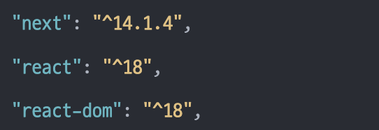
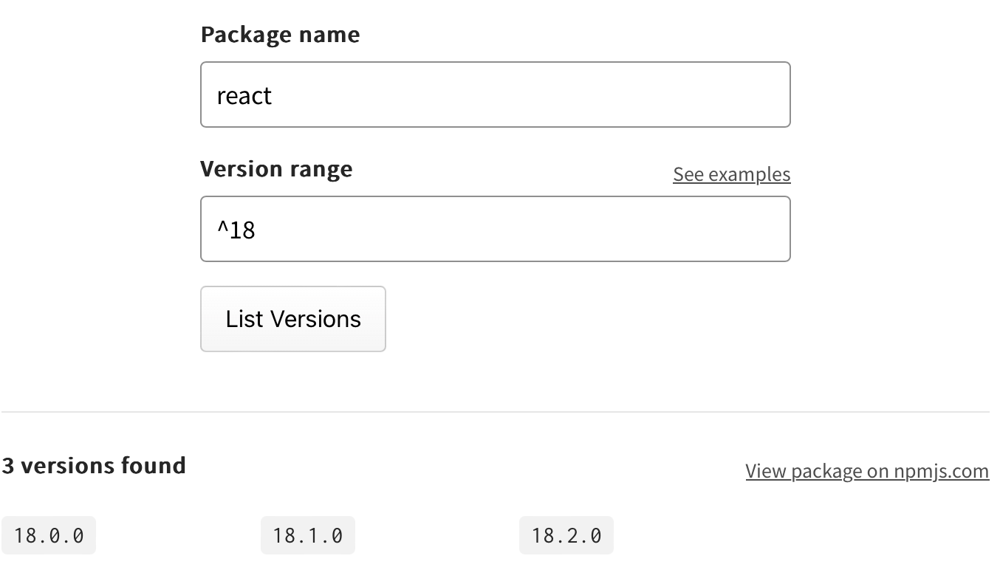

# 소프트웨어의 버전을 표기하는 방법 - 시맨틱 버저닝

이번 글에서는 버전을 표기하는 방법인 시맨틱 버저닝(Semantic versioning)에 대해 알아보려 합니다.

# 시맨틱 버저닝

시맨틱 버저닝은 3개의 숫자 포맷으로 버전을 명세하는 것입니다. package.json에 표시되는 패키지들의 버전들이 바로 이 시맨틱 버저닝 표기법을 따르고 있습니다.

이 표기법을 사용하는 소프트웨어는 open API여야 하며, 이 API는 코드 자체로 선언하거나, 문서로 엄격히 명시돼야 합니다. 가장 중요한 것은 어찌됐든 **정확하고 이해하기 쉬워야 한다**는 점입니다.

## 작성법

`X.Y.Z` 형태로 작성하며, 각 번호는 반드시 **증가하는 형태의 자연수**여야 합니다. 그리고 숫자 앞에 0은 붙이지 않습니다. (1.0.01 - ❌ / 1.0.1 - ⭕️)

각각의 번호에는 다음과 같은 의미가 있습니다.

### Major (첫 번째 숫자)

- 이전 버전과 호환되지 않는 API 변경 (breaking change)
- Major 버전이 0인 소프트웨어는 초기 개발을 위해 사용됨 (0.y.z 형태)
- 1.0.0 버전은 공개 API를 정의한다는 의미

### Minor (두 번째 숫자)

- 이전 버전과 호환되면서 새로운 기능 추가
- API의 일부를 제거할 계획(deprecate)인 것 표시할 때도 사용됨

### Patch (세 번째 숫자)

- 이전 버전과 호환되면서 버그 수정ㅇ

### Pre-release

- 필요 시 사용하는 버전
- `-` 기호 뒤에 pre-release 버전을 표기
- 아직 불안정하며 연관된 일반 버전에 대해 호환성 요구사항이 충족되지 않을 수 있음
- ex) 1.0.0-alpha, 1.0.0-alpha.1, 1.0.0-x.7.z.92

### 빌드 메타 데이터

- Patch나 Pre-release 버전 뒤에 + 기호를 붙이고 마침표로 구분된 식별자를 덧붙여 표현
- ex) 1.0.0-alpha+001, 1.0.0+20130313144700, 1.0.0-beta+exp.sha.5114f85

## 규칙

시맨틱 버저닝은 다음의 규칙을 따릅니다.

- Major 버전을 변경하는 경우, Minor와 Patch는 0에서부터 다시 시작해야 함
- Minor 버전을 변경하는 경우, Patch는 0에서부터 다시 시작해야 함
- 각 버전의 변경은 그 하위 버전의 변화를 포함할 수 있음
  - Major 변경에 Minor, Patch 수준의 변경이 포함되어도 됨
  - Minor 변경에 Patch 수준의 변경이 포함되어도 됨
- 이미 배포해버린 버전에 수정이 필요한 경우, 이미 올린 버전을 내리는 수정이 아닌 올린 것에서 더 올리는 식으로 수정 후 배포해야 함

## 범위를 지정하는 방법

범위 앞에 특정 기호가 없다면 해당 버전과 정확하게 일치하는 버전의 의존성을 사용하겠다는 의미입니다. 그런데 package.json을 살펴 보면, 기호와 함께 표시된 버전도 많은 것을 확인할 수 있습니다.

이렇게 기호와 함께 표기된 버전은 일반적으로 정확하게 일치하는 버전을 사용하기 보다, 제한된 버전 내에서 최신 버전을 사용하겠다는 의미가 됩니다.

### 틸드 (~)

- Patch를 기준으로 최신 패키지(=버그 패치가 된 패키지)를 사용한다는 의미
- ex) `~1.3.2`: `1.3.*` 허용, `~2`: `2.*.*` 허용

### 캐럿 (^)

- Minor를 기준으로 최신 패키지(호환 가능한 기능들이 추가된 패키지)를 사용한다는 의미
- ex) `^14.1.4`: `14.*.*` 허용, 15 버전은 비허용

이제 위 이미지를 다시 살펴보면,

- next: 14 버전 중 최신을 가져오겠다
- react: 18 버전 중 최신을 가져오겠다
- react-dom: 18 버전 중 최신을 가져오겠다

라는 의미가 됩니다.

어느 버전까지 허용하는 것인지 헷갈릴 때는 [semver 사이트](https://semver.npmjs.com)에 접속하여 확인할 수 있습니다.

(patch 버전이 없는 리액트…멋있네염)

참고로 npm 패키지를 설치할 때는 범위 연산자(^)가 항상 적용됩니다. 범위를 지정하지 않고 정확한 버전을 설치하고 싶다면 `npm install —save-exact` 옵션을 주어야 합니다.

# 참고

[https://semver.org/lang/ko/](https://semver.org/lang/ko/)
