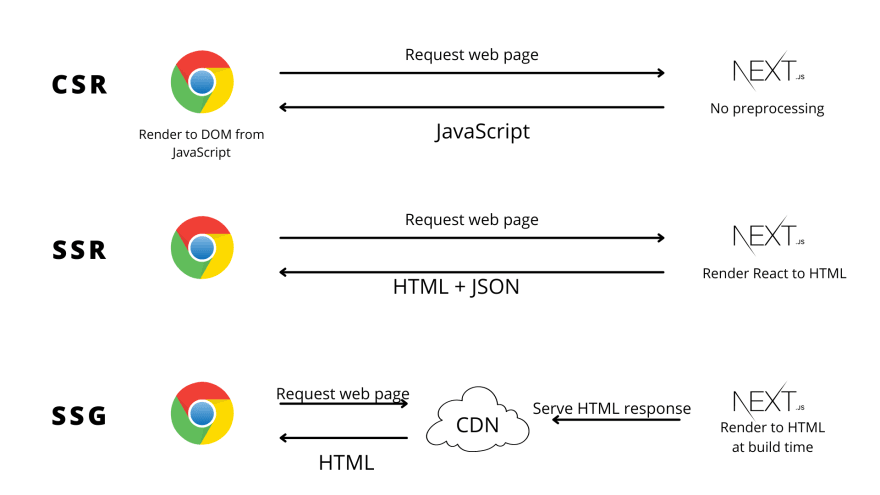
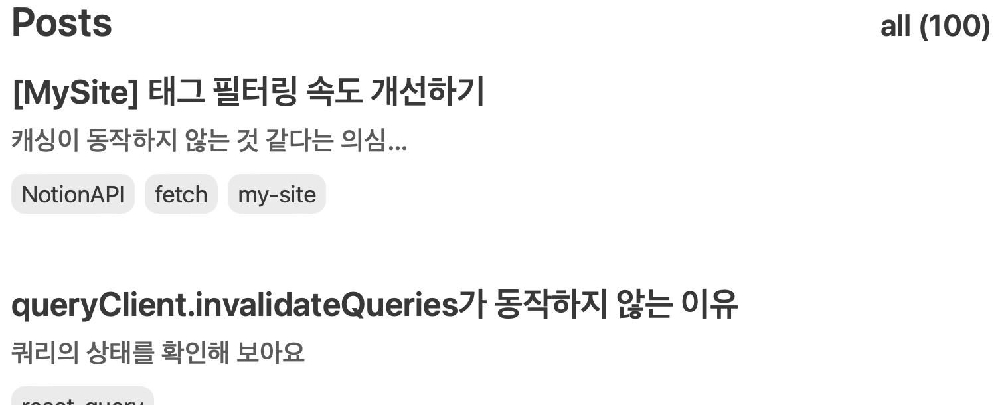

> 본 포스팅은 Next.js의 **app router**를 기반으로 작성되었습니다.

# SSG

SSG(Static Site Generation)은 빌드 시에 사이트를 렌더링해 두고, 요청이 있을 때 미리 렌더링해 둔 페이지를 제공하는 방식을 말해요.

사용자의 요청이 있을 때 렌더링을 수행하는 SSR(Server Side Rendering)과는 달리, 빌드 시점에 페이지를 렌더링해 두기 때문에 SSR보다 SSG가 더 빠릅니다.



# Next.js의 기본 렌더링 방식

Next.js의 기본 렌더링 방식은 **Static Rendering** 입니다. 즉, 각 경로는 빌드 시에 렌더링되고 렌더링된 결과는 CDN에 저장됩니다.

그리고 이 정적 렌더링이 가능하기 위해서는 빌드 시에 어떤 경로가 있는지 알아야 하기 때문에 **정적인 경로에 대해서만 static rendering이 가능**합니다.

하지만, 개발 시점에 모든 경로를 알고 있는 것은 당연히 어렵습니다. 당장 제 블로그만 해도 100개의 경로가 존재하고 글을 작성할 때마다 이 경로는 늘어나게 되겠죠…



따라서 빌드 시점에 서버가 모르는 **동적**인 경로에 대해서는 Static Rendering이 적용되지 않습니다. 동적인 경로에 접속한다면, 빌드 시점이 아닌 **접속한 시점(=요청 시점)**에 렌더링이 수행되어 약간의 로딩 시간이 발생합니다.


지금도 엄청 느린 편은 아니지만 어찌됐든 약 0.5초의 로딩 시간이 발생하네요!

# 동적 경로에 SSG 적용하기 - generateStaticParams

동적인 경로에 SSG를 적용하고 싶다면 빌드 시점에 어떤 경로가 있는지 알려줘야겠죠! Next.js에서 제공하는 `generateStaticParams` 함수를 사용하여 그 역할을 수행할 수 있습니다.

> The `generateStaticParams` function can be used in combination with [dynamic route segments](https://nextjs.org/docs/app/building-your-application/routing/dynamic-routes) to **[statically generate](https://nextjs.org/docs/app/building-your-application/rendering/server-components#static-rendering-default)** routes at build time instead of on-demand at request time.

요청 시점에 렌더링하는 대신, 동적 경로를 빌드 타임에 정적으로 생성할 수 있다고 하네요.

`generateStaticParams`는 다음과 같이 동적 경로에 오는 값을 리턴하는 식으로 구현하면 됩니다. 저는 다음처럼 `slug` 값들을 배열로 리턴해 주었어요.

```tsx
// app/blog/[slug]/page.tsx
export async function generateStaticParams() {
  const posts = await getAllPosts();

  return posts.map((post) => ({
    params: { slug: post.slug },
  }));
}
```

이제 빌드해 보면, Dynamic에서 SSG로 변경된 것을 확인할 수 있어요.


빌드 시점에 각 포스팅 경로가 정적 렌더링되어 로딩 속도가 향상되었어요! 로딩이 거의 없다고 느껴집니다.


# 엇 근데 글 수정하면 어떻게 됨..?

각 페이지는 빌드 시점에 만들어지기 때문에 **최신 데이터를 반영하기 어렵다**는 단점이 있습니다.

이 SSG의 단점을 보완한 렌더링 방식이 바로 **ISR** 입니다!

## ISR

ISR(Incremental Static Regeneration)은 빌드와 배포가 된 이후에 다시 빌드를 하지 않고도 사이트를 업데이트하는 방식을 말합니다.

[Route Segment Config](https://nextjs.org/docs/app/api-reference/file-conventions/route-segment-config) 옵션 중 `revalidate`를 설정하여 특정 시간 뒤에 해당 페이지가 재생성되도록 할 수 있습니다.

이렇게 revalidate=600을 설정하면, 이 페이지는 600초 동안 fresh한 페이지가 됩니다.

```tsx
// app/blog/[slug]/page.tsx

export const revalidate = 600;

export default function Page() {}
```

> **주의할 점**

- revalidate의 단위는 초(second) 단위이다.
- 정적으로 분석될 수 있도록 연산이 아닌 정확한 숫자 값으로 작성해야 한다. (revalidate=60\*10 🙅)
  >

### n초 뒤 바로 페이지가 재생성되는 것은 아님!


페이지가 stale된 다음(n초가 지난 뒤)에 들어온 첫 요청은 바로 fresh 페이지가 아닌 **stale 페이지를 받게** 되고, 백그라운드에 새로운 데이터 가져오기 요청을 트리거하는 역할을 합니다. ([참고](https://nextjs.org/docs/app/building-your-application/caching#time-based-revalidation))

(한 명이 희생해 주면 그 다음 사람은 최신 페이지 열람 가능…..)

### SSG지만 업데이트는 하고 싶어

라면 `revalidate` 옵션을 사용해 Time-based Revalidation을 구현하면 되겠습니다! (참고로 공식 문서에서는 시간 기반 이외의 재검증 방법도 소개하고 있습니다.)

# 마치며

제가 SSG를 적용한 이유처럼 변경될 일이 많지 않은 페이지(거의 없음)라면 SSG를 고려해 TTV 시간을 줄여보는 것도 좋을 것 같네요!

감사합니다.

# 참고

Next.js 공식 문서

[https://dev.to/anshuman_bhardwaj/what-the-heck-is-ssg-static-site-generation-explained-with-nextjs-5cja](https://dev.to/anshuman_bhardwaj/what-the-heck-is-ssg-static-site-generation-explained-with-nextjs-5cja)
