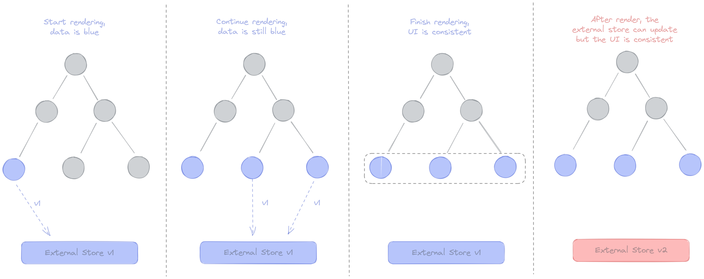
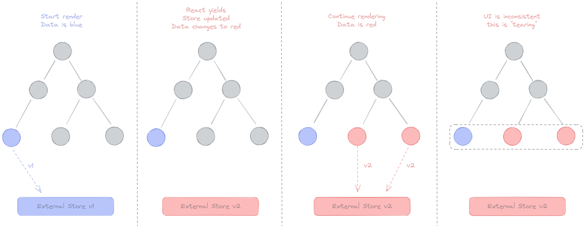
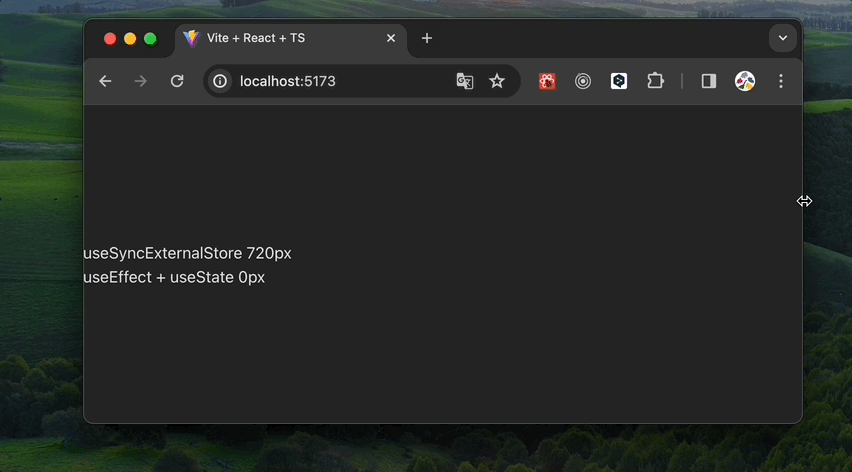

# tearing이란?

tearing은 “찢어진다”는 의미를 갖는 말인데요. 일반적으로 여러가지의 UI가 표현되는 것을 의미하는 용어입니다.

**하나의 state가 서로 다른 값으로 렌더링되는 현상**을 리액트에서의 tearing이라고 볼 수 있어요.

# Synchronous Rendering

현재 잘 알려진 리액트의 렌더링 방식은 synchronous 렌더링 방식입니다.



첫 번째 패널을 먼저 살펴보겠습니다. 리액트 트리를 렌더링하면서 외부 스토어에 접근을 하게 되는데요. 현재 외부 스토어가 가진 데이터는 `파란색`입니다. 따라서 컴포넌트는 `파란색`으로 렌더링이 됩니다.

두 번째 패널과 세 번째 패널에서도 마찬가지로 외부 스토어의 데이터는 `파란색`이기 때문에 모든 컴포넌트는 파란색으로 동일하게 렌더링됩니다.

네 번째 패널은 외부 스토어의 데이터가 `빨간색`으로 업데이트된 상황입니다.

이렇게 synchronous 렌더링에서는 렌더링이 중단되지 않기 때문에 동일한 데이터로 렌더링을 완료한 다음에야 데이터를 변경하고 새로운 데이터로 렌더링할 수 있습니다. 즉, 동일한 데이터를 참조하는 컴포넌트들은 모두 동일한 값으로 렌더링을 끝마치게 되어 **UI 간 불일치가 발생하지 않습니다.**

만약 위 렌더링 방식으로 무거운 렌더링 동작을 수행하고 있는 도중 유저 인터렉션이 발생한다면 어떻게 될까요?

synchronous 렌더링의 경우, 렌더링이 메인 스레드를 차지하고 있기 때문에 사용자는 진행 중인 렌더링 작업이 완료된 다음에야 인터렉션에 대한 피드백을 얻을 수 있습니다. 이는 사용자에게 낮은 인터렉션 경험을 줄 수 있는 원인이 되기도 합니다.

# Concurrent Feature

리액트 v18에서는 렌더링 도중 우선 순위기 높은 UI 변경에 스레드를 위임할 수 있는 concurrent feature가 추가되었습니다.

따라서 사용자의 인터렉션(긴급 업데이트)에 높은 우선 순위를 부여한다면, 무거운 렌더링(전환 업데이트)을 중단하고 사용자의 인터렉션에 대한 피드백을 먼저 렌더링할 수 있게 됩니다.

이는 UX를 향상시킬 수 있는 기능이지만 글의 주제인 tearing이 발생할 수 있는 문제가 존재합니다.

## tearing이 발생하는 과정



렌더링하는 중에 사용자가 `파란색` 값을 `빨간색`으로 변경하는 버튼을 클릭했다고 가정해 봅시다.

버튼을 클릭하기 전이라면 첫 번째 패널처럼 `파란색` 값을 가지고 컴포넌트를 렌더링할 것입니다.

이어서 렌더링을 하려는데 사용자가 `빨간색`으로 값을 변경했다면 외부 스토어의 값이 변경되어, 이후에 렌더링되는 컴포넌트는 `빨간색`이라는 값으로 렌더링을 진행할 것입니다.

즉, `파란색`이라는 값으로 일관되게 렌더링했던 컴포넌트들이 `빨간색`과 `파란색`이 혼합된 상태로 나타나게 되는 것을 알 수 있습니다. 같은 데이터임에도 다른 값을 표시하는 이러한 현상을 **tearing**이라고 합니다.

## 그럼 concurrent 쓰지 말아야 되나?

라고 생각할 수도 있는데요.

리액트에서 제공하는 `useState`, `useReducer`, `context`, `props`와 같이 **내부 스토어**라면 내부적으로 이러한 문제를 해결하기 위한 처리가 되어 있습니다.

단, 리액트가 관리할 수 없는 **외부** 데이터 소스라면 문제가 되는데요. 여기서 외부 데이터란 상태 관리 라이브러리(redux, recoil, jotai, zustand 등)를 포함하여 `document.body`, `window` 등 간단히 말해 `useState`나 `useReducer`가 아닌 모든 것을 말합니다.

이 외부 데이터 소스에 리액트에서 추구하는 동시성 처리가 추가돼 있지 않다면 tearing 현상이 발생하게 됩니다.

리액트 팀에서는 이러한 문제를 해결하기 위해 외부 스토어와 싱크를 맞추기 위해 사용할 수 있는 `useSyncExternalStore` 훅을 도입하게 됩니다.

# useSyncExternalStore

훅은 다음과 같이 생겼습니다.

```tsx
useSyncExternalStore(
	subsribe: (callback) => Unsubscribe,
	getSnapshot: () => State,
	getServerSnapshot: () => State,
) => State
```

- subscribe
  - 콜백 함수를 받아 스토어에 등록하는 용도로 사용됩니다.
  - 스토어에 있는 값이 변경되면 이 콜백이 호출되고, `useSyncExternalStore` 훅을 호출한 컴포넌트를 리렌더링합니다.
- getSnapshot
  - 컴포넌트에 필요한 현재 스토어의 데이터를 반환하는 함수입니다.
  - 스토어에 있는 값이 변경되지 않았다면 매번 함수를 호출할 때마다 동일한 값을 반환해야 합니다.
    - 스토어의 값에 변경이 있는지 확인하기 위해 `Object.is`를 사용합니다.
- getServerSnapshot
  - 옵셔널 값으로, 서버 사이드 렌더링 시에 내부 리액트를 하이드레이션 하는 도중에만 사용됩니다.
  - 서버 사이드에서 렌더링되는 훅이라면 반드시 이 값을 넘겨줘야 하며, 클라이언트 값과 불일치가 발생하면 오류가 발생합니다.

## 예제 코드

다음은 `useSyncExternalStore` 훅을 사용해 현재 윈도우의 innerWidth를 확인하는 코드입니다.

```tsx
import { useSyncExternalStore } from 'react';

function subscribe(callback: (this: Window, ev: UIEvent) => void) {
  window.addEventListener('resize', callback);
  return () => {
    window.removeEventListener('resize', callback);
  };
}

export default function App() {
  const windowSize = useSyncExternalStore(subscribe, () => window.innerWidth);

  return <>{windowSize}</>;
}
```

innerWidth는 외부에 있는 값이기 때문에, 이 값의 변경 여부를 확인해 리렌더링까지 이어지도록 하려면 `useSyncExternalStore` 훅을 사용하는 것이 적절합니다.

---

또한, 리액트에서 제공하는 컴포넌트 외부의 시스템과의 동기화를 위한 `useEffect` 훅을 사용해서도 비슷한 로직을 작성할 수 있는데요.

```tsx
function useWindowWidth() {
  const [windowWidth, setWindowWidth] = useState(0);

  useEffect(() => {
    function handleResize() {
      setWindowWidth(window.innerWidth);
    }

    window.addEventListener('resize', handleResize);
    return () => {
      window.removeEventListener('resize', handleResize);
    };
  }, []);

  return windowWidth;
}
```

---

두 가지 방법을 모두 실행해보면 다음과 같이 tearing 현상이 발생하는 것을 확인할 수 있습니다.

`useSyncExternalStore` 훅을 사용했을 때는 컴포넌트 렌더링 이후에 정확하게 현재 width를 가져올 수 있었으나,

`useEffect`와 `useState` 조합을 사용한 경우에는 값을 가져오지 못하고 초기값인 0을 가져와서 보여주는 것을 확인할 수 있어요.



즉, 외부에 상태가 있는 데이터에는 반드시 `useSyncExternalStore`를 사용해 값을 가져와야 합니다.

## 이 훅.. 쓸 일이 많을까요?

`useSyncExternalStore` 훅은 애플리케이션 코드에 직접적으로 사용할 일이 많지 않습니다. 라이브러리를 작성하는 경우가 아니라면 참고만 하면 된다고 하네요.

다만 사용 중인 상태 관리 라이브러리가 외부에서 상태를 관리한다면, 해당 라이브러리가 외부 데이터 소스의 변경을 추적하고 있는지 확인이 필요합니다. (그렇지 않다면 tearing 현상이 발생할 수 있기 때문이에요.)

# 마치며

tearing이라는 용어가 무엇인가로 시작해서 훅까지 알아보게 되었는데요.

아직 동시성 렌더링을 구현해 본적이 없지만, 혹시 나중에 이러한 이슈를 만나게 된다면 힘들이지 않고 tearing이라는 키워드로 구글링을 할 수 있을 것 같네요.

또한, UX 개선 작업으로 인해 다른 부분에서 이슈가 발생하지 않는지 잘 확인해야겠습니다.

감사합니다.

# Reference

[https://github.com/reactwg/react-18/discussions/69](https://github.com/reactwg/react-18/discussions/69)

[https://velog.io/@hyunjine/리액트에서-외부-시스템과-동기화하기](https://velog.io/@hyunjine/%EB%A6%AC%EC%95%A1%ED%8A%B8%EC%97%90%EC%84%9C-%EC%99%B8%EB%B6%80-%EC%8B%9C%EC%8A%A4%ED%85%9C%EA%B3%BC-%EB%8F%99%EA%B8%B0%ED%99%94%ED%95%98%EA%B8%B0)

[https://velog.io/@jay/Concurrent-React](https://velog.io/@jay/Concurrent-React)
