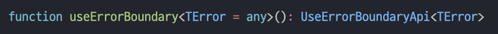
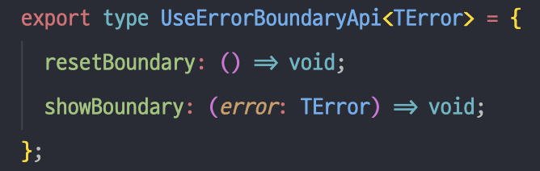
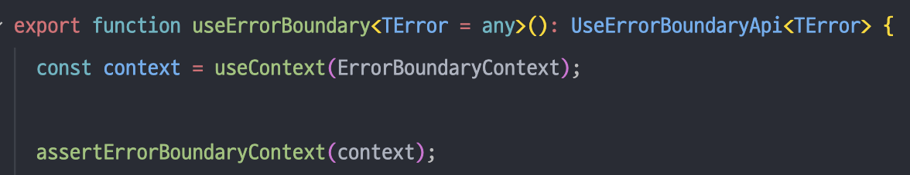
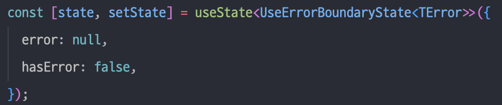
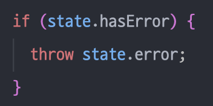

# [React] react-error-boundary 라이브러리 톺아보기 (2) - useErrorBoundary

# useErrorBoundary

이번에는 error boundary를 hook으로 사용할 수 있는 useErrorBoundary의 코드를 읽어 보면서 인상 깊었던 내용을 정리하려 합니다.

### 전체 코드

```tsx
import { useContext, useMemo, useState } from 'react';
import { ErrorBoundaryContext } from '.';
import { assertErrorBoundaryContext } from './assertErrorBoundaryContext';

type UseErrorBoundaryState<TError> = { error: TError; hasError: true } | { error: null; hasError: false };

export type UseErrorBoundaryApi<TError> = {
  resetBoundary: () => void;
  showBoundary: (error: TError) => void;
};

export function useErrorBoundary<TError = any>(): UseErrorBoundaryApi<TError> {
  const context = useContext(ErrorBoundaryContext);

  assertErrorBoundaryContext(context);

  const [state, setState] = useState<UseErrorBoundaryState<TError>>({
    error: null,
    hasError: false,
  });

  const memoized = useMemo(
    () => ({
      resetBoundary: () => {
        context.resetErrorBoundary();
        setState({ error: null, hasError: false });
      },
      showBoundary: (error: TError) =>
        setState({
          error,
          hasError: true,
        }),
    }),
    [context.resetErrorBoundary]
  );

  if (state.hasError) {
    throw state.error;
  }

  return memoized;
}
```

## 시그니처 부분



`useErrorBoundary`를 호출하면 `UseErrorBoundaryApi`를 반환하는데요.

UseErrorBoundary는 훅을 호출해 반환받는 resetBoundary와 showBoundary 함수를 프로퍼티 갖는 객체입니다.



훅을 호출할 때 제네릭으로 Error의 타입을 넣어준다면 `showBoundary`의 error 타입으로 활용되네요.

## ErrorBoundaryContext를 참조한다.

ErrorBoundary 컴포넌트는 children을 ErrorBoundaryContext라는 컨텍스트의 Provider로 감싸 리턴합니다.

```tsx
<ErrorBoundaryContext.Provider value={{ didCatch, error, resetErrorBoundary }}>
  {children}
</ErrorBoundaryContext.Provider>
```

<br />

`useErrorBoundary`는 이 컨텍스트를 활용하게 되는데요.

그렇기 때문에 처음 등장하는 코드는 `useContext`입니다.



### 타입을 식별하고 좁히기

그 밑에는 `assertErrorBoundaryContext`라는 함수가 있는데요.

무슨 역할을 하는 함수인지 내부를 보겠습니다.

```tsx
export function assertErrorBoundaryContext(value: any): asserts value is ErrorBoundaryContextType {
  if (value == null || typeof value.didCatch !== 'boolean' || typeof value.resetErrorBoundary !== 'function') {
    throw new Error('ErrorBoundaryContext not found');
  }
}
```

음.. 저는 `asserts`나 `is` 같이 처음 보는 키워드가 많아 코드를 해석할 수 없었습니다. 😓💦💦💦

두 키워드에 대한 개념을 간단히 정리한 다음, 이 함수가 어떤 역할을 하는 것인지 해석해 보겠습니다.

(코드를 바로 이해하실 수 있는 분은 이쪽으로 스킵하시길 바랍니다. 좀 길어요!)

<br />

먼저 `asserts` 키워드에 대해 알아보겠습니다.

[타입스크립트의 공식 문서](https://www.typescriptlang.org/docs/handbook/release-notes/typescript-3-7.html#assertion-functions)를 보면, 이러한 예제 코드가 있습니다.

```tsx
function assert(condition: any, msg?: string): asserts condition {
  if (!condition) {
    throw new AssertionError(msg);
  }
}
```

> _It ensures that whatever condition is being checked must be true for the remainder of the containing scope._

위 assert 함수는 검사되는 모든 조건을 스코프의 나머지 영역에서 true여야 함을 보장하는 함수라고 합니다.

> `*asserts condition` says that whatever gets passed into the `condition` parameter must be true if the `assert` returns (because otherwise it would throw an error). That means that for the rest of the scope, that condition must be truthy.\*

그리고 `asserts condition` 부분은 어떤 조건이 condition 파라미터로 들어오든, 이 assert라는 함수가 반환을 하고 나면 항상 true임을 표현한다고 합니다.

condition을 만족하지 못했다면 이 함수가 반환하기 전에 에러를 던지기 때문이에요. (if문)

즉, 한 스코프에서 이 함수를 호출한 다음 부분부터는 **condition이라는 조건을 항상 만족한다**는 것입니다.

<br />

이렇게 알게 된 내용을 `assertErrorBoundaryContext` 함수의 반환 타입에 적용해 본다면,

이 함수가 호출된 다음부터는 `value is ErrorBoundaryContextType`이라는 조건이 항상 true가 되겠네요!

---

이번에는 `is` 키워드에 대해 알아보겠습니다.

_이펙티브 타입스크립트_ 책에 보면 **사용자 정의 타입 가드**라는 개념으로 `is`를 소개하고 있는데요.

다음 코드를 보겠습니다.

```tsx
function isInputElement(el: HTMLElement): el is HTMLInputElement {
  return 'value' in el;
}
```

이 함수의 반환 타입인 `el is HTMLInputElement`는 함수의 반환이 true인 경우, 타입 체커에게 매개변수의 타입을 좁힐 수 있다고 알려주는 역할을 합니다.

위 함수는 다음과 같이 타입이 HTMLInputElement인지 확인하고 싶을 때 사용할 수 있습니다.

```tsx
function getElementContent(el: HTMLElement) {
  if (isInputElement(el)) {
    // el의 타입은 HTMLInputElement이므로
    el; // HTMLInputElement
    return el.value; // value에 접근할 수 있음
  }
  el; // el의 타입은 HTMLElement임 (HTMLInputElement가 아님)
  return el.textContent;
}
```

즉, 함수의 반환 타입이 `something is type`이라는 형태로 되어 있다면

이는 **“함수가 리턴하는 값이 true라면 something의 타입은 type이다”** 라는 뜻이 되겠습니다.

<br />

공식 문서의 예제를 하나 더 보겠습니다.

```tsx
function assertIsString(val: any): asserts val is string {
  if (typeof val !== 'string') {
    throw new AssertionError('Not a string!');
  }
}
```

이제 이 함수를 해석할 수 있겠네요.

assertIsString 함수가 에러 없이 실행된다면 함수를 호출한 이후 val은 모두 string 타입으로 취급됩니다.

<br />

그럼 다시 `assertErrorBoundaryContext` 코드를 살펴 보겠습니다.

```tsx
export function assertErrorBoundaryContext(value: any): asserts value is ErrorBoundaryContextType {
  if (value == null || typeof value.didCatch !== 'boolean' || typeof value.resetErrorBoundary !== 'function') {
    throw new Error('ErrorBoundaryContext not found');
  }
}
```

우선 이 함수의 시그니처를 통해 이 함수가 호출되고 나면,

`value`의 타입은 `ErrorBoundaryContextType`으로 좁혀지겠구나 라는 것을 알 수 있습니다.

그럼 어떠한 경우에 `ErrorBoundaryContextType`이 되지 못할까요?

- value==null
- typeof value.didCatch ! == “boolean”
- typeof value.resetErrorBoundary ! == “function”

위와 같은 조건을 만족하지 않는다면 에러 바운더리 컨텍스트가 아니라고 취급합니다.

참고로 `ErrorBoundaryContextType`은 이렇게 생겼습니다.

```tsx
export type ErrorBoundaryContextType = {
  didCatch: boolean;
  error: any;
  resetErrorBoundary: (...args: any[]) => void;
};
```

####결론적으로 `assertErrorBoundary`의 역할은 다음과 같겠습니다.

- `useErrorBoundary`를 사용하는 컴포넌트가 `ErrorBoundary`로 감싸졌는지 체크
- `useContext`에 넣은 context가 에러 바운더리 컨텍스트가 맞는지 체크
- null 또는 ErrorBoundaryContextType인 컨텍스트의 타입을 ErrorBoundaryContextType로 좁힘(null 검사)

## resetBoundary와 showBoundary의 역할

useErrorBoundary는 다음과 같은 상태를 가집니다.



```tsx
type UseErrorBoundaryState<TError> = { error: TError; hasError: true } | { error: null; hasError: false };
```

이 상태는 에러가 발생했다면 {에러가 발생함, 무슨 에러임} 이라는 상태를 갖고 에러가 없는 상태라면 {에러 없음, null} 이런 상태를 가집니다.

그리고 hasError가 true가 된다면 (에러가 발생한다면) error를 throw합니다.



상태를 “에러가 발생했다”고 어떻게 변경할 수 있을까요?

### showBoundary

이 훅을 호출해 사용하는 컴포넌트에서 `showBoundary` 함수를 호출하면 에러가 발생한 상태라고 변경할 수 있습니다.

```tsx
// ...
showBoundary: (error: TError) =>
	setState({
		error,
		hasError: true,
	}),
```

`showBoundary`를 호출해서 훅 내부의 상태가 바뀌면,

`state.hasError`가 true로 바뀌면서 `state.error`를 throw합니다.

<br />

그럼 여기서 던진 에러를 누가 catch하게 될까요?

바로 컴포넌트를 감싸고 있는 `ErrorBoundary`에서 이 에러를 catch합니다.

즉, 에러가 상위 방향으로 전파되었고 이를 부모가 잡아낸 상황입니다.

```tsx
componentDidCatch(error: Error, info: ErrorInfo) {
	this.props.onError?.(error, info);
}
```

위 코드를 실행하여 `ErrorBoundary` 컴포넌트 내부의 상태가 변경(`didCatch`: true, `error`: 에러 객체)되고,

내부 로직에 따라 fallback 컴포넌트가 보여지게 됩니다. (내부 로직은 [1편](https://velog.io/@jhsung23/React-react-error-boundary-라이브러리-톺아보기-1-ErrorBoundary#에러-발생-시-fallback-컴포넌트를-보여주는-동작-방식)을 참고해 주세요.)

### resetBoundary

그럼 최근에 에러가 발생한 부분의 동작을 다시 시도할 수 있게 해 주는 `resetBoundary`는 어떻게 동작할까요?

```tsx
resetBoundary: () => {
	context.resetErrorBoundary();
	setState({ error: null, hasError: false });
},
```

`resetBoundary`가 호출되면 context로부터 받은 함수를 실행하고

훅 내부의 상태를 에러가 발생하기 전으로 돌려 놓습니다.

이때 `resetErrorBoundary`가 호출되면 부모인 `ErrorBoundary` 컴포넌트의 상태도 에러가 발생하기 전으로 초기화되면서 fallback이 아닌 성공 시 보여주려는 컴포넌트가 렌더링됩니다. (내부 로직은 [1편](https://velog.io/@jhsung23/React-react-error-boundary-라이브러리-톺아보기-1-ErrorBoundary#resetboundary의-동작-방식)을 참고해 주세요.)

이 컴포넌트가 렌더링되면서 또 에러가 발생한다면 `showBoundary`가 호출되고 이 상황이 반복되겠죠!

# 결론

useErrorBoundary 훅의 코드를 살펴봤습니다.

코드가 길지 않은 편이라 라이브러리 코드를 읽는 게 크게 부담스럽진 않았던 것 같아요.

타입을 체크하고 좁히는 방법에 대해 알 수 있었고 이 훅은 에러를 상위로 전파하여 처리하는 용도임을 알게 되었습니다.

다음에는 마지막 편인 withErrorBoundary HOC 코드를 살펴보겠습니돠.
