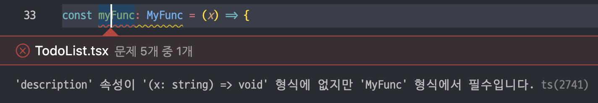
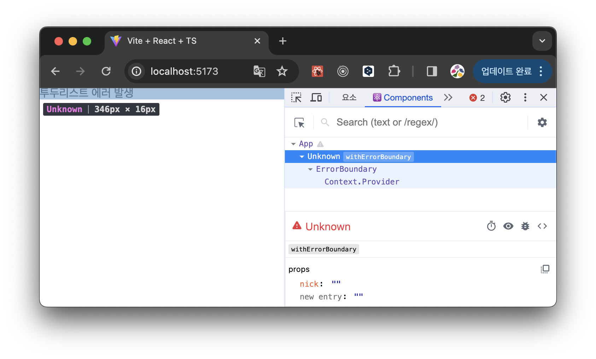
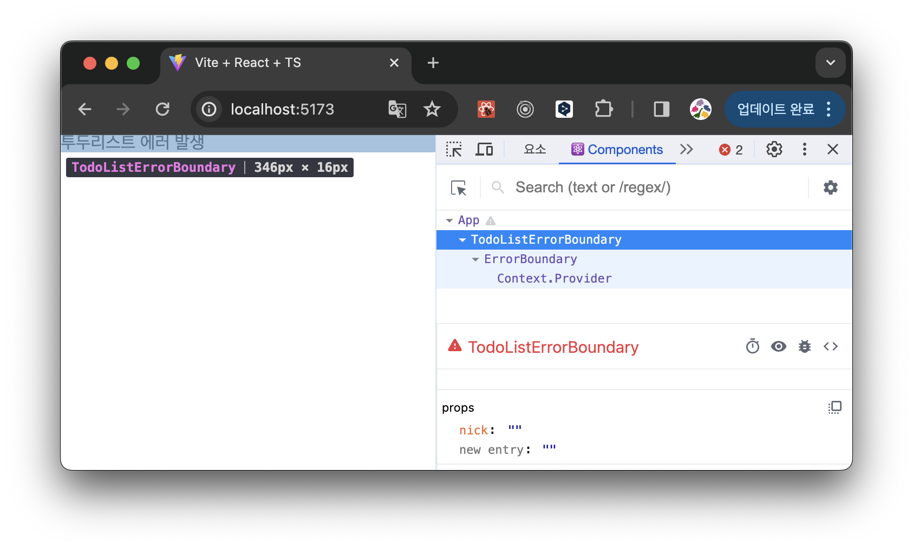

# withErrorBoundary

이번에는 에러 바운더리를 **고차 컴포넌트**로 사용할 수 있는 `withErrorBoundary`의 코드를 살펴보겠습니다.

### 전체 코드

```tsx
export function withErrorBoundary<Props extends Object>(
  component: ComponentType<Props>,
  errorBoundaryProps: ErrorBoundaryProps
): ForwardRefExoticComponent<PropsWithoutRef<Props> & RefAttributes<any>> {
  const Wrapped = forwardRef<ComponentType<Props>, Props>((props: Props, ref: ForwardedRef<ComponentType<Props>>) =>
    createElement(ErrorBoundary, errorBoundaryProps, createElement(component, { ...props, ref }))
  );

  // Format for display in DevTools
  const name = component.displayName || component.name || 'Unknown';
  Wrapped.displayName = `withErrorBoundary(${name})`;

  return Wrapped;
}
```

# 시그니처 부분

```tsx
export function withErrorBoundary<Props extends Object>(
  component: ComponentType<Props>,
  errorBoundaryProps: ErrorBoundaryProps
): ForwardRefExoticComponent<PropsWithoutRef<Props> & RefAttributes<any>> {}
```

고차 컴포넌트는 컴포넌트를 인수로 받아 새로운 컴포넌트를 반환하는 컴포넌트입니다.

따라서 `component`를 첫 번째 인수로 받고 있으며, 그 타입은 `ComponentType<Props>`로 되어 있네요.

## ComponentType

여기서 `ComponentType`은 고차 컴포넌트를 만들 때 자주 사용되는 타입으로, `클래스형 컴포넌트 타입` 또는 `함수형 컴포넌트 타입`을 의미합니다.

```tsx
type ComponentType<P = {}> = ComponentClass<P> | FunctionComponent<P>;
```

그 중 `FuncionComponent` 타입을 좀 더 자세히 보겠습니다.

```tsx
interface FunctionComponent<P = {}> {
  (props: P, context?: any): ReactNode;
  propTypes?: WeakValidationMap<P> | undefined;
  contextTypes?: ValidationMap<any> | undefined;
  defaultProps?: Partial<P> | undefined;
  displayName?: string | undefined;
}
```

제네릭 타입인 P는 컴포넌트가 받는 props의 타입을 의미하는 것은 알겠는데, HOC에 컴포넌트를 어떻게 넘겨야 할지 잘 이해가 되지 않았어요. ~~withErrorBoundary({…}) 이렇게 객체 형태의 하나의 인수를 넘겨야 하나..? 라고 생각했습니다..~~

그래서 위 타입을 어떻게 해석해야 하는지 궁금했는데, [공식 문서](https://www.typescriptlang.org/ko/docs/handbook/2/functions.html)에서 답을 얻을 수 있었습니다.

### Call signatures

바로 **Call signatures**입니다.

자바스크립트에서 함수는 객체이므로 프로퍼티를 가질 수 있다는 걸 알고 계실 것입니다.

그런데 함수 타입 표현식 문법은 프로퍼티를 정의할 수 없는데요.

```tsx
type MyFunc = (x: string) => void; // 프로퍼티에 대한 타입은 없다!
```

만약 **호출이 가능**하면서 **프로퍼티를 가진** 무언가를 설명해야 한다면 **call signature**를 사용하면 됩니다.

```tsx
type MyFunc = {
  description: string;
  (x: string): void; // [주의] => 가 아닌 :(콜론)을 써야 합니다.
};
```

위처럼 타입을 지정하면, `MyFunc` 함수는 `x`라는 파라미터를 갖고 `description`이라는 프로퍼티를 갖는다는 의미가 됩니다.

#### 예시

예시로, 다음과 같이 `myFunc`이라는 함수를 만들었습니다.

```tsx
const myFunc: MyFunc = (x) => {
  console.log(x);
  console.log('my func');
};
```

이렇게 함수를 만들면 `description` 속성이 없다는 에러가 발생합니다.



`MyFunc` 타입에서 `description`은 옵셔널 프로퍼티가 아니기 때문에 해당 속성을 string으로 채워줘야 합니다. 따라서 다음과 같이 `description` 값을 할당해 줘야 `MyFunc`이라는 타입을 만족하는 함수가 될 수 있습니다.

```tsx
const myFunc: MyFunc = (x) => {
  console.log(x);
  console.log('my func');
};
myFunc.description = 'This is my func'; // 함수의 description 프로퍼티를 string으로 채우기
```

### FunctionComponent 타입 해석

그럼 다시 본론으로 돌아가 `FunctionComponent`의 타입을 살펴보면,

```tsx
interface FunctionComponent<P = {}> {
  (props: P, context?: any): ReactNode;
  propTypes?: WeakValidationMap<P> | undefined;
  contextTypes?: ValidationMap<any> | undefined;
  defaultProps?: Partial<P> | undefined;
  displayName?: string | undefined;
}
```

`propTypes`, `contextTypes`, `defaultProps`, `displayName`은 모두 `FunctionComponent` 타입의 함수의 프로퍼티임을 알 수 있습니다. 그리고 프로퍼티들은 옵셔널이기 때문에 undefined로 두어도 `FunctionComponent` 타입을 만족하는 함수가 될 수 있습니다.

## ErrorBoundaryProps

`withErrorBoundary`의 두 번째 파라미터인 `errorBoundaryProps`는 에러가 발생했을 때 보여줄 fallback 컴포넌트를 받습니다.

해당 타입에 대한 설명은 [1편](https://sungjihyun.vercel.app/blog/deep-dive-error-boundary)에서 다루었기 때문에 넘어가도록 하겠습니다.

## ForwardRefExoticComponent

withErrorBoundary의 리턴 타입은 다음과 같습니다.

```tsx
ForwardRefExoticComponent<PropsWithoutRef<Props> & RefAttributes<any>>;
```

간단히 설명하면, `ForwardRef`를 사용해 Ref를 전달할 수 있는 고차 컴포넌트를 반환한다는 의미입니다.

그리고 원래 컴포넌트의 props들과 ref를 제네릭으로 받고 있습니다.

여기서 `ForwardRefExoticComponent`는 주로 사용자 정의 컴포넌트를 구현할 때 사용한다고 하네요.

# 고차 함수 컴포넌트

그럼 함수 내부 코드를 살펴보겠습니다.

다음의 `Wrapped`가 최종 리턴값이기 때문에 원래 컴포넌트에 에러 바운더리를 감싼 형태임을 대강 짐작해 볼 수 있습니다.

```tsx
const Wrapped = forwardRef<ComponentType<Props>, Props>((props: Props, ref: ForwardedRef<ComponentType<Props>>) =>
  createElement(ErrorBoundary, errorBoundaryProps, createElement(component, { ...props, ref }))
);
```

`forwardRef`를 통해 Ref를 전달할 수 있는 컴포넌트를 만드는 것을 확인할 수 있습니다.

이때 props는 위에서 살펴봤던 원래 컴포넌트가 가진 props를 의미합니다.

## jsx 없이 컴포넌트 만들기

jsx는 `React.createElement(component, props, …children)`를 호출하기 위한 문법적 설탕이기 때문에 순수 Javascript로 변환이 가능합니다.

따라서, 위처럼 `createElement` 함수를 사용하면 jsx 없이 컴포넌트를 작성할 수 있습니다.

예를 들어 다음의 jsx로 작성된 코드는

```tsx
class Hello extends React.Component {
  render() {
    return <div>Hello {this.props.toWhat}</div>;
  }
}

const root = ReactDOM.createRoot(document.getElementById('root'));
root.render(<Hello toWhat="World" />);
```

아래처럼 jsx를 사용하지 않은 코드로 컴파일될 수 있습니다.

```tsx
class Hello extends React.Component {
  render() {
    return React.createElement('div', null, `Hello ${this.props.toWhat}`);
  }
}

const root = ReactDOM.createRoot(document.getElementById('root'));
root.render(React.createElement(Hello, { toWhat: 'World' }, null));
```

---

다시 본 코드를 살펴보면,

- `createElement(component, {…props, ref})`
  - `{…props, ref}`를 props로 갖는 컴포넌트를 만든다. (에러 바운더리로 감싸려는 컴포넌트)
    ```tsx
    <ErrorProneComponent {…props, ref} />
    ```
- `createElement(ErrorBoundary, errorBoundaryProps, createElement(component, {…props, ref})`
  - `errorBoundaryProps`를 props로 갖는 에러 바운더리 컴포넌트를 만든다.
    ```jsx
    <ErrorBoundary {…errorBoundaryProps} >
    	<ErrorProneComponent {…props, ref} />
    </ErrorBoundary>
    ```

## displayName 설정하기

`Wrapped` 컴포넌트를 만든 다음, `displayName`을 셋팅하는 부분이 있는데요.

```jsx
const name = component.displayName || component.name || 'Unknown';
Wrapped.displayName = `withErrorBoundary(${name})`;
```

컴포넌트에 미리 이름을 붙여주면 그 이름이 DevTools에 노출되어 디버깅을 용이하게 해 줍니다.

- 이름이 없는 경우 → Unknown 처리
  
- 이름이 있는 경우
  

# 라이브러리 톺아보기를 마치며

이렇게 react-error-boundary에서 제공하는 `ErrorBoundary`, `useErrorBoundary`, `withErrorBoundary` 코드를 모두 살펴봤는데요.

코드가 길지 않아서 부담이 되지 않으면서도, 생각해야 할 것들이 좀 있어서 관련 공부를 좀 더 하게 되는 좋은 경험이었습니다.

특히 타입 관련해서 새롭게 배운 부분이 많았고, 이전엔 라이브러리를 뜯어본 적이 없어서 약간 봉인된 마법(?)처럼 느꼈던 기능들이 실제로 어떻게 동작하는지 눈으로 확인할 수 있어서 좋았습니다.
