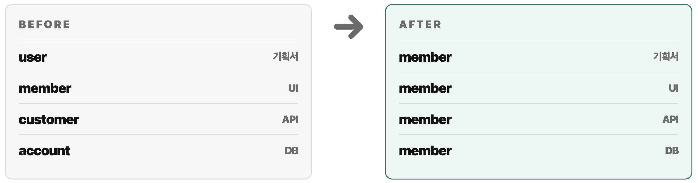
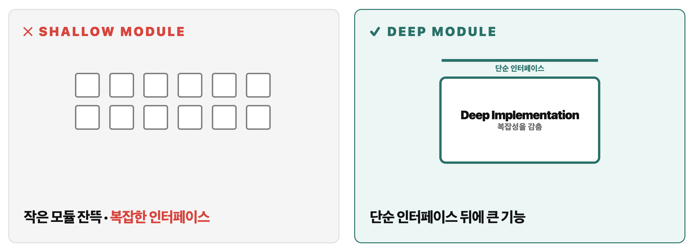
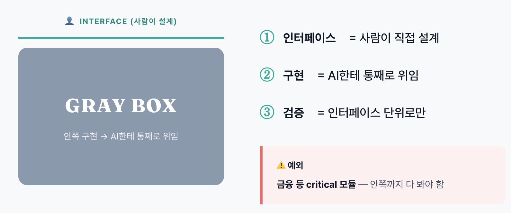

- 원문: https://www.youtube.com/watch?v=v4F1gFy-hqg (26.4.24)
- 한국어 해설: https://www.youtube.com/watch?v=FOee3zb98wI
- 참고 자료
	- https://www.aihero.dev/my-grill-me-skill-has-gone-viral
	- https://www.aihero.dev/5-agent-skills-i-use-every-day
	- https://app.daily.dev/posts/it-ain-t-broke-why-software-fundamentals-matter-more-than-ever-matt-pocock-ai-hero-mattpocockuk-7ys0ida2q

# AI 시대에도 소프트웨어 기본기가 중요한 이유

## 핵심 주장

> AI는 코드베이스의 상태를 그대로 증폭한다.

- 좋은 코드베이스에서는 AI가 생산성을 크게 올려준다.
- 나쁜 코드베이스에서는 AI가 엔트로피를 더 빠르게 키운다.
- 그래서 AI 시대의 개발자 역량은 **AI가 잘 작업할 수 있는 구조를 설계하고 유지하는 능력**으로 이동한다.

## 발표가 향하는 청자

- AI가 코드를 대신 작성하면서, 내가 쌓아온 개발 실력이 덜 중요해진 것 아닌가 걱정하는 사람
- Claude Code, Cursor, Codex 같은 에이전트를 써봤지만 결과물이 점점 망가진다고 느낀 사람
- "스펙만 잘 쓰면 AI가 알아서 구현한다"는 말에 기대와 불안을 동시에 느끼는 사람

이 발표의 결론은 반대다.

- 기본기는 덜 중요해진 것이 아니다.
- AI가 더 빠르게 코드를 만들수록, 기본기는 더 큰 레버리지가 된다.

## 1. "specs-to-code"의 함정

최근 AI 코딩 담론에는 `specs-to-code`, `spec-driven development`, `vibe coding` 같은 흐름이 있다.

- 스펙을 쓴다.
- AI가 코드를 생성한다.
- 코드는 직접 보지 않고 스펙만 고친다.
- 문제가 생기면 다시 생성한다.

이 흐름의 전제는 다음과 같다.

> **"Code is cheap."**

코드는 값싸다 — AI가 무한히 토해낼 수 있으니까. 스펙만 잘 쓰면 AI가 알아서 짜준다. 개발자는 코드를 직접 보지 말고 스펙만 다듬어라. 라는 주장이다.

### Pocock의 실험 결과

Pocock은 직접 이 방식을 시도했고 결과를 이렇게 요약한다.


문제는 AI가 코드를 못 짜서가 아니다.

- AI는 현재 코드베이스의 패턴을 학습해서 이어 쓴다.
- 이미 모호한 네이밍이 있으면 더 모호하게 만든다.
- 이미 책임 경계가 흐리면 더 넓게 건드린다.
- 이미 테스트하기 어렵다면 검증 없이 큰 diff를 만든다.

즉 AI는 코드베이스의 품질을 **대체**하지 않고 **증폭**한다.

## 2. 소프트웨어 엔트로피

1999년 책 The Pragmatic Programmer에는 **Software Entropy**라는 개념이 나온다.

- **소프트웨어는 변경될수록 자연스럽게 무질서해진다.**
- 작은 예외, 임시 수정, 애매한 이름, 중복된 로직이 누적된다.
- 아무도 의식적으로 구조를 관리하지 않으면 코드는 점점 변경하기 어려워진다.

AI 코딩은 이 엔트로피를 없애는 도구가 아니다. 오히려 구조가 약한 곳에서는 엔트로피를 더 빠르게 만든다.

### AI가 엔트로피를 가속하는 이유

- 생성 속도가 빠르기 때문에 나쁜 결정도 빠르게 누적된다.
- 한 번에 많은 파일을 건드리기 때문에 변경 영향 반경이 커진다.
- 사람은 생성된 코드를 모두 읽지 못하고 넘어가기 쉽다.
- 기존 코드의 나쁜 패턴을 "로컬 컨벤션"으로 착각해 반복한다.

그래서 Pocock은 전제를 뒤집는다.

> Code is not cheap.

그리고 더 강하게 말한다.

> Bad code is the most expensive it has ever been.

나쁜 코드베이스는 AI 시대에 더 큰 부채, 비용이 되었다.

## 3. 첫 번째 함정: AI가 의도와 다른 것을 만든다

AI에게 기능을 설명했는데, 결과물이 계속 미묘하게 다르게 나오는 경우가 있다.

- 내가 머릿속에 그린 제품 흐름과 다르게 구현한다.
- 예외 케이스의 우선순위를 다르게 둔다.
- 데이터 모델을 내 의도와 다르게 해석한다.
- "이 정도는 당연히 알겠지"라고 생각한 부분을 놓친다.

이 문제는 프롬프트가 짧아서만 발생하지 않는다. 진짜 원인은 **공유된 설계 개념(shared design concept)** 이 없다는 점이다.

### Design Concept


Frederick Brooks의 The Design of Design에서 중요한 개념이 나온다.

- **Design Concept**
	- ❌ 자산이 아니다
	- ❌ 문서·마크다운·그림이 아니다
	- ✅ **협업자 사이에 공유되는 invisible theory** — 보이지 않는 이론, 암묵적인 합의

진짜 정렬은 문서가 아니라 그 보이지 않는 공유 이해에서 일어난다. AI와 일할 때도 마찬가지다.

- PRD를 썼다고 정렬된 것이 아니다.
- 이슈를 쪼갰다고 정렬된 것이 아니다.
- AI와 사람이 같은 설계 트리를 공유해야 한다.

### 처방: `/grill-me`

Pocock이 소개한 방법은 바로 구현을 시키지 않고, 먼저 AI가 나를 집요하게 인터뷰하게 만드는 것이다.

```
Interview me relentlessly about every aspect of this plan until we reach a shared understanding.

공유 이해에 도달할 때까지 집요하게 나를 인터뷰해라.

Walk down each branch of the design tree, resolving dependencies one by one.

설계 트리의 각 가지를 따라 내려가면서 결정 간 의존성을 하나씩 해결해라.

For each question, provide your recommended answer.

각 질문마다 네 추천 답을 함께 제시해라.
```

이 프롬프트의 핵심은 문서를 예쁘게 만드는 것이 아니다.

- 숨은 가정을 드러낸다.
- 의사결정 사이의 의존성을 정리한다.
- 구현 전에 사람과 AI가 같은 목적지를 보게 만든다.

대화 자체가 결과물이다. 해당 워크플로가 끝났을 때 사람과 AI가 같은 invisible theory를 공유한 상태로 만드는 것. (Pocock: Plan mode 보다 좋았다)

### 정렬 워크플로

`/grill-me` → `/write-prd` → `/write-issues`

1. `/grill-me`로 공유 이해를 만든다.
2. `/write-prd`로 목적지 문서를 만든다.
3. `/write-issues`로 검증 가능한 작은 작업 단위로 쪼갠다.

여기서 중요한 것은 이슈가 단순히 작아야 한다는 뜻이 아니다.

- DB만 만들기
- API만 만들기
- UI만 만들기

이런 식으로 수평 레이어를 나누면 피드백이 늦어진다. 대신 하나의 작은 기능이 DB부터 UI까지 관통하는 **vertical slice**가 되어야 한다.

## 4. 두 번째 함정: AI가 너무 장황하다.

단순히 답변이 길다는 뜻만은 아니다. 같은 개념을 매번 다른 표현으로 풀어 쓰면서, 코드와 문서의 용어 일관성을 무너뜨린다는 뜻이다.

예를 들어 같은 도메인 개념을 이렇게 섞어 쓴다고 해보자.

| 문맥 | 사용한 단어 |
| --- | --- |
| 기획서 | 유저 |
| 화면 문구 | 회원 |
| API | customer |
| DB | account |

사람은 대충 맥락으로 맞춰 읽을 수 있다. 하지만 AI는 통계적 연관성으로 다음 토큰을 선택하기 때문에, 이런 혼재를 그대로 증폭한다.


- 어떤 파일에서는 `user`를 쓴다.
- 어떤 파일에서는 `member`를 쓴다.
- 새로 만든 타입에서는 `Account`를 만든다.
- PRD에서는 같은 개념을 다시 `customer`라고 부른다.

결과적으로 도메인 경계가 흐려진다.

### 처방: DDD의 Ubiquitous Language

Eric Evans의 2003년 책 Domain-Driven Design에서 제시한 개념.

- 도메인 전문가, 개발자, 문서, 코드가 **같은 단어를 써야 한다.**
- 같은 단어는 같은 개념을 의미해야 한다.
- 다른 개념은 다른 이름을 가져야 한다.

AI에게도 이 언어표를 컨텍스트로 제공해야 한다.

| 권장 용어          | 쓰지 않을 용어                      | 의미                |
| -------------- | ----------------------------- | ----------------- |
| `member`       | `user`, `customer`, `account` | 서비스에 가입한 회원       |
| `workspace`    | `team`, `org`                 | 협업 단위             |
| `subscription` | `plan`, `billingInfo`         | 결제 상태와 권한을 포함한 구독 |



스킬을 통해서 코드베이스 스캔해서 용어 추출 → 마크다운 사전 생성 → AI + 사람이 사용하는 구조

## 5. 세 번째 함정: 피드백 없는 속도

> "밤에 자동차 헤드라이트보다 빨리 달리면 사고가 난다."
> — _The Pragmatic Programmer_


AI 에이전트는 기본적으로 너무 멀리 가버리는 경향이 있다.

- 작은 변경을 시켰는데 주변 파일까지 전부 리팩터링한다.
- 실행해보지 않은 코드를 그럴듯하게 만든다.
- 타입 에러가 나는데도 다음 구현으로 넘어간다.
- 실패한 테스트를 고치는 대신 테스트를 약하게 만든다.

"피드백 속도가 곧 개발 속도의 제한 속도다."

### AI 코딩에서 피드백이 중요한 이유

- AI는 결과가 틀렸다는 신호를 받기 전까지 계속 확신 있게 진행한다.
- 피드백이 늦으면 잘못된 방향으로 만든 코드가 커진다.
- diff가 커질수록 사람이 리뷰하기 어려워진다.
- 사람이 리뷰하지 못하면 구조적 부채가 그대로 병합된다.

즉 AI 시대의 속도는 "얼마나 빨리 생성하는가"가 아니라 **얼마나 빨리 검증하고 되돌릴 수 있는가**로 결정된다.

### 처방: TDD

TDD는 테스트를 숭배하는 방법론이 아니다. 핵심은 작은 피드백 루프다.

1. 작은 요구사항을 잡는다.
2. 실패하는 테스트나 타입 조건을 먼저 만든다.
3. AI에게 구현을 맡긴다.
4. 즉시 실행해서 확인한다.
5. 통과한 뒤 구조를 다듬는다.

그런데, 테스트는 원래 어렵다. 어떤 단위로 테스트할지, 뭘 mock할지, 어떤 동작을 테스트할지 — 결정해야 할 게 많고 다 서로 얽혀 있다. 즉 TDD가 진짜로 작동하려면 그 **밑에 깔린 구조**가 있어야 한다.

## 6. 네 번째 함정: Shallow Module

AI는 가만히 두면 작은 파일을 많이 만드는 경향이 있다.

- `utils.ts`
- `helpers.ts`
- `constants.ts`
- `types.ts`
- `useSomething.ts`
- `SomethingService.ts`

파일이 작다는 것 자체가 문제는 아니다. 문제는 작은 파일들이 서로 얽혀 있고, 인터페이스가 내부 복잡성을 숨기지 못하는 경우다.

> "The best modules are deep."
> — *John Ousterhout*

John Ousterhout의 A Philosophy of Software Design은 이를 **shallow module**과 **deep module**로 구분한다.


| 구분    | Shallow Module | Deep Module  |
| ----- | -------------- | ------------ |
| 인터페이스 | 복잡함            | 단순함          |
| 내부 구현 | 별로 감추지 못함      | 많이 감춤        |
| 파일 구조 | 작고 많이 흩어짐      | 경계 안에 응집됨    |
| 테스트   | 경계가 흐려 어려움     | 인터페이스 단위로 쉬움 |
| AI 협업 | 탐색 비용이 큼       | 위임하기 쉬움      |

### 처방: `/improve-codebase-architecture`

코드 베이스를 탐색해서 결합도 높은 작은 모듈들을 큰 deep module로 합치고, 그 경계에 깔끔한 인터페이스를 둔다.

1. **인터페이스 경계에서 테스트하기 쉬워진다** — 세 번째 함정의 TDD가 비로소 작동
2. **AI가 인터페이스만 보면 작업 가능**

## 7. 다섯 번째 함정: 모든 구현을 다 이해하려는 피로

AI를 쓰면 코드가 많이 생긴다. 코드는 더 많이 나오는데, 그걸 다 머리에 담을 수가 없다. AI가 쏟아내는 모듈, 의존성, 변경 사항을 하나하나 추적하는 건 사람의 인지 한계를 넘는다.

- 예전보다 더 많은 diff를 봐야 한다.
- 내가 직접 쓰지 않은 코드를 유지보수해야 한다.
- 생성된 모듈의 의존성을 모두 기억하기 어렵다.
- 코드베이스를 예전보다 덜 알고 있다는 느낌이 든다.

### Gray Box 전략



> Design the interface, delegate the implementation.

이 전략은 AI가 만든 코드를 전혀 보지 말자는 뜻이 아니다.

- 시스템 경계
- 입력과 출력
- invariant
- 실패 조건
- 보안과 결제 같은 critical path

이 부분은 사람이 반드시 책임져야 한다. 다만 모든 내부 구현을 사람이 한 줄씩 계속 추적하려고 하면 AI의 생산성 이점을 얻기 어렵다.

### Gray Box가 가능한 조건

Gray Box 위임은 아무 코드베이스에서나 가능하지 않다.

- 인터페이스가 명확해야 한다.
- 테스트가 인터페이스 경계에서 가능해야 한다.
- 타입이 계약 역할을 해야 한다.
- 실패 시 원인을 좁게 찾을 수 있어야 한다.

결국 Gray Box 전략도 다시 기본기로 돌아온다.

## 8. 여섯 번째 함정: 전략까지 AI에게 맡기는 것

AI는 전술 실행에 강하다.

- 이미 알려진 패턴 구현
- 반복적인 코드 작성
- 타입 에러 수정
- 테스트 케이스 확장
- 문서 초안 작성

하지만 시스템 전략을 AI에게 전부 맡기면 문제가 생긴다.

- 어떤 경계를 둘 것인가
- 어떤 책임을 합치고 나눌 것인가
- 어떤 모듈을 critical path로 볼 것인가
- 어떤 구현은 위임하고 어떤 구현은 직접 검증할 것인가
- 지금 빠르게 가도 되는지, 구조를 먼저 다져야 하는지

이 판단은 여전히 사람이 해야 한다.

### Sergeant와 Officer

Pocock은 이를 군대의 비유로 설명한다.

| 역할 | 책임 |
| --- | --- |
| AI = Sergeant | 전술 실행, 코드 작성, 알려진 패턴 적용 |
| 개발자 = Officer | 전략 판단, 경계 설계, 위임 결정, 일관성 유지 |

AI가 강력해질수록 개발자는 더 많이 타이핑하는 사람이 아니라, 더 잘 설계하고 더 잘 위임하는 사람이 되어야 한다.

### 매일 설계에 투자해라

> "Invest in the design of the system every day."
> — *Kent Beck*

**specs-to-code는 이 설계 투자를 포기하는 워크플로다.** 그래서 무너진다. Pocock의 프레임워크는 설계에 매일 재투자하는 워크플로다. 그래서 AI를 진짜 생산적으로 만든다.

## 9. 실무 적용 워크플로

이 발표를 실제 AI 코딩 워크플로로 바꾸면 다음과 같다.

### 구현 전

- 기능 설명을 바로 구현시키지 않는다.
- 먼저 AI에게 질문을 시켜 숨은 가정을 드러낸다.
- 도메인 용어표를 만든다.
- vertical slice 단위로 이슈를 쪼갠다.
- 인터페이스와 실패 조건을 먼저 정한다.

### 구현 중

- 한 번에 큰 diff를 만들지 않는다.
- 타입 체크와 테스트를 자주 실행한다.
- 실패한 피드백을 다음 프롬프트의 중심에 둔다.
- AI가 주변 코드를 과하게 고치면 즉시 범위를 좁힌다.

### 구현 후

- "동작한다"가 아니라 "구조가 유지되었는가"를 본다.
- 새로 생긴 용어가 기존 언어와 충돌하지 않는지 확인한다.
- 모듈 경계가 더 깊어졌는지, 더 얕아졌는지 확인한다.
- 반복되는 실패는 프롬프트가 아니라 하네스나 문서로 고정한다.
- 지속적으로 시스템과 코드 베이스를 개선한다.

이 지점은 이전 발표 내용들과도 연결된다.

- [우리는 왜 어떤 코드를 읽기 쉽다고 느낄까](../%EC%9A%B0%EB%A6%AC%EB%8A%94%20%EC%99%9C%20%EC%96%B4%EB%96%A4%20%EC%BD%94%EB%93%9C%EB%A5%BC%20%EC%9D%BD%EA%B8%B0%20%EC%89%BD%EB%8B%A4%EA%B3%A0%20%EB%8A%90%EB%82%84%EA%B9%8C/index.md)
	- 사람에게 읽기 쉬운 코드는 AI에게도 탐색하기 쉽다.
	- 일관된 네이밍은 사람의 청킹을 돕고, AI의 추론도 안정화한다.
	- 시각적 구조와 책임 경계는 리뷰 비용을 낮춘다.
- [Everything I Know About Good API Design](../Everything%20I%20Know%20About%20Good%20API%20Design/index.md)
	- 좋은 API는 지루하고 예측 가능하다. AI 협업에서도 좋은 인터페이스는 지루해야 한다.
	- 내부 구현은 바뀌어도 외부 계약은 안정적이어야 한다.
- [Harness Engineering](../Harness%20Engineering/index.md)
	- 좋은 코드베이스는 AI에게 좋은 작업 환경이다.
	- 좋은 테스트는 AI에게 빠른 피드백 센서다.
	- 좋은 문서는 AI에게 feedforward guide다.

## 10. 마무리

이 발표가 흥미로운 이유는 새로운 방법론을 팔지 않기 때문이다. 모두 오래된 소프트웨어 기본기다.

- Frederick Brooks: 공유된 설계 개념
- The Pragmatic Programmer: 엔트로피와 피드백 속도
- Eric Evans: Ubiquitous Language
- John Ousterhout: Deep Module
- Kent Beck: 매일 시스템 설계에 투자하기

다만 AI 시대에는 이 기본기들이 더 큰 레버리지를 갖는다. AI가 코드를 더 많이, 더 빠르게 만들기 때문이다.

AI가 반복할수록 코드를 망친다면 먼저 프롬프트를 의심할 수 있다. 하지만 더 근본적으로는 코드베이스를 봐야 한다. 코드 품질이 AI 출력 품질의 천장이다.

그 천장은 매일의 설계 결정, 언어 정리, 피드백 루프, 모듈 경계 관리 등을 통해 유지될 수 있다.
