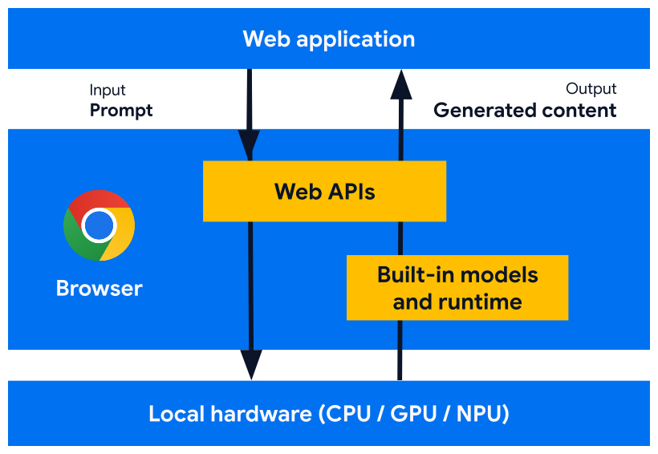
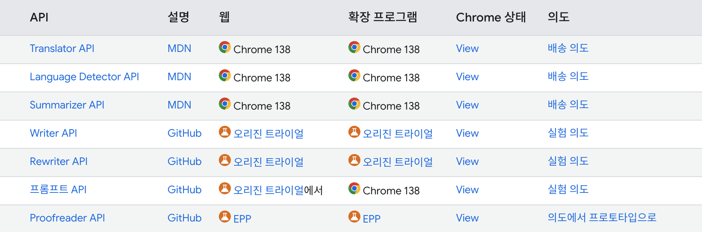

## Chrome Built‑in AI란?

Chrome 브라우저에 내장된 Gemini Nano 및 Expert Models(특정 작업에 최적화된 소형 AI 모델)를 활용해 브라우저 내부에서 AI 기능을 로컬로 실행하는 기능

→ Web App 또는 Extension에서 별도 서버 없이 AI 기반 작업 가능

## Built-in AI의 이점

### 배포 용이성

- 브라우저가 **각 기기의 성능에 맞게 모델을 배포**하고, **업데이트도 자동으로 관리**
- AI 모델 관리 부담 → Chrome이 처리
- 다음과 같은 **복잡한 운영 과제들을 고려하지 않아도 됨**
  - **Storage eviction**: 저장공간이 부족할 때 모델을 지울지 유지할지 결정하는 로직
  - **Runtime memory budget**: 사용자의 기기 메모리 상황에 맞게 AI 모델 크기 조절
  - **Serving costs**: 서버에서 AI inference를 돌릴 때 발생하는 비용

### 민감한 데이터의 로컬 처리

- 데이터를 서버로 보내지 않고 AI 기능을 제공할 수 개인정보 보호 확보

### 빠른 사용자 경험

- Client - Server round trip 지연 시간을 단축

### AI 접근성 향상

- 클라이언트-서버 하이브리드 구조
- 사용자의 기기에서 일부 연산을 부담하여 서버 부하를 분산
- 그 대가로 사용자에게 더 많은 기능을 제공
  - 예: 유료 기능을 클라이언트 사이드 AI를 통해 무료 체험의 형태로 보여줌

### 오프라인 AI 사용

- 사용자가 인터넷에 연결되어 있지 않아도 AI 기능에 액세스 가능
- 오프라인 또는 연결 상태에 관계없이 예상대로 작동
- 서버 사이드 AI의 fallback 으로써 사용될 수 있음

## 기본 동작 구조



- **Gemini Nano (LLM)** + **Task-specific Expert Models**
- JavaScript API를 통한 호출 (Summarizer, Translator, LanguageDetector, LanguageModel)
- 사용자의 입력을 받아 **기기 내 모델에서 즉시 추론 실행**

### API 종류



- Chrome Stable / Origin Trial / EPP
  - Chrome AI API의 접근 권한과 실험 범위를 구분
  - 인증 혹은 정해진 도메인에서 테스트할 수 있게 해주거나, 베타 프로그램에 신청해야하는 차이가 있음

## 사용해보기

- **OS**: Windows 10/11, macOS 13+ Ventura, 또는 Linux (모바일 미지원)
- **스토리지**: Chrome 프로필이 있는 드라이브에 **22 GB 이상 여유 공간 필요**
- **GPU VRAM**: 4 GB 이상

### 웹페이지 요약 Chrome Extension

```json
// manifest.json

{
  "manifest_version": 3,
  "name": "Page Summarizer",
  "version": "1.0",
  "description": "Summarize the current page using Chrome Built-in AI",
  "permissions": ["activeTab", "scripting"],
  "action": {
    "default_popup": "popup.html",
    "default_title": "Summarize this page"
  },
  "host_permissions": ["<all_urls>"]
}
```

```html
<!-- popup.html -->

<!DOCTYPE html>
<html>
  <head>
    <meta charset="utf-8" />
    <title>Page Summarizer</title>
    <style>
      body {
        font-family: "Segoe UI", sans-serif;
        margin: 20px;
        background-color: #f9f9f9;
        color: #333;
        width: 600px; /* 고정 너비 */
      }

      h3 {
        margin-top: 0;
        font-size: 20px;
        border-bottom: 2px solid #ddd;
        padding-bottom: 4px;
      }

      #summarize {
        width: 100%;
        padding: 8px 16px;
        font-size: 14px;
        background-color: #007bff;
        color: white;
        border: none;
        border-radius: 4px;
        cursor: pointer;
        margin-bottom: 12px;
      }

      #summarize:hover {
        background-color: #0056b3;
      }

      #output {
        background: #fff;
        border: 1px solid #ccc;
        padding: 12px;
        border-radius: 4px;
        max-height: 400px;
        overflow-y: auto;
        font-size: 14px;
        line-height: 1.5;
        white-space: pre-wrap; /* 줄바꿈 허용 */
        word-wrap: break-word; /* 단어 단위로 줄바꿈 */
        box-sizing: border-box;
      }
    </style>
  </head>
  <body>
    <h3>Summarizer</h3>
    <button id="summarize">요약하기</button>
    <pre id="output">요약을 시작하려면 버튼을 클릭하세요.</pre>
    <script src="popup.js"></script>
  </body>
</html>
```

```js
// popup.js

// https://developer.chrome.com/docs/ai/summarizer-api
document.getElementById("summarize").addEventListener("click", async () => {
  const output = document.getElementById("output");
  output.textContent = "요약 중입니다...";

  try {
    // <article /> 내용을 가져오기
    const [tab] = await chrome.tabs.query({
      active: true,
      currentWindow: true,
    });
    const [{ result: articleText }] = await chrome.scripting.executeScript({
      target: { tabId: tab.id },
      func: () => document.querySelector("article")?.innerText || "",
    });

    // Summarizer 지원 여부 검사
    if (!("Summarizer" in self)) {
      output.textContent = "Summarizer API를 지원하지 않는 환경입니다.";
      return;
    }

    // Summarizer 옵션 정의
    const options = {
      type: "tldr", // key-points, tldr, teaser, headline
      format: "markdown", // markdown, plain-text
      length: "medium", // short, medium, long
      monitor(m) {
        m.addEventListener("downloadprogress", (e) => {
          console.log(`Downloaded ${e.loaded * 100}%`);
        });
      },
    };

    // Summarizer 상태 확인
    const availibility = await Summarizer.availability();
    if (availibility === "unavailable") {
      output.textContent = `요약 모델 준비 안됨: ${availibility}`;
      return;
    }

    // Summarizer 초기화 및 요약
    const summarizer = await Summarizer.create(options);
    const summary = await summarizer.summarize(articleText);

    output.textContent = summary;
    console.log("[Summarizer] 요약:", summary);
  } catch (e) {
    output.textContent = "에러 발생: " + e.message;
    console.error("[Summarizer]", e);
  }
});
```

| 유형           | 의미                                                                                        |
| -------------- | ------------------------------------------------------------------------------------------- |
| `"tldr"`       | 요약은 짧고 요점을 제시하여 바쁜 독자에게 적합한 입력에 대한 간략한 개요를 제공해야 합니다. |
| `"teaser"`     | 요약은 입력의 가장 흥미로운 부분에 초점을 맞춰 독자가 더 많이 읽도록 유도해야 합니다.       |
| `"key-points"` | 요약은 입력에서 가장 중요한 사항을 추출하여 글머리 기호 목록으로 표시해야 합니다.           |
| `"headline"`   | 요약에는 입력의 핵심 사항이 기사 제목 형식으로 하나의 문장에 효과적으로 포함되어야 합니다.  |

<video src="./video-1.mov"></video>

### 실무에 적용

- 사내 툴이나 어드민에의 간단한 적용
- Summarizer Extension

## 한계

- 일부 API는 Origin Trial 또는 EPP 대상
- 로컬 추론 특성상 성능은 기기 사양에 따라 달라질 수 있음
- 첫 실행 시 약 2~3GB 이상의 모델 다운로드가 발생하며, 전체적으로 22GB 여유 공간 요구
- 데스크톱 Chrome 환경에서만 지원 (모바일 OS 미지원)
  - Google은 브라우저 간 호환성을 보장하기 위해 표준화하는 것이 목표
    > Google의 [API 제안](https://github.com/WICG/proposals/issues/163)은 커뮤니티의 지원을 받았으며 추가 논의를 위해 [W3C Web Incubator Community Group](https://wicg.io/)으로 이동했습니다. Chrome팀은 [W3C 기술 아키텍처 그룹](https://github.com/w3ctag/design-reviews/issues/991)에 의견을 요청하고 [Mozilla](https://github.com/mozilla/standards-positions/issues/1067)와 [WebKit](https://github.com/WebKit/standards-positions/issues/393)에 표준 입장을 문의했습니다.

## Reference

- https://developer.chrome.com/docs/ai/built-in?hl=ko
- https://developer.chrome.com/docs/ai?hl=ko
