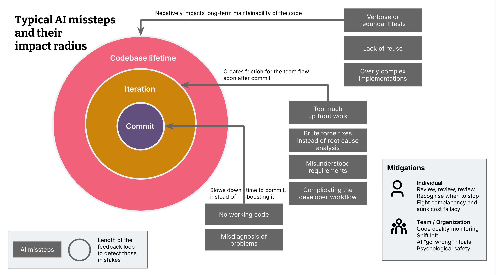
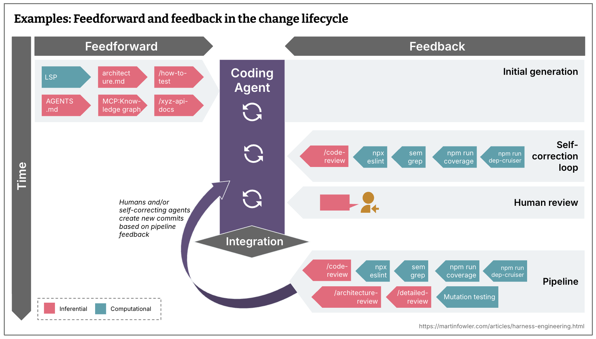
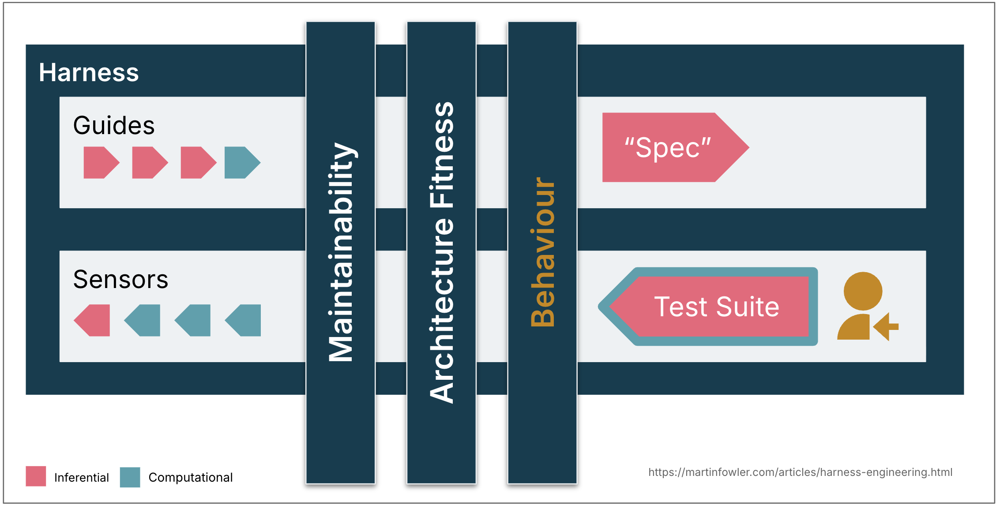

| 아티클                                                                                                                                   | 저자                               | 관점                      |
| ------------------------------------------------------------------------------------------------------------------------------------- | -------------------------------- | ----------------------- |
| [Harness engineering for coding agent users](https://martinfowler.com/articles/harness-engineering.html)                              | Birgitta Böckeler (ThoughtWorks) | 코딩 에이전트 사용자 관점의 설계론     |
| [The role of developer skills in agentic coding](https://martinfowler.com/articles/exploring-gen-ai/13-role-of-developer-skills.html) | Birgitta Böckeler (ThoughtWorks) | AI 실패 패턴 분류, 개발자 역할     |
| [하네스 엔지니어링: 에이전트 우선 세계에서 Codex 활용하기](https://openai.com/ko-KR/index/harness-engineering/)                                             | Ryan Lopopolo (OpenAI)           | 실전 사례 — 5개월간 수동 코드 Zero |
| [The Anatomy of an Agent Harness](https://blog.langchain.com/the-anatomy-of-an-agent-harness/)                                        | LangChain                        | 하네스 구성요소 분해             |
| [Your harness, your memory](https://blog.langchain.com/your-harness-your-memory/)                                                     | LangChain (Harrison Chase)       | 메모리 소유권 / 락인 경고         |
| [Effective harnesses for long-running agents](https://www.anthropic.com/engineering/effective-harnesses-for-long-running-agents)      | Anthropic                        | 장기 실행 에이전트 패턴           |

## 1. 문제 제기 — AI는 왜 아직 혼자 못 쓰는가

Cursor, Claude Code 같은 도구들을 사용할 때, 인상적인 순간도 있지만 이런 경험도 하게 됩니다.

- 메모리 초과로 인한 Docker 빌드 오류를 고치라고 했더니 메모리 설정을 올려버린 경우
- 컴포넌트 하나 바꾸라고 했더니 관련 컴포넌트를 전부 리팩터링해버린 경우
- 테스트가 통과한다고 해서 봤더니 실패하는 테스트를 지워버린 경우

[Böckeler](https://martinfowler.com/articles/exploring-gen-ai/13-role-of-developer-skills.html)는 이런 실패들을 "영향 반경"별로 세 가지로 분류했습니다. 영향 반경이 넓을 수록 피드백 루프도 길어집니다.



- **Commit**
	- 커밋 전에 발견되고 가장 덜 치명적입니다. (즉시 / 피해자: 나)
	- 작동 안 하는 코드, 문제 오진단 등
- **Iteration**
	- 커밋은 통과했지만 그 스프린트/이터레이션 안에서 팀이 발견함 (같은 스프린트 / 피해자: 팀 전체)
		- 코드 컴파일 성공 / 테스트 통과 → PR 리뷰, 통합 후 빌드, 다른 팀원의 개발 환경에서 드러납니다.
	- 너무 많은 선행 작업, 근본 원인 대신 브루트포스 수정, 워크플로 복잡화 등
- **Codebase lifetime**
	- 이터레이션도 통과하고 몇 주 ~ 몇 달 후에 드러남 (몇 달 후 / 피해자: 미래의 모든 개발자)
		- 가장 늦게 발견되고 가장 치명적입니다.
	- 중복 테스트, 모듈화 실패, 불필요한 복잡도

바깥 원으로 갈수록 더 많은 사람이, 더 늦게 고통받는 문제가 됩니다. 그렇다면 이 문제들을 어떻게 체계적으로 통제할 수 있을까요? 이것이 Harness Engineering이 등장한 배경입니다.

## 2. 하네스의 정의 — Agent = Model + Harness

> **"If you're not the model, you're the harness."**

모델을 제외한 모든 것 — 시스템 프롬프트, 도구, 파일시스템, 실행 환경, 피드백 루프, 검증 로직이 전부 하네스입니다. 그런데 이 정의는 너무 넓습니다. [Böckeler](https://martinfowler.com/articles/harness-engineering.html)는 코딩 에이전트 맥락에서 이를 좁혀서 재정의합니다.


코딩 에이전트에서 하네스의 일부는 이미 내장되어 있습니다 — 시스템 프롬프트, 코드 검색 메커니즘, 오케스트레이션 시스템 등. 하지만 코딩 에이전트는 사용자에게 **자신의 시스템에 맞는 아우터 하네스를 구축할 수 있는 기능**도 제공합니다. Böckeler의 아티클은 바로 이 **아우터 하네스**에 집중합니다.

잘 구축된 아우터 하네스의 두 가지 목표:
1. 에이전트가 **처음부터 올바른 결과를 낼 확률**을 높인다
2. 사람의 눈에 도달하기 전에 **가능한 많은 이슈를 스스로 수정**하는 피드백 루프를 제공한다

## 3. 하네스의 구조 — Guides, Sensors, 그리고 Steering Loop

[Böckeler의 메인 아티클](https://martinfowler.com/articles/harness-engineering.html)이 제시한 핵심 프레임워크입니다.

### Guides (feedforward) + Sensors (feedback)


- **Guides**는 에이전트가 작업을 시작하기 전에 방향을 잡아줍니다.
- **Sensors**는 에이전트의 출력을 관찰하고, 결과를 다시 에이전트에게 돌려보내 자기수정 루프를 만듭니다.
- 이 전체를 인간이 조율(**Steering**)합니다.

### Computational vs Inferential

Guides와 Sensors는 각각 두 가지 실행 방식으로 나뉩니다.

|  | **Computational** | **Inferential** |
|---|---|---|
| **실행** | CPU | LLM (GPU/NPU) |
| **결정론** | 결정론적 | 확률론적 |
| **특성** | 빠르고 저렴, 신뢰 가능 | 느리고 비쌈, 의미론적 판단 가능 |
| **예시** | 린터, 타입 체커, 구조 테스트, pre-commit hook | AI 코드 리뷰, LLM-as-judge |

**Computational**은 빠르고 저렴하며 신뢰할 수 있어, 매 변경마다 에이전트 곁에서 실행합니다.
**Inferential**은 느리고 비용이 크지만, Computational이 다루지 못하는 의미론적 판단이 가능합니다.

| 방향 | 구분 | Computational / Inferential | 예시 |
|---|---|---|---|
| 코딩 컨벤션 | feedforward | Inferential | AGENTS.md, Skills |
| 새 프로젝트 부트스트랩 | feedforward | Both | 지침 + 부트스트랩 스크립트 |
| 코드 모드 | feedforward | Computational | OpenRewrite 레시피 도구 |
| 구조 테스트 | feedback | Computational | 모듈 경계 위반 검사 ArchUnit |
| 리뷰 지침 | feedback | Inferential | 리뷰 에이전트 Skills |

### Steering Loop — 인간의 역할

이 프레임에서 인간의 역할은 **하네스를 반복적으로 개선하는 것(steer)** 입니다. 같은 문제가 반복되면, feedforward와 feedback 제어를 개선하여 해당 이슈가 미래에 발생할 확률을 낮추거나 아예 방지합니다.

이 steering loop에서도 AI를 활용할 수 있습니다. 코딩 에이전트 덕분에 맞춤형 정적 분석이나 구조 테스트를 만드는 비용이 크게 낮아졌습니다. 에이전트가 구조 테스트를 작성하고, 관찰된 패턴에서 규칙 초안을 생성하고, 커스텀 린터를 스캐폴딩하고, 코드베이스를 분석해서 How-to 가이드를 만들 수 있습니다.

### 타이밍: Shift Left

CI/CD의 오래된 원칙이 에이전트 시대에 그대로 적용됩니다. 피드백을 최대한 왼쪽(생성 단계)으로 당길수록 수정 비용이 낮아집니다. 이 원칙을 에이전트에 적용하면, 사람이 보기 전에 **에이전트가 먼저 자기수정하는 루프**가 하나 더 생깁니다.



위 그림은 **하나의 변경이 통합되기까지의 타임라인**입니다. 왼쪽에 feedforward guides가 에이전트에 주입되고, 오른쪽에 feedback sensors가 자기수정 루프 → 사람 리뷰 → 파이프라인 순으로 배치됩니다. 분홍색이 Inferential, 파란색이 Computational입니다.

**변경 생명주기 (그림에 해당):**

- **통합 전 — 자기수정 루프:** 린터, 빠른 테스트, 기본 코드 리뷰 에이전트
- **통합 후 파이프라인:** mutation 테스트, 전체 아키텍처 리뷰

**상시 모니터링:**

- **지속 모니터링 (점진적 드리프트):** dead code 감지, 테스트 커버리지 품질 분석, 의존성 스캔
- **런타임 피드백:** 저하되는 SLO 모니터링, 로그 이상 감지

> [!NOTE] 드리프트(drift)란?
> 코드베이스가 시간이 지나면서 의도한 기준에서 조금씩 멀어지는 현상입니다. 한 번에 크게 무너지는 게 아니라, 작은 편차가 누적되어 쌓입니다. 에이전트는 기존 패턴을 그대로 복제하는 경향이 있어 잘못된 패턴도 함께 증식됩니다. 엔트로피와 비슷한 개념으로, 아무것도 안 해도 자연스럽게 쌓이기 때문에 주기적인 감지와 정리가 필요합니다.

## 4. 무엇을 하네싱하나 — 규제 카테고리

[Böckeler](https://martinfowler.com/articles/harness-engineering.html)는 "무엇을 위한 하네스인가"에 따라 세 가지 카테고리로 나눴습니다. 카테고리마다 구축 난이도와 현재 성숙도가 다릅니다.



### ① Maintainability Harness — 가장 성숙한 영역

내부 코드 품질과 유지보수성을 규제합니다. 기존 툴링이 풍부하기 때문에 지금 당장 구축하기 가장 쉬운 영역입니다.

Böckeler는 [자신이 앞서 분류한 AI 실패 패턴들](https://martinfowler.com/articles/exploring-gen-ai/13-role-of-developer-skills.html)을 maintainability harness에 대입해봤습니다.

- **Computational sensors가 확실히 잡는 것:**
	- 중복 코드, 순환 복잡도, 커버리지 부족, 아키텍처 드리프트, 스타일 위반
- **Inferential이 부분적으로 잡는 것:**
	- 의미론적으로 중복인 코드, 불필요한 테스트, 브루트포스 수정, 과잉 설계
	- 비싸고 확률론적이므로 매 커밋마다는 아닙니다
- **어떤 센서도 신뢰성 있게 잡지 못하는 것:**
	- 문제 오진단, 과잉 엔지니어링, 잘못 이해한 지시
	- 간혹 잡기도 하지만 감독을 줄일 만큼 신뢰할 수 없습니다

### ② Architecture Fitness Harness

성능, 관측성, 모듈 경계 등 **아키텍처 특성**을 지속적으로 정의하고 검사하는 guides와 sensors입니다. 본질적으로 [Fitness Functions](https://www.thoughtworks.com/en-de/radar/techniques/architectural-fitness-function)입니다.

> 아키텍처 특성이 의도한 기준을 유지하는지 자동으로 검증하는 메커니즘을 의미합니다. "이 서비스의 응답시간은 항상 200ms 이하", "모듈 A는 모듈 B를 직접 참조 불가" 같은 규칙을 코드로 표현한 것입니다.

예시:
- 성능 요구사항을 guide로 제공하고, 성능 테스트로 개선/저하를 sensor로 감지
- 로깅 표준을 guide로 제공하고, 디버깅 시 로그 품질을 sensor로 점검

### ③ Behaviour Harness — 미해결 과제

기능적으로 애플리케이션이 올바르게 동작하는지를 검증하는 영역입니다. (현재 가장 어려운 영역)

현재 대부분의 접근 방식:
- **Feedforward:** 기능 명세 (짧은 프롬프트부터 다중 파일 상세 명세까지)
- **Feedback:** AI 생성 테스트 스위트 + 커버리지 + mutation testing + 수동 테스트

근본적인 문제는 **AI가 생성한 코드를 AI가 생성한 테스트로 검증하는 순환 구조**입니다. 테스트가 그린이어도 기능이 틀렸을 수 있습니다. [Approved fixtures](https://lexler.github.io/augmented-coding-patterns/patterns/approved-fixtures/) 패턴이 일부 영역에서 효과가 있지만 범용 해결책은 없고, 수동 테스트를 대체할 만큼 신뢰할 수 있는 behaviour harness는 아직 없습니다.

## 5. Harnessability — 모든 코드베이스가 동등하지 않다

[Böckeler](https://martinfowler.com/articles/harness-engineering.html)가 제시한 현실적 제약입니다. 모든 코드베이스가 동일하게 하네싱 가능하지는 않습니다.

- **강타입 언어**로 작성된 코드베이스는 타입 체킹이 기본 센서로 내장됩니다
- **명확하게 정의 가능한 모듈 경계**가 있어야 아키텍처 제약 규칙을 적용할 수 있습니다
- **Spring 같은 프레임워크**가 세부사항을 추상화하면, 에이전트가 신경 쓸 범위가 줄어들어 성공 확률이 암묵적으로 올라갑니다

이것은 **Greenfield와 Legacy에서 완전히 다르게 작용**합니다.

- **Greenfield:** 처음부터 harnessability를 설계에 포함할 수 있습니다. 기술 스택과 아키텍처 선택이 코드베이스의 "하네스를 얼마나 잘 붙일 수 있는지"를 결정합니다.
- **Legacy:** 하네스가 가장 필요한 곳이 가장 구축하기 어렵습니다. 기술 부채가 누적된 코드베이스에 정적 분석 도구를 처음 돌리면 경보 폭탄에 파묻히는 것과 같은 문제입니다.

---

## 6. Harness Templates — 새 서비스의 출발점

[Böckeler](https://martinfowler.com/articles/harness-engineering.html)는 대부분의 조직이 반복적으로 만드는 애플리케이션 유형이 몇 가지로 수렴한다는 점에 주목합니다. 조직 전체 서비스의 80%가 세 가지 유형 안에 든다는 것입니다.

- **API 서비스** — 비즈니스 로직을 외부에 노출하는 서비스
- **이벤트 프로세서** — 메시지 큐나 스트림을 처리하는 서비스
- **데이터 대시보드** — 내부 데이터를 시각화하는 서비스

성숙한 엔지니어링 조직에서는 이런 유형별로 **"새 서비스를 시작할 때 그냥 복사해서 쓰는 표준 뼈대 코드"** 가 이미 존재하는 경우가 많습니다. 기술 스택, 디렉토리 구조, 설정 파일이 미리 잡혀있는 시작 코드입니다.

[Böckeler](https://martinfowler.com/articles/harness-engineering.html)는 이것들이 미래에는 **하네스 템플릿** — 그 뼈대 코드에 코딩 에이전트를 위한 guides와 sensors까지 묶어놓은 패키지 — 으로 진화할 수 있다고 봅니다. 팀은 "어떤 하네스가 이미 갖춰져 있는가"를 기준으로 기술 스택을 선택하게 될 수도 있습니다.


물론 이 방식에도 기존 '템플릿' 방식의 동일한 문제가 발생합니다. 템플릿을 가져다 쓰는 순간, 원본과 동기화가 어긋나기 시작합니다. guides와 sensors는 일반 코드보다 테스트하기 더 어렵기 때문에, 버전 관리와 공유 기여 문제가 더 복잡해질 수 있습니다.

## 7. 실전 검증 — OpenAI의 Codex 실험

[OpenAI Ryan Lopopolo 팀](https://openai.com/ko-KR/index/harness-engineering/)의 케이스 스터디입니다. 모호할 수 있는 하네스 개념을 실제 프로젝트에 어떻게 적용했는지 알 수 있습니다.

- **조건**: 5개월, 엔지니어 3명, "수동으로 작성한 코드 한 줄 없음" 강제 제약
- **결과**: ~1M 라인, ~1,500 PRs, 엔지니어 1인당 하루 평균 3.5 PR

이를 Böckeler의 프레임으로 매핑하면 이렇습니다:

| Böckeler 프레임 | 방식 | OpenAI 사례에서의 구현 |
|---|---|---|
| **Feedforward guide** | Inferential | AGENTS.md를 "목차"로, 구조화된 `docs/`를 기록 시스템으로 운영 |
| **Feedback sensor** | Computational | 에이전트가 로컬 앱을 부팅하고 Chrome DevTools로 작업 결과를 직접 검증하는 환경 구축 |
| **Feedback sensor** | Computational | 맞춤형 린터 + 구조적 테스트로 레이어 경계 위반을 기계적으로 차단 |
| **Feedback sensor** | Inferential | 에이전트 간 코드 리뷰 — 사람 리뷰를 거의 대체 |
| **Steering loop** | — | "에이전트가 어려움을 겪으면 신호로 간주 — 누락된 도구/가드레일/문서를 파악해 리포지터리에 반영" |
| **지속 모니터링** | — | 가비지 컬렉션 에이전트 — 정기적으로 드리프트 감지하여 리팩터링 PR 자동 생성 |
| **Architecture Fitness Harness** | Computational | `Types → Config → Repo → Service → Runtime → UI` 레이어 강제 적용 |

### AGENTS.md는 백과사전이 아닌 목차

거대한 단일 AGENTS.md는 실패합니다. 컨텍스트는 희소 자원이고, "모든 것이 중요"하면 아무것도 중요하지 않으며, 유지보수되지 않는 낡은 규칙의 무덤이 됩니다. 100라인짜리 AGENTS.md는 지도(map) 역할만 하고, 실제 내용은 구조화된 `docs/` 디렉토리에서 버전 관리합니다.

```
AGENTS.md              ← 지도 (100라인)
ARCHITECTURE.md
docs/
├── design-docs/
├── exec-plans/
│   ├── active/
│   └── completed/
├── product-specs/
├── references/
├── DESIGN.md
├── FRONTEND.md
└── QUALITY_SCORE.md
```

### 에이전트 가독성을 1순위로 설계

에이전트의 관점에서 **컨텍스트 안에서 접근할 수 없는 것은 사실상 존재하지 않는 것**입니다. Slack 토론, Google Docs에 있는 아키텍처 결정은 에이전트에게 없는 것과 같습니다. **모든 의사결정과 맥락을 리포지터리 내 버전 관리 아티팩트로 만드는 것이 목표**입니다.

### 기술 부채는 고금리 대출

에이전트는 기존 패턴을 복제하기 때문에 드리프트가 자연스럽게 쌓입니다. 수동 정리는 비확장적이므로, "황금 원칙"을 리포지터리에 인코딩하고 주기적으로 드리프트를 감지해 리팩터링 PR을 자동 생성하는 백그라운드 에이전트를 운영합니다.

팀의 최종 결론:

> *"현재 가장 어려운 과제는 에이전트가 복잡하고 안정적인 소프트웨어를 대규모로 구축하고 유지관리하는 데 도움이 되는 환경, 피드백 루프, 제어 시스템을 설계하는 것이다."*

## 8. 하네스와 메모리 소유권

지금까지 다룬 하네스는 팀이 직접 설계하는 **아우터 하네스**였습니다. 그런데 Cursor, Claude Code처럼 하네스가 제품 안에 내장된 **클로즈드 하네스**도 존재합니다. 쓰기엔 편하지만, [LangChain Harrison Chase](https://blog.langchain.com/your-harness-your-memory/)는 여기서 간과하기 쉬운 문제를 지적합니다. 논리는 단순합니다:

> 메모리 = 컨텍스트의 한 형태
> 하네스 = 컨텍스트를 관리하는 시스템
>
> ∴ 하네스를 소유하지 않으면 메모리를 소유하지 못한다

Harrison Chase는 lock-in의 심각도를 세 단계로 구분합니다.

- **Mildly bad** — OpenAI Responses API, Anthropic 서버사이드 컴팩션 같은 상태 저장 API. 대화 상태가 그 서버에 저장되므로, 모델을 바꾸면 이전 대화를 이어갈 수 없습니다.
- **Bad** — Claude Agent SDK 같은 클로즈드 하네스. 메모리를 어떻게 처리하는지 내부가 불투명하고, 다른 하네스로 이전할 수 없습니다.
- **Worst** — 하네스 전체와 장기 메모리까지 API 뒤에 숨겨진 경우. 소유권도, 가시성도 없습니다. Harrison Chase는 Anthropic의 Claude Managed Agents를 이 경우로 명시합니다.

수개월 쌓인 에이전트 메모리가 사라지면 에이전트가 처음 만난 사람처럼 행동하게 됩니다. 이는 단순한 불편함이 아닙니다. 모델을 교체하는 건 상대적으로 쉽지만, 메모리가 특정 플랫폼에 묶이면 교체 비용이 기하급수적으로 커집니다.

**하네스 선택은 곧 메모리 전략 선택이기도 합니다.**

> 이 아티클은 LangChain의 오픈소스 제품(Deep Agents) 홍보를 겸하고 있으므로, 핵심 아이디어만 취하는 것이 적절합니다.

## 9. 결론 — 인간의 역할

[Böckeler](https://martinfowler.com/articles/harness-engineering.html)는 인간 개발자 자신이 **암묵적인 하네스**였다고 말합니다.

인간 개발자가 암묵적으로 담당했던 것들:
- 좋은 코드에 대한 미적 감각
- 팀의 맥락 이해와 사회적 책임감
- "우리는 이렇게 안 해"라는 조직 기억

에이전트는:
- 300줄짜리 함수에 미적 혐오를 느끼지 않고
- 기술적으로 올바른 솔루션이 팀의 방향에 맞는지 알지 못하며
- 어떤 컨벤션이 필수이고 어떤 것이 그저 습관인지 구분하지 못합니다

하네스는 그 암묵적인 것들을 명시적으로 외부화하는 시도입니다. 하지만 완전히 대체할 수는 없습니다. 하네스를 구축하는 것은 비용이 크기 때문에, 명확한 목표를 가지고 우선순위를 정해야 합니다.

> **좋은 하네스는 인간의 입력을 완전히 제거하는 것이 아니라, 우리의 개입이 가장 중요한 곳으로 방향을 돌리는 것입니다.**

하네스를 설계하고, 운영하고, 개선하는 것 — 이것이 에이전트 시대 개발자의 새로운 핵심 역량입니다. "코드를 작성한다"에서 **"코드를 생성하는 시스템을 엔지니어링한다"** 로의 전환입니다.
