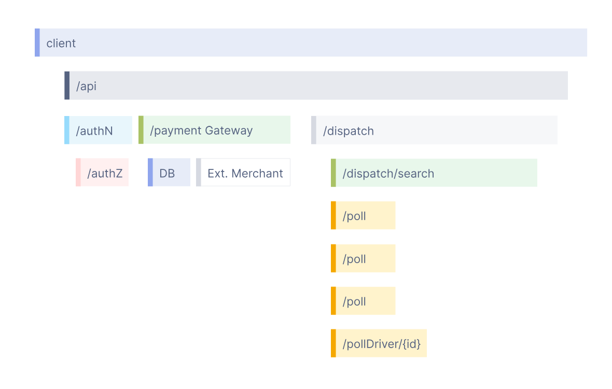
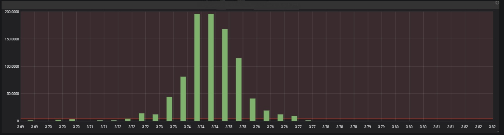
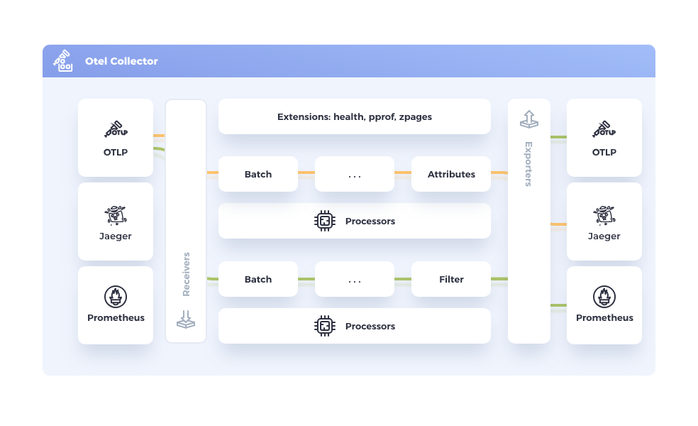

# OpenTelemetry란?

- OpenTelemetry는 애플리케이션의 **Observability**을 위한 표준화된 오픈 소스 프레임워크
- 벤더 중립적(vendor-neutral). 특정 모니터링 솔루션(예: Datadog, Prometheus 등)에 종속되지 않으며 프로그래밍 언어, 인프라, 런타임 환경에 구애받지 않고 쉽게 계측할 수 있도록 함
- 계측 및 전송만 담당: 계측한 데이터의 저장과 시각화의 책임은 의도적으로 분리되어있음

## Observability

- traces, metrics, logs를 포함한 측정 데이터를 검토하여 시스템의 내부 상태를 파악할 수 있는 능력
- 시스템을 관찰 가능하게 만들려면 계측(instrumented)이 필요
- 즉 애플리케이션 코드는 [traces](https://opentelemetry.io/docs/concepts/signals/traces/), [metrics](https://opentelemetry.io/docs/concepts/signals/metrics/), [logs](https://opentelemetry.io/docs/concepts/signals/logs/) 와 같은 [signals](https://opentelemetry.io/docs/concepts/signals/)를 방출해야 함

## Signals

플랫폼에서 실행되는 OS · 애플리케이션의 기본 활동을 설명하는 시스템 출력

- **Trace**: “요청 1건의 여정” 전체를 묶는 상자. 시작부터 끝까지의 **관계/흐름**을 담는다.
- **Span**: 그 여정 속의 **작업 단위 1개**. 시작·끝 시각, 속성(메서드, 라우트, 상태코드 등), 이벤트, 링크를 가진다.
- **Metric**: 시스템이 **지속적으로 집계**하는 수치 스트림. 초당 요청수, 지연시간 히스토그램, 에러율 등.

### Traces



#### 기본 개념

- 분산된 마이크로서비스 아키텍처에서 하나의 요청이 여러 서비스를 거쳐 처리되는 과정을 시각적으로 연결해주는 데이터
- 요청의 병목 지점이나 오류 발생 위치를 쉽게 찾아낼 수 있음

#### Spans

- 작업 또는 연산의 단위. 함수 호출 · HTTP 요청 등
- Traces는 여러 Spans를 모은 트리 구조로 구성됨

#### Context Propagation

- 컨텍스트 전파를 통해 **각 플랫폼에서 발생한 Span을 동일한 Trace에 묶어줄** 수 있음 => 분산 트레이싱
  - 클릭 → API 요청 → DB 쿼리까지
  - [W3C Trace Context](https://www.w3.org/TR/trace-context/)
- Span이 같은 `traceId`를 공유함

### Metrics



#### 기본 개념

- **숫자 지표(time-series data)**
  - 특정 시점에서의 수치 값을 시간 축으로 계속 기록하는 것.
  - 예: 요청 수, 에러율, 응답 지연 시간, 메모리 사용량 등.
- 집계된 패턴을 보기 좋음 => **시스템 전체 상태를 숫자로 관찰**

#### 구성 요소 (Instrument)

- Counter
  - 증가만 하는 지표
  - 예시
    - **트래픽 측정**: HTTP 요청 수(http.server.requests)
    - **성공/실패 카운트**: error.count, login.success.count
- UpDownCounter
  - 예시
    - **활성 세션 수**: 로그인/로그아웃 시 ±1
    - **동시 연결 수**: 웹소켓/DB 커넥션 카운트
- Histogram
  - 값의 분포(distribution)를 기록하는 도구. 평균, 최소, 최대뿐만 아니라 p90, p95, p99 같은 백분위 추출이 가능
  - SLA 모니터링(p95, p99)이나 성능 병목 지점을 파악할 때 중요
  - 예시
    - **지연 시간 분포**: HTTP 응답 시간(http.server.duration)
    - **페이로드 크기**: 요청/응답 body size
- Gauge
  - 현재 상태를 직접 관찰해 기록하는 계기
  - 예시
    - **시스템 리소스 상태**: CPU 사용률, 메모리 사용량
    - **서비스 상태**: 캐시 hit ratio 등

#### Traces와의 차이점

- Trace
  - 특정 요청이 어떻게 흘렀는가 (개별 사건 단위)
  - 예시: 특정 사용자 요청이 DB에서 1.5초 걸렸다.
- Metrics
  - 시스템 전체가 어떻게 흘러가고 있는가 (숫자 집계)
  - 예시: 지난 5분 동안 평균 DB 지연은 120ms, p95는 400ms였다.
- Exemplar 를 사용하면 Metric - Trace 연계도 가능
  - 그래프의 특정 점에서 트레이스로 점프

## Collector



- 애플리케이션에서 출력한 telemetry를 **받고(receivers) → 가공(processors) → 내보내는(exporters)** 파이프라인 허브
- 샘플링 · 정규화 · 민감정보 마스킹 같은 공통 처리를 중앙화
- 별도의 플랫폼(인프라 레벨, 외부 프로세스)에 띄워져있고, 애플리케이션레벨에서 해당 Endpoint로 전송
  - OTLPTraceExporter, OTLPMetricExporter

# Next.js 애플리케이션 계측하기

## instrumentation.ts

- 새 서버 인스턴스가 시작될 때 단 한 번 호출됨
- 이 시점에 **글로벌 Provider 등록**, **자동계측 활성화(얇은 래핑)**, **Exporter 설정**이 이루어짐

```ts
// instrumentation.ts
export async function register() {
  if (process.env.NEXT_RUNTIME === 'nodejs') {
    await import('./instrumentation.node.ts')
  }
}

// instrumentation.node.ts
import { ... }

const sdk = new NodeSDK({
  resource: new Resource({
    [ATTR_SERVICE_NAME]: 'next-app',
  }),
  spanProcessor: new BatchSpanProcessor(new OTLPTraceExporter()),
  instrumentations: [
    new HttpInstrumentation(),
    new UndiciInstrumentation(),
  ],
  metricReader: new PrometheusExporter(),
})

sdk.start()
```

- **Resource**: service.name을 next-app으로 고정 → 이 값으로 Grafana/Trace 백엔드에서 식별됨.
- **BatchSpanProcessor**: 스팬을 일정 주기로 전송 (SimpleSpanProcessor 대비 네트워크 효율 ↑)
- **Trace Exporter**: OTLPTraceExporter() → Collector나 OTLP 호환 백엔드로 Trace 데이터 전송
- **Instrumentations**:
  - HttpInstrumentation: Node 기본 HTTP 요청/응답 자동 트레이싱
  - UndiciInstrumentation: fetch API(Node 18+) 트레이싱
- **MetricReader**: PrometheusExporter() → Prometheus Server가 9464 포트로 메트릭 pull 해서 가져감

## Next.js의 기본 Span

- `next.span_name`
- `next.route` (예: `/[param]/user`)
- `next.page` 등

```ts
// https://github.com/vercel/next.js/blob/43d4532a32f8b92aa0efcad2867f8f38a9f70eda/packages/next/src/server/next-server.ts#L845-L851
return getTracer().trace(
  NextNodeServerSpan.findPageComponents,
  {
    spanName: 'resolve page components',
    attributes: {
      'next.route': isAppPath ? normalizeAppPath(page) : page,
    },
  },
```

## 자동 계측의 실제 동작

- `new HttpInstrumentation()`으로 초기화하기만 해도 traces/metrics 가 수집됨
- 앱/런타임의 표준 라이브러리나 프레임워크를 **얇게 패치(wrap)** 해서 Span·Metrics를 자동 생성하기 때문

### HttpInstrumentation

- **Inbound**: Node의 http.createServer()/requestListener 경로를 가로채 **서버 수신 요청**마다 서버 Span을 시작하고, 메서드/경로/상태코드 같은 **HTTP Semantic Attributes**을 붙인다.
- **Outbound**: http.request/http.get(및 undici 계층)을 패치해 **외부 호출**마다 클라이언트 Span을 만든다. 필요 시 W3C Trace Context를 **헤더(traceparent, tracestate)**로 전파한다.
  - 초기화 시점에 Node의 HTTP 모듈 메서드를 **래핑** → 요청 시작/종료 시점에 Span start/end를 호출 → 표준 속성 채우기

# 마무리

- **Observability**를 위해 애플리케이션은 **traces · metrics · logs** 신호를 **방출**해야 한다.
- **Trace/Span**은 **요청 단위의 흐름·원인**을, **Metric**은 **시스템 상태·추세**를 보여준다.
- **OpenTelemetry**는 애플리케이션의 **계측/전송**을 하기 위한 오픈소스 프레임워크
- **W3C Trace Context**를 통해 서로 다른 시스템 간 분산 트레이싱이 가능
- 전송된 데이터를 처리할 애플리케이션 **외부**의 파이프라인 허브인 **Collector** 가 필요
- **Next.js**에서는 서버 기동 시 **instrumentation.ts가 1회 실행**되어 Global Provider 등록 · 자동계측 활성화 · Exporter 설정이 이루어짐

# 참고 링크

- https://opentelemetry.io/docs/what-is-opentelemetry/
- https://opentelemetry.io/docs/languages/js/
- https://github.com/open-telemetry/opentelemetry-js
- https://github.com/open-telemetry/opentelemetry-js-contrib
- https://nextjs.org/docs/app/guides/open-telemetry
- https://medium.com/@dudwls96/opentelemetry-%EB%9E%80-%EB%AC%B4%EC%97%87%EC%9D%B8%EA%B0%80-18b6e4fe6e36
