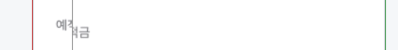

# Visual Snapshot Testing with Storybook

## Visual Test 란?

코드 변경이 UI에 영향을 미쳤는지 자동으로 감지하는 테스트 방식

## 왜 필요한가?

### UI 회귀(regression) 방지

- 공통 컴포넌트의 CSS 변경이 의도치 않게 다른 컴포넌트에 영향을 주는 경우가 다수
- 개발자가 인지하지 못한 변경 사항이 실서비스에 반영되어 사용자 혼란 유발
- 일반적으로 기능 테스트를 작성하더라도 UI 변경사항은 놓치는 경우가 많음

### PR 리뷰 시 신뢰할 수 있는 변경 검증 도구 제공

- PR에서 어떤 UI가 바뀌었는지 설명하지 않아도 자동으로 비교 이미지 제공
- 리뷰어는 스냅샷 diff만 보고 UI 변경을 확인 가능

## 기본 동작

Visual Snapshot Testing은 아래 세 가지 구성 요소를 통해 동작합니다.

- Storybook: 테스트 대상 UI 정의 (컴포넌트별 Story)
- Test Runner: 브라우저에서 Storybook을 탐색하고 각 Story를 렌더링
- jest-image-snapshot: 캡처된 이미지를 기존 스냅샷과 비교

### 흐름

1. Storybook을 실행하여 컴포넌트 렌더링
2. Playwright 기반 Test Runner가 페이지를 순회하며 스크린샷 캡처
3. jest-image-snapshot 매처로 baseline과 비교
    - pass / fail  판단

### 동작 예시

- diff_output에 저장되는 파일
  

- GitHub PR UI 상에서 표시
  


## 설정 방법

1. 패키지 설치
    ```bash
    yarn add -D @storybook/test-runner jest-image-snapshot
    ```

2. 테스트 러너 설정 (`.storybook/test-runner.ts`)
    ```ts
    import { type TestRunnerConfig, waitForPageReady } from "@storybook/test-runner";
    import { toMatchImageSnapshot } from "jest-image-snapshot";

    const customSnapshotsDir = `${process.cwd()}/__snapshots__`;

    const config: TestRunnerConfig = {
      setup() {
        expect.extend({ toMatchImageSnapshot });
      },

      async preVisit(page) {
        // 대표적인 기기 사이즈에 맞춰 세팅
        await page.setViewportSize({ width: 380, height: 1000 });

        // 동적인 애니메이션 요소 제거를 위한 스타일
        await page.addStyleTag({
          content: `
            .skeleton { visibility: hidden; }
            * { transition: none !important; animation: none !important; }
          `,
        })
      }

      async postVisit(page, context) {
        // test-runner가 image 등 불러오기를 기다리도록 함
        await waitForPageReady(page);

        // 스크린샷을 찍고 baseline과 비교
        expect(await page.screenshot()).toMatchImageSnapshot({
          customSnapshotsDir,
          customSnapshotIdentifier: context.id,
        });
      },
    };

    export default config;
    ```
    
3. 실행
    ```sh
    yarn test-storybook    # diff test
    yarn test-storybook -u # update snapshot
    ```
  

## 적용 팁

### 동적 요소 제거: transition, animation 등

```ts
await page.addStyleTag({
  content: `
    .skeleton { visibility: hidden; }
    * { transition: none !important; animation: none !important; }
  `,
})
```

- 타이밍에 따라 UI가 달라져서 diff noise를 발생 시키는 요소
- `preVisit` 레벨에서 사전 처리 가능

### 뷰포트 고정

```ts
await page.setViewportSize({ width: 380, height: 1000 });
```

- 스냅샷은 고정된 사이즈에서 찍어야 의미 있음
- 모바일 서비스의 경우 대표 뷰포트 사이즈로 설정
- 상황에 따라 데스크탑/모바일 별로 스냅샷 저장

### 허용 오차 설정

```ts
expect(image).toMatchImageSnapshot({
  failureThreshold: 0.01,
  failureThresholdType: "percent",
});
```

### Yarn PnP - Playwright 호환 이슈 (PlaywrightError)

```sh
yarn add -D playwright
yarn playwright install
```

### Component Testing

```tsx
// play function을 통해 사용자 상호작용 후 상태를 확인하는 테스트 작성도 가능
export const 기본: Story = {
  // ...

  async play({ canvasElement, step }) {
    await canvas.findByRole('button', { name: /충전/ });
  }
}
```

## 장점

- Storybook 기반 워크플로우에 자연스럽게 통합
    - Storybook 스토리가 문서이자 테스트 시나리오 역할
    - 기존에 Storybook을 잘 작성해 놓았다면 추가 설정 몇 줄만으로 쉽게 도입 가능
- [왜 필요한가?](#왜-필요한가?) 에서 설명한 바와 동일
    - 코드 수정 후 예상치 못한 UI 변경을 자동 감지
    - 로컬/CI 환경에서 빠른 피드백 루프 제공

## 한계

- 컴포넌트 테스트, 통합 테스트 등과 함께 서로 보완 필요
- False negative
- GitHub Actions 사용 시 자체 러너에 환경 구성 어려움
- Storybook 9 부터 vitest 기반 테스트 + Visual Tests addon 사용 권장 (Chromatic 기반)

## Reference

- https://github.com/storybookjs/test-runner/blob/next/README.md