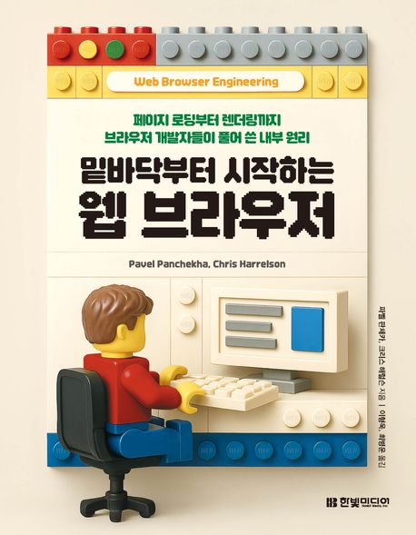
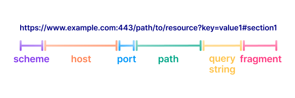
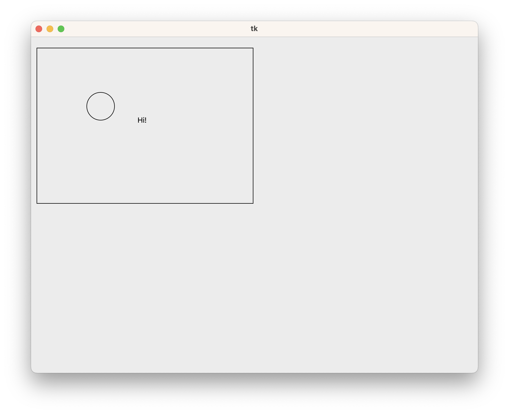
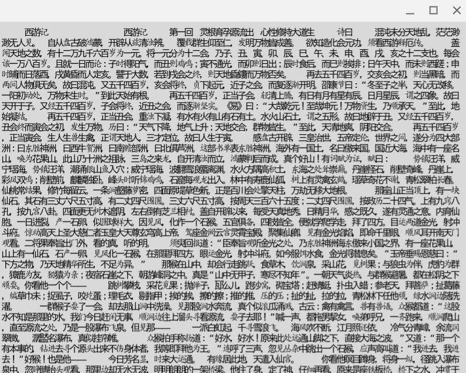
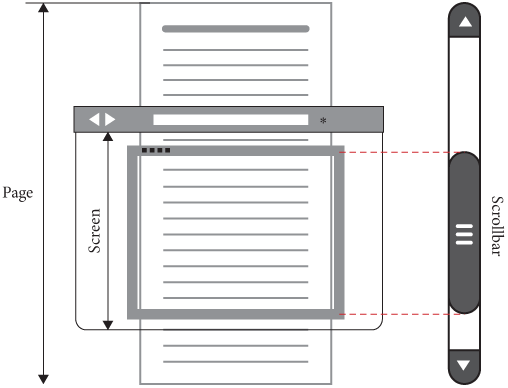

# 밑바닥부터 시작하는 웹 브라우저

## 책 소개



우리는 매일 브라우저 위에서 개발하지만, 브라우저 내부에서 어떤 과정이 일어나는지는 종종 “블랙박스”로 남아 있다. 이 책은 그 블랙박스를 열어, **네트워크 요청부터 렌더링, 스크롤, 자바스크립트 실행**까지 브라우저의 전체 파이프라인을 직접 구현해보게 만든다.

- **브라우저 동작을 코드로 체험**  
	- Python으로 간단한 브라우저를 직접 만든다. HTML 파싱, 레이아웃 계산, 텍스트 렌더링, 이벤트 처리까지 한 단계씩 구현하며 브라우저의 사고방식을 따라가게 된다.
- **프론트엔드 개발과의 연결**  
	- 실무에서 자주 겪는 퍼포먼스 이슈, Reflow/Repaint, 스크롤 지연, 스타일 계산 비용 등을 “왜 그런 문제가 발생하는지” 브라우저 시점에서 이해할 수 있다
- 빵빵한 저자 & 역자
	- 구글 Blink 팀, 네이버 웨일 개발팀, Webkit/Chromium 컨트리뷰터 등 실제 브라우저 엔진을 만드는 사람들이 쓰고 번역한 책

## 오늘 다룰 내용

1. **CH.1 웹페이지 다운로드**  
	- URL → TCP → HTTP → HTML 수신까지의 과정
	- 브라우저의 첫 단계인 네트워크 I/O 흐름을 코드로 확인한다.
2. **CH.2 화면에 그리기**  
	- 창 생성, 텍스트 배치, 스크롤, 간단한 렌더링 최적화까지 
	- 화면에 “무언가가 보이기”까지의 기본 렌더링 구조를 다룬다.

## CH.1 웹페이지 다운로드

### 1.1 서버에 연결하기

- 스킴: 어떻게 정보를 접근할 수 있는지
- 호스트: 어디에서 정보를 얻을 수 있는지
- 경로: 무슨 정보를 얻을 것인지

```sh
> telnet example.org 80
Trying 23.220.75.238...
Connected to example.org.
```
- DNS를 통해 IP를 얻어옴

### 1.2 정보 요청하기

```
GET /index.html HTTP/1.0
Host: example.org

```

- 실습 브라우저에서는 HTTP 1.0 만 구현 예정
- 첫 번째 줄 이후에는 줄마다 이름 - 값 (Host: example.org)로 이루어진 헤더가 위치
- 마지막 빈 줄로 헤더가 끝났음을 표시

### 1.3 서버의 응답

```
HTTP/1.0 200 OK
Content-Type: text/html
ETag: "bc2473a18e003bdb249eba5ce893033f:1760028122.592274"
Last-Modified: Thu, 09 Oct 2025 16:42:02 GMT
Cache-Control: max-age=86000
Date: Sun, 02 Nov 2025 12:34:01 GMT
Content-Length: 513
Connection: close
X-N: S

<!doctype html><html lang="en"><head><title>Example Domain</title>...
```

- 호스트가 HTTP/1.0으로 응답하고 있고 요청에 대해 200 OK로 확인했음을 알려줌
- 두 번째 줄부터는 헤더
- 헤더 뒤에 빈 줄이 있고, 서버 응답의 body가 이어짐

### 1.4 파이썬을 통한 텔넷

```python
import socket
import ssl

class URL:
    def __init__(self, url):
		    # URL 파싱
        self.scheme, url = url.split("://", 1)    # 스킴 구분
        assert self.scheme == "http"  

        if "/" not in url:
            url = url + "/"
        self.host, url = url.split("/", 1)        # host와 경로 구분
        self.path = "/" + url

    def request(self):
        # 운영체제에서 제공하는 소켓을 통해 호스트와 연결
        s = socket.socket(
            family=socket.AF_INET,    # 다른 컴퓨터를 찾는 방법을 알려주는 address family
            type=socket.SOCK_STREAM,  # 어떤 종류의 대화가 이루어질지 (SOCK_DGRAM 등)
            proto=socket.IPPROTO_TCP, # 두 컴퓨터가 연결을 설정하는 단계 (TCP, QUIC 등)
        )
        s.connect((self.host, 80)) # 연결 완료

        request = "GET {} HTTP/1.0\r\n".format(self.path)
        request += "Host: {}\r\n".format(self.host) # 개행 시 \r\n
        request += "\r\n" # 마지막 줄바꿈
        s.send(request.encode("utf8")) # encode: 텍스트를 바이트로 변환
        
        # makefile
        # - 데이터가 도착할 때마다 루프를 돌며 응답을 수집
        # - 서버로부터 받은 모든 바이트를 포함한 파일 형식의 객체
        # - utf8 인코딩을 사용하는 문자열로 변환
        #    - 보통 하드코딩하지 않고 Content-Type 헤더를 사용하거나, 없더라도 브라우저는 문자 빈도를 기반으로 추측하여 변환함
        # - HTTP의 줄바꿈 \r\n을 알려줌
        response = s.makefile("r", encoding="utf8", newline="\r\n")
        
        # 첫째 줄은 상태
        statusline = response.readline() 
        version, status, explanation = statusline.split(" ", 2) # 공백으로 구분
        
        # 둘쨰 줄부터 헤더. `:` 기준으로 나누어 맵을 구성
        response_headers = {}
        while True:
            line = response.readline()
            if line == "\r\n":
                break
            header, value = line.split(":", 1)
            response_headers[header.casefold()] = value.strip()
        
        # 특히 중요한 헤더
        assert "transfer-encoding" not in response_headers
        assert "content-encoding" not in response_headers
        
        # 헤더 다음의 모든 내용을 가져와 전송된 데이터를 얻음
        body = response.read()
        s.close()
        
        # 화면에 그려야 할 Body
        return body
```

### 1.5 HTML 표시하기

```python
# class URL

def show(body):
    in_tag = False
    for c in body:
        if c == "<":
            in_tag = True
        elif c == ">":
            in_tag = False
        elif not in_tag:
            print(c, end="")

def load(url):
    body = url.request()
    show(body)

if __name__ == "__main__":
    import sys
    load(URL(sys.argv[1])) # 커멘드 라인에서 실행 시 load를 실행
```

### 1.6 부가 기능

- HTTPS
- HTTP/1.1 + Keep-Alive
- file, data, view-source 등 특수 스킴
- 리다이렉트
- Cache-Control
- 압축


## CH.2 화면에 그리기

- 브라우저는 그래픽 애플리케이션으로써 동작
- “코드 → 네트워크”뿐 아니라 **“렌더링 엔진 → 화면 출력”** 구조를 이해하는 것이 중요

### 2.1 창 만들기

- OS는 화면과 창을 관리하고, 브라우저는 그 창을 요청하고 그림을 그린다.
- 파이썬의 `tkinter` 예제:
    ```python
    import tkinter
    window = tkinter.Tk()
    tkinter.mainloop()
    ```
- 이벤트 루프 흐름:
    ```python
    while True:
        for evt in pendingEvents():
            handleEvent(evt)
        drawScreen()
    ```
- 브라우저나 게임 등 그래픽 애플리케이션에서 보편적인 구조

### 2.2 캔버스 그리기

- 창을 띄우고, 그 안에 캔버스(canvas) 위젯을 만든다. 
    ```python
    canvas = tkinter.Canvas(window, width=800, height=600)
    canvas.pack()
    ```
- 캔버스 위에서 사각형, 원, 텍스트 등을 그릴 수 있다. 
    ```python
    canvas.create_rectangle(10, 20, 400, 300)
    canvas.create_oval(100, 100, 150, 150)
    canvas.create_text(200, 150, text="Hi!")
    ```
    

### 2.3 Layout

```python
def lex(body):
    text = ""
    # ...
    for c in body:
        # ...
        elif not in_tag:
            text += c
    return text

def load(self, url):
    HSTEP, VSTEP = 13, 18
    cursor_x, cursor_y = HSTEP, VSTEP
    for c in text:
        canvas.create_text(cursor_x, cursor_y, text=c)
        cursor_x += HSTEP
        if cursor_x >= WIDTH - HSTEP:
            cursor_y += VSTEP
            cursor_x = HSTEP
```

- HTML에서 텍스트만 추출
- 폰트 사이즈에 따라 텍스트 레이아웃 처리
- 한 줄을 다 채우면 줄 바꿈



### 2.4 스크롤 처리

- 스크롤은 브라우저에서 기본 기능
- 구조 변경: layout(text)로 위치 계산 -> draw() 함수로 그리기
	- 분리된 단계로 생각하는 것이 중요 -> 추후 렌더링/스크롤/애니메이션 최적화의 기초가 됨



1. 기존 텍스트 렌더링 함수(load)를 layout으로 분리
    ```python
    def layout(text):
        display_list = []
        cursor_x, cursor_y = HSTEP, VSTEP
        for c in text:
            display_list.append((cursor_x, cursor_y, c))
            # ...
        return display_list
    ```
2. display_list 를 받아와서 렌더링하는 draw 함수
    ```python
    class Browser:
        def draw(self):
            for x, y, c in self.display_list:
                self.canvas.create_text(x, y, text=c)
    ```
3. load 함수는 layout과 draw를 호출
    ```python
    class Browser:
        def load(self, url):
            body = url.request()
            text = lex(body)
            self.display_list = layout(text)
            self.draw()
    ```
4. 스크롤 기능 추가 가능
    ```python
    SCROLL_STEP = 100
    
    class Browser:
        def __init__(self):
            # ...
            self.scroll = 0
            self.window.bind("<Down>", self.scrolldown)
        
        def scrolldown(self, e):
            self.scroll += SCROLL_STEP
            self.draw()
        
        def draw(self):
            self.canvas.delete("all") # 이전 텍스트를 지움
            for x, y, c in self.display_list:
                self.canvas.create_text(x, y - self.scroll, text=c)
    ```

### 2.5 최적화

- 사용자가 부드럽게 느끼려면 **약 16 ms 이하**로 화면을 갱신해야 한다 (60 Hz 기준)
	- 모든 상호작용이 부드럽게 동작해야하는 것은 아니다. 예를 들어 클릭 이벤트는 100ms 이내에 반응하면 충분. 다만 스크롤 인터렉션은 빨라야 함. 인간의 마음이 움직임과 개별적인 행동을 처리하는 방식이나 뇌가 그런 행동을 결정하고 실행하여 그 결과를 이해하는 데까지 걸리는 시간과 관련이 있음
- 불필요한 객체나 보이지 않는 부분까지 그리는 것은 성능 저하 원인
- 예제 최적화
	```python
	for x, y, c in display_list:
	    if y > self.scroll + HEIGHT: continue
	    if y + VSTEP < self.scroll: continue
	    canvas.create_text(x, y - self.scroll, text=c)
	```
	- 최적화를 위해 layout을 변경할 필요가 없음
- 실제 브라우저는 GPU 활용, 복합(compositing), 텍스처 캐시 등 더 복잡한 최적화를 갖춘다

### 2.6 연습문제

- 창 크기 조절
- 스크롤바
- 이모지
- about:blank

## 이후 내용

- 문서 트리 구축
- 스타일
- 쿠키
- 태스크, 스레드 스케줄링
- 애니메이션
- GPU 가속
- 접근성 등..

## 관련 링크

- https://product.kyobobook.co.kr/detail/S000217503808
- https://browser.engineering/
- https://github.com/browserengineering/book