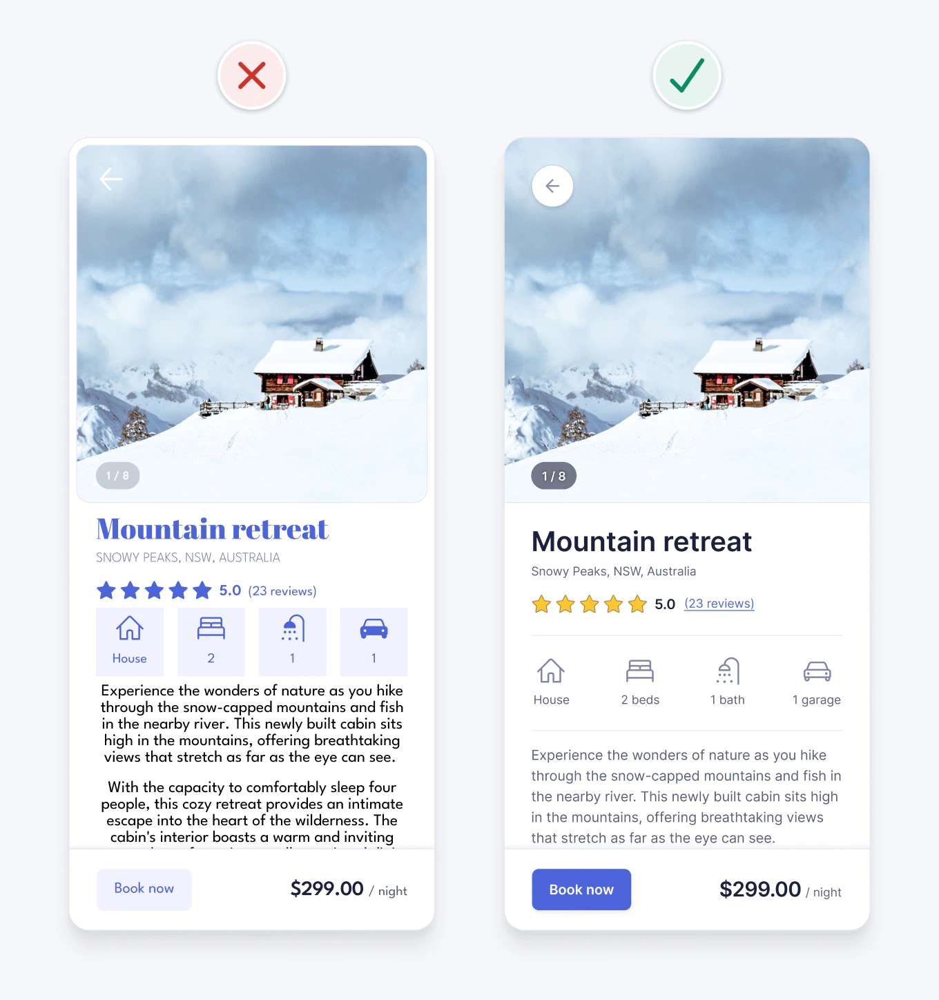

원문: [16 little UI design tips that make a big impact](https://www.adhamdannaway.com/blog/ui-design/ui-design-tips)
작성자: Adham Dannaway
원문 최종 업데이트: 2026-07-03

> 이 페이지는 원문을 그대로 옮긴 전체 번역이 아니라, 한국어로 재구성한 학습용 요약과 실무 체크리스트입니다. 이미지는 원문에 게시된 이미지를 로컬 assets 폴더에 저장해 참조합니다.

## 한 줄 요약

좋은 UI는 감각만으로 만드는 것이 아니라, 간격, 일관성, 위계, 색, 대비, 타이포그래피 같은 논리적 기준을 적용해 더 읽기 쉽고, 예측 가능하고, 접근성 높은 인터페이스로 다듬는 과정입니다.

## 핵심 관점

- UI 디자인 결정은 “예뻐 보이는가”보다 “사용자가 더 빨리 이해하고 더 적게 실수하는가”로 판단한다.
- 관련된 요소는 가까이 두고, 다른 기능은 다르게 보이게 만든다.
- 가장 중요한 정보와 주요 액션이 먼저 보이도록 시각적 위계를 만든다.
- 색은 장식보다 의미 전달에 사용한다.
- 접근성 기준에 맞는 대비와 읽기 쉬운 타이포그래피를 기본값으로 둔다.

## 16가지 팁

### 1. 여백으로 관련 요소를 묶기

관련 있는 요소는 가까이 배치하고, 관련 없는 그룹과는 더 넓게 떨어뜨립니다. 컨테이너를 매번 추가하기보다 여백, 정렬, 유사한 스타일을 활용하면 화면이 덜 복잡해집니다.

### 2. 일관성 유지하기

비슷한 요소는 비슷하게 보이고 작동해야 합니다. 아이콘 스타일, 선 굵기, 라운드 값, 라벨 사용 방식이 들쭉날쭉하면 사용자는 의미를 다시 해석해야 합니다.

### 3. 비슷하게 생긴 요소는 비슷하게 작동하게 만들기

버튼처럼 보이면 사용자는 누를 수 있다고 기대합니다. 인터랙션이 없는 정보성 요소가 버튼처럼 보이지 않도록 색, 배경, 테두리 스타일을 구분합니다.

### 4. 명확한 시각적 위계 만들기

중요한 정보와 주요 액션을 크기, 대비, 위치, 여백, 굵기 차이로 더 두드러지게 만듭니다. 눈을 살짝 흐리게 뜨고 봐도 핵심 액션이 보여야 합니다.

### 5. 불필요한 스타일 제거하기

선, 배경, 테두리, 색, 장식이 정보를 전달하지 않는다면 인지 부하만 늘릴 수 있습니다. 그룹화나 의미 전달에 기여하지 않는 시각 요소는 덜어냅니다.

### 6. 색을 목적 있게 사용하기

색은 장식이 아니라 의미를 전달하는 수단입니다. 브랜드 컬러는 링크나 버튼처럼 인터랙션을 암시하는 요소에 우선 적용하고, 비인터랙티브 텍스트나 장식에는 신중하게 사용합니다.

### 7. UI 요소는 최소 3:1 대비 확보하기

아이콘, 버튼 경계, 폼 필드 같은 인터페이스 요소는 배경과 최소 3:1 대비를 갖추는 것이 좋습니다. 사진 위 아이콘은 배경색을 추가해 대비와 터치 영역을 함께 확보합니다.

### 8. 텍스트는 최소 4.5:1 대비 확보하기

작은 텍스트는 최소 4.5:1 대비가 필요합니다. 흐린 회색 텍스트나 사진 위 텍스트는 읽기 어려워질 수 있으므로 더 진한 색, 불투명 배경, 그림자 등을 조합합니다.

### 9. 색만으로 상태를 구분하지 않기

색각 이상 사용자는 색 차이를 구분하기 어려울 수 있습니다. 링크는 색뿐 아니라 밑줄, 아이콘, 형태 같은 추가 단서를 제공해야 합니다.

### 10. 하나의 산세리프 서체 사용하기

UI에서는 보통 단순하고 중립적인 산세리프 서체 하나로 시작하는 편이 안전합니다. 장식적인 서체는 개성을 줄 수 있지만 작은 화면에서는 가독성과 일관성을 해칠 수 있습니다.

### 11. 소문자 높이가 큰 서체 선택하기

작은 크기에서 읽기 쉬운 서체는 보통 x-height가 큽니다. 본문이나 보조 텍스트가 많은 UI에서는 Inter 같은 가독성 높은 서체가 유리합니다.

### 12. 대문자 사용 줄이기

대문자는 단어의 외곽 형태가 비슷해져 읽기 속도를 떨어뜨립니다. 긴 라벨이나 위치 정보는 문장식 표기(sentence case)가 더 읽기 쉽습니다.

### 13. Regular와 Bold 중심으로 폰트 굵기 단순화하기

폰트 굵기를 많이 쓰면 화면이 복잡해지고 체계도 흐려집니다. 보통 제목은 bold, 나머지 텍스트는 regular로 두고, thin이나 extra bold는 큰 제목에만 제한적으로 사용합니다.

### 14. 순수 검정 텍스트 피하기

흰 배경 위 순수 검정은 대비가 너무 강해 피로감을 줄 수 있습니다. 주요 텍스트는 짙은 회색을 쓰고, 덜 중요한 설명문은 한 단계 연한 회색으로 낮춰 위계를 만듭니다.

### 15. 텍스트는 왼쪽 정렬하기

긴 본문은 왼쪽 정렬이 가장 읽기 쉽습니다. 가운데 정렬은 짧은 제목에는 가능하지만, 긴 문장에서는 줄의 시작점이 매번 달라져 읽기 부담이 커집니다.

### 16. 본문 줄 높이는 최소 1.5로 설정하기

줄 사이 여백은 같은 줄을 다시 읽는 일을 줄이고, 긴 텍스트를 더 편하게 만듭니다. 본문은 line-height 1.5-2 범위에서 시작하는 것이 실무적으로 안정적입니다.

## 실무 체크리스트

- 관련 정보끼리 충분히 가까운가?
- 같은 기능의 요소가 같은 스타일을 쓰는가?
- 버튼처럼 보이는 것은 실제로 클릭 가능한가?
- 주요 액션이 화면에서 가장 먼저 보이는가?
- 의미 없는 테두리, 배경, 색을 제거했는가?
- 브랜드 컬러가 인터랙션 또는 의미 전달에 쓰이는가?
- 아이콘/버튼/필드의 대비가 3:1 이상인가?
- 작은 텍스트 대비가 4.5:1 이상인가?
- 링크나 상태를 색만으로 표현하지 않았는가?
- 서체와 굵기 체계가 단순한가?
- 긴 텍스트가 왼쪽 정렬이고 줄 높이가 충분한가?

## 참고 이미지

- [대표 전후 비교 이미지](./assets/ui-design-tips-before-after.webp)
- [여백 비교](./assets/ui-design-tips-spacing.webp)
- [아이콘 일관성](./assets/ui-design-tips-icons.webp)
- [색 사용 개선](./assets/ui-design-tips-color.webp)
- [텍스트 정렬 개선](./assets/ui-design-tips-left-align.webp)
- [줄 높이 개선](./assets/ui-design-tips-line-height.webp)

## 출처

- 원문: [Adham Dannaway - 16 little UI design tips that make a big impact](https://www.adhamdannaway.com/blog/ui-design/ui-design-tips)
- 원문 이미지: Adham Dannaway 웹사이트 이미지
