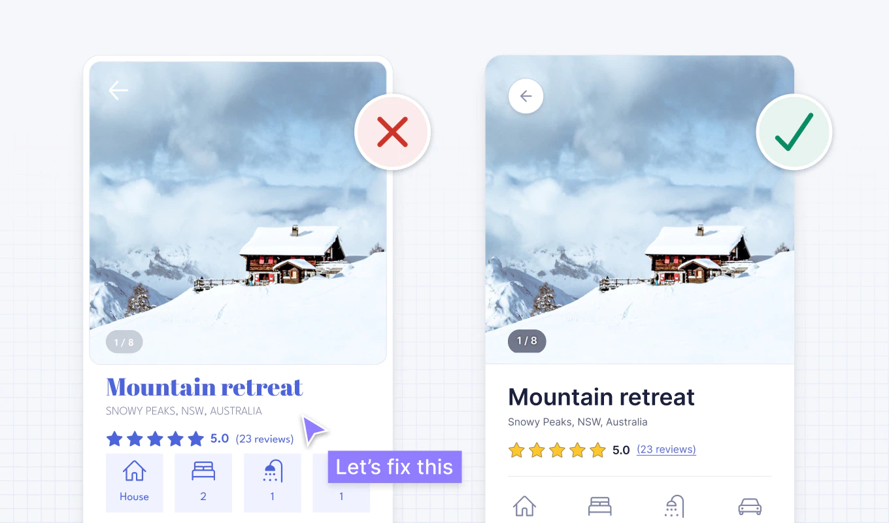

- 디자인 결정 대부분이 논리적인 가이드라인 체계에 의해 좌우된다
- 예술적 감각이나 마법 같은 직관이 아니라, 단순한 가이드라인
- 논리적인 체계가 없다면, 그저 예쁘게 보일 때까지 감으로 요소를 옮기고 있는 것뿐

## 16가지 팁

### 1. 여백으로 관련 요소를 묶기

관련 있는 요소는 가까이 배치하고, 관련 없는 그룹과는 더 넓게 떨어뜨립니다. 컨테이너를 매번 추가하기보다 여백, 정렬, 유사한 스타일을 활용하면 화면이 덜 복잡해집니다.

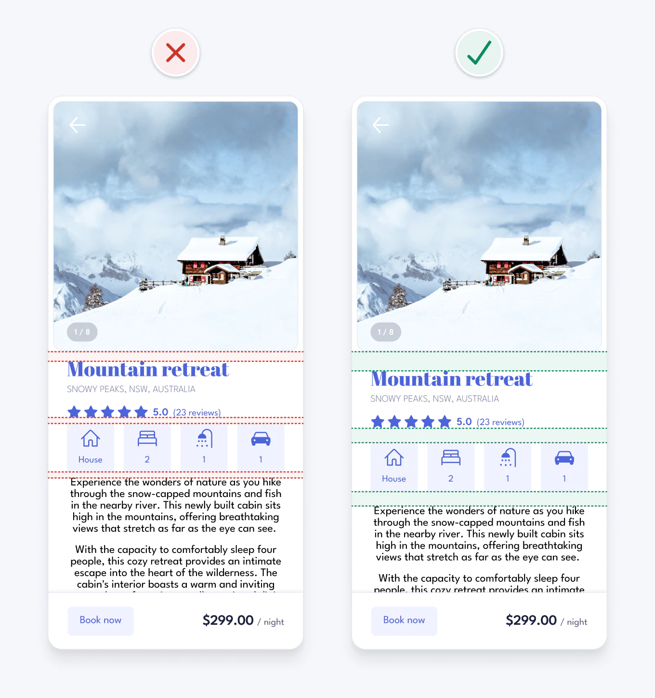

### 2. 일관성 유지하기

비슷한 요소는 비슷하게 보이고 작동해야 합니다. 아이콘 스타일, 선 굵기, 라운드 값, 라벨 사용 방식이 들쭉날쭉하면 사용자는 의미를 다시 해석해야 합니다.

- “2가 뭐지? 침대 2개인가, 방 2개인가?”
- “1은 욕실 1개라는 뜻인가?”
- “자동차 아이콘은 주차장인가, 차고인가?”
- “아이콘 스타일이 다른 건 선택됐다는 뜻인가, 그냥 디자인이 다른 건가?”

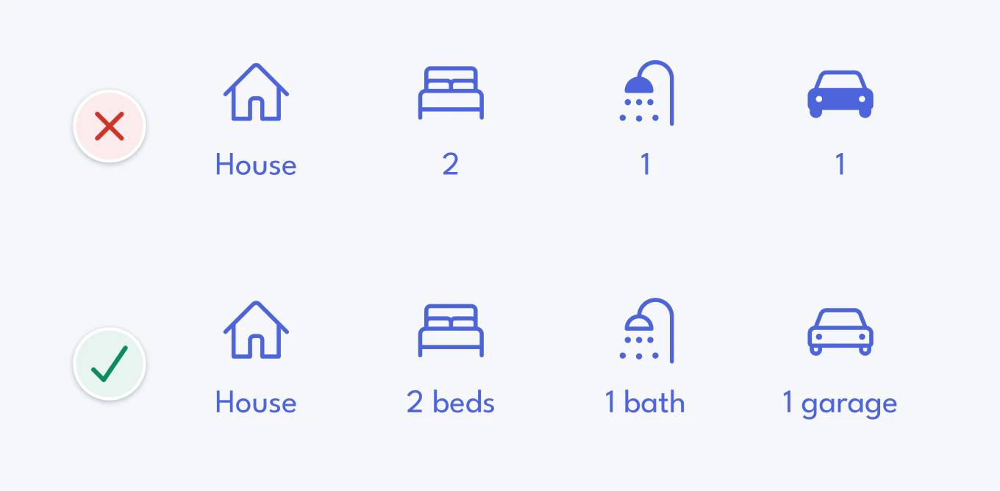

아이콘의 의미를 사람들이 이해할 수 있도록 텍스트 라벨도 추가했습니다. 이는 특히 스크린 리더를 사용하는 사람들에게 도움이 됩니다.

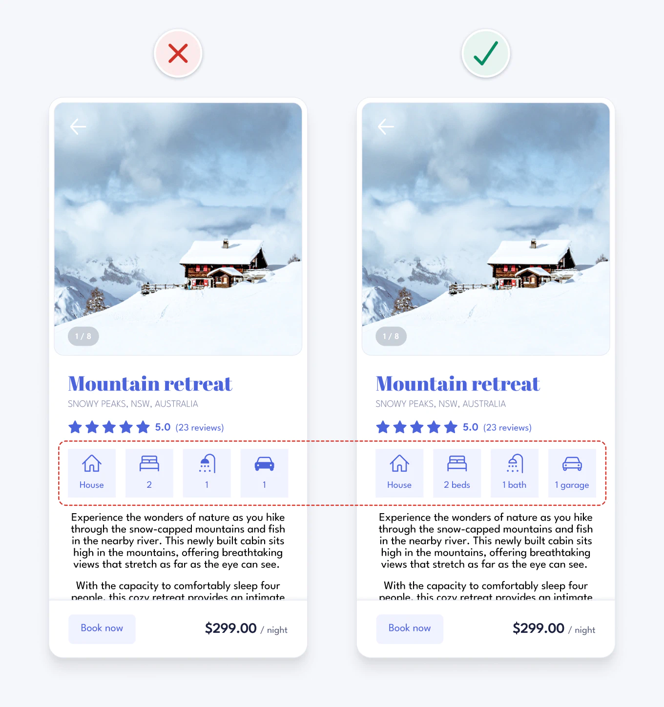

### 3. 비슷하게 생긴 요소는 비슷하게 작동하게 만들기

버튼처럼 보이면 사용자는 누를 수 있다고 기대합니다. 인터랙션이 없는 정보성 요소가 버튼처럼 보이지 않도록 색, 배경, 테두리 스타일을 구분합니다.

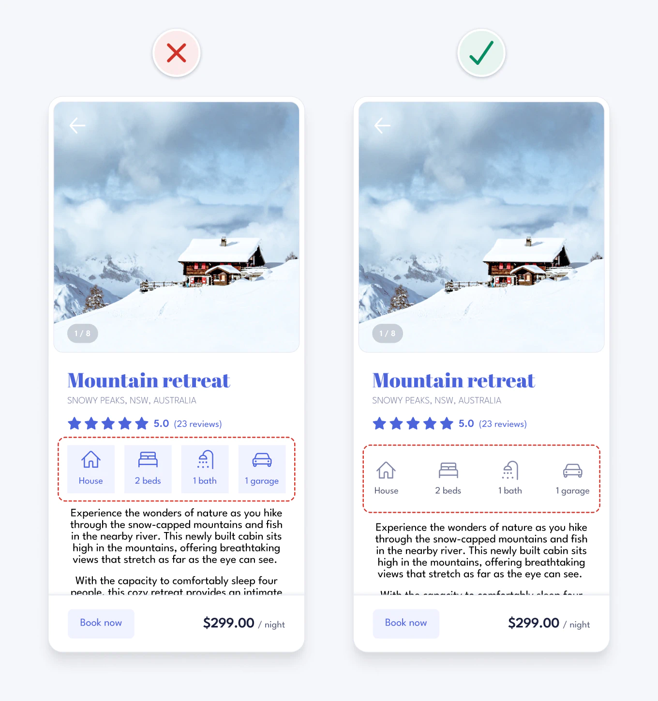

실제로는 인터랙티브하지 않은데도 인터랙티브한 것처럼 보입니다.

### 4. 명확한 시각적 위계 만들기

중요한 정보와 주요 액션을 크기, 대비, 위치, 여백, 굵기 차이로 더 두드러지게 만듭니다. 눈을 살짝 흐리게 뜨고 봐도 핵심 액션이 보여야 합니다.

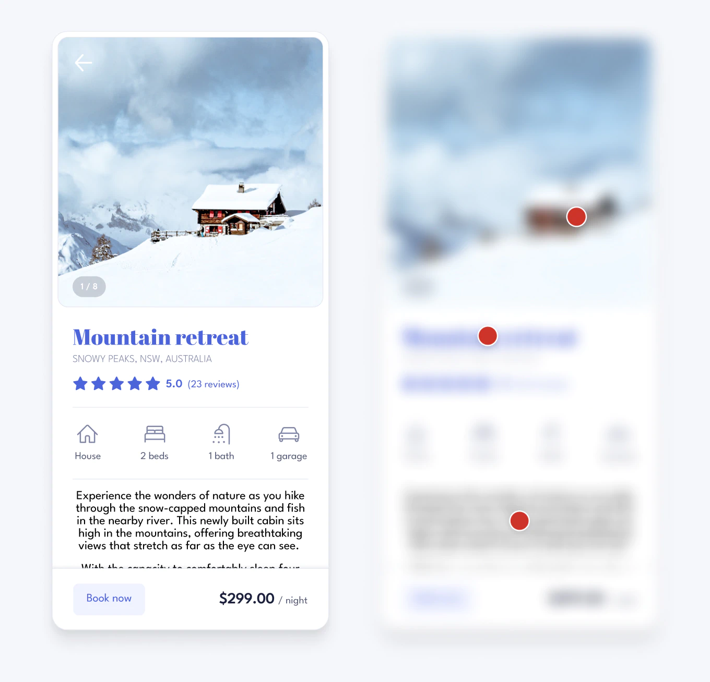

주요 액션은 일반적으로 인터페이스에서 가장 두드러진 요소여야 합니다. 높은 대비의 배경색과 굵은 글꼴 굵기를 주면 이를 달성하는 데 도움이 됩니다.

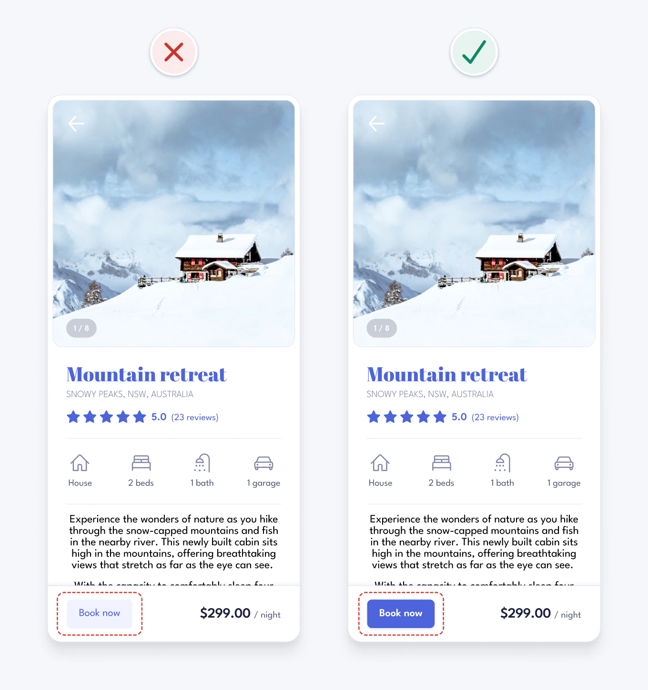

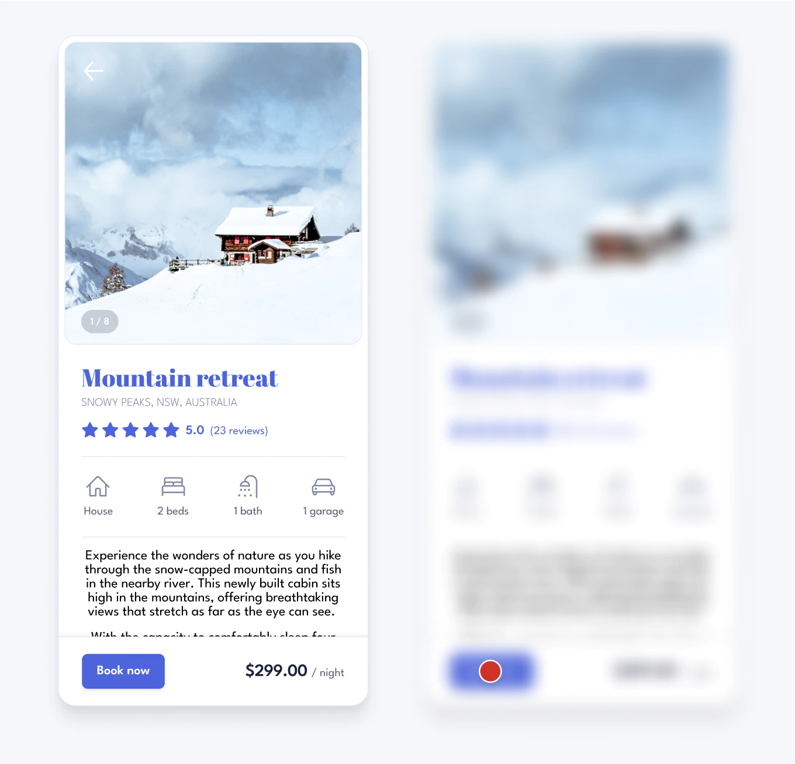

### 5. 불필요한 스타일 제거하기

선, 배경, 테두리, 색, 장식이 정보를 전달하지 않는다면 인지 부하만 늘릴 수 있습니다. 그룹화나 의미 전달에 기여하지 않는 시각 요소는 덜어냅니다.

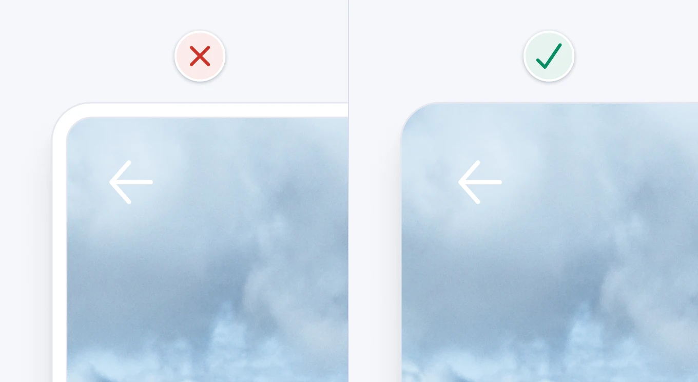

이미지 주변의 흰 공간과 테두리가 불필요한 시각적 복잡성을 더합니다. 정보를 전달하거나 요소를 그룹화하는 데 필요하지 않으므로, 디자인을 단순화하기 위해 안전하게 제거할 수 있습니다.

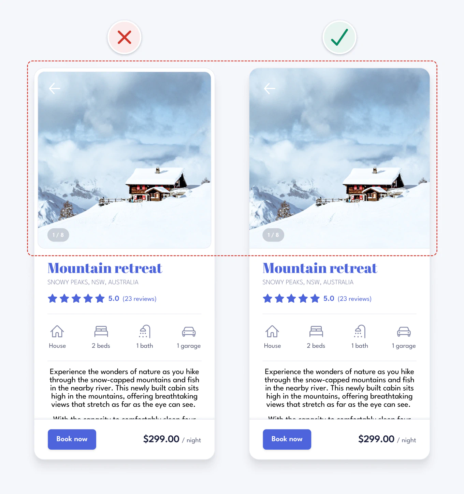

### 6. 색을 목적 있게 사용하기

색은 장식이 아니라 의미를 전달하는 수단입니다. 브랜드 컬러는 링크나 버튼처럼 인터랙션을 암시하는 요소에 우선 적용하고, 비인터랙티브 텍스트나 장식에는 신중하게 사용합니다. 이는 무엇이 인터랙티브하고 무엇이 아닌지 사람들에게 학습시키는 데 도움이 됩니다.

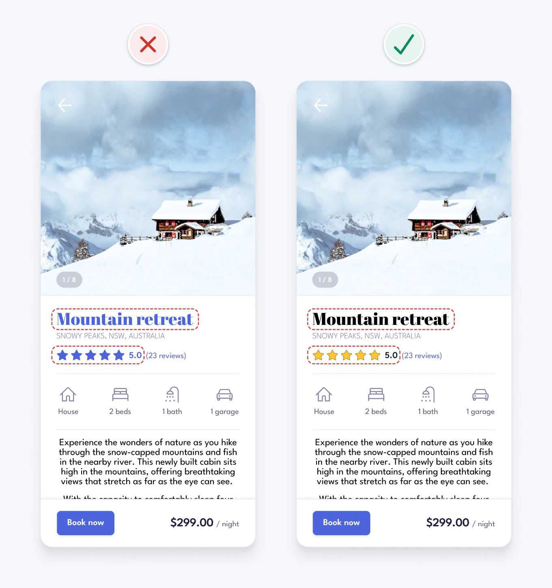

모든 인터랙티브 요소에 색을 추가할 필요는 없습니다. 일부 요소는 이미 인터랙티브하다는 것을 나타내는 시각적 단서를 갖고 있기 때문입니다. 예를 들어 다음 예시의 카드는 파란 링크가 있든 없든 여전히 인터랙티브하게 느껴집니다.

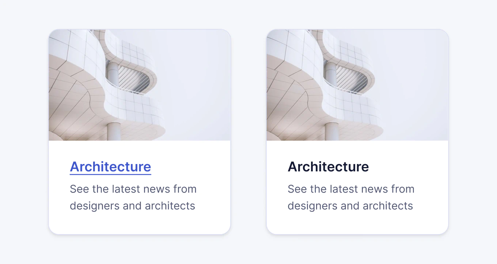

별점 같은 다른 비인터랙티브 요소에서도 파란색을 제거합니다. 이렇게 하면 무엇이 인터랙티브하고 무엇이 아닌지 훨씬 더 쉽게 알 수 있습니다.

### 7. UI 요소는 최소 3:1 대비 확보하기

명암비는 두 색 사이에서 인지되는 밝기 차이를 측정한 것입니다. 이는 1:1부터 21:1까지의 비율로 표현됩니다. 예를 들어 검은 배경 위의 검은 텍스트는 가장 낮은 1:1 명암비를 갖고, 흰 배경 위의 검은 텍스트는 가장 높은 21:1 명암비를 갖습니다.

아이콘, 버튼 경계, 폼 필드 같은 인터페이스 요소는 배경과 최소 3:1 대비를 갖추는 것이 좋습니다. 사진 위 아이콘은 배경색을 추가해 대비와 터치 영역을 함께 확보합니다. 이는 아이콘의 탭 영역이 더 커지고 명확하게 보이기 때문에 인터랙션 비용도 줄입니다.

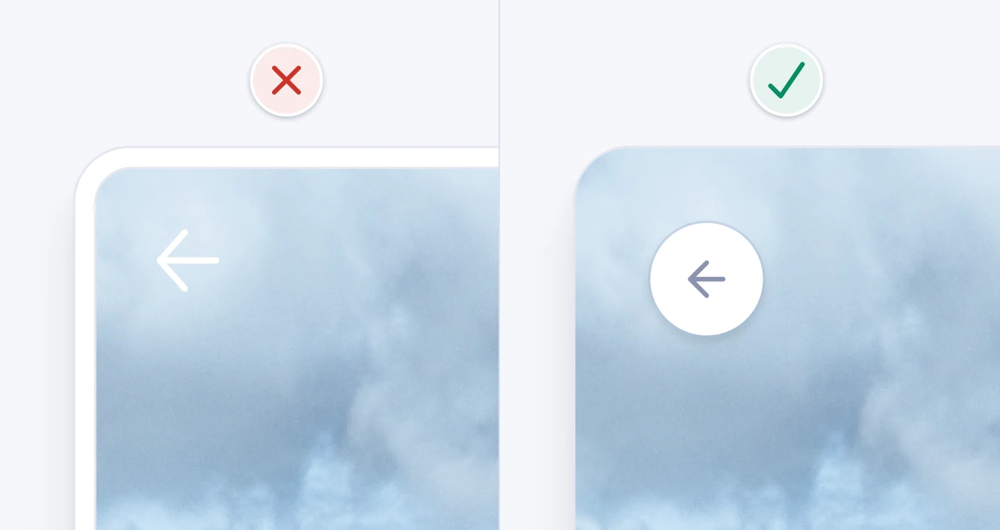

원래 예시의 주요 버튼 명암비도 너무 낮았습니다. 시각적 위계를 다룰 때 이미 고쳤지만, 여기서도 언급할 가치가 있습니다.

### 8. 텍스트는 최소 4.5:1 대비 확보하기

시각 장애가 있는 사람들이 텍스트를 명확하게 읽을 수 있도록 하려면, 명암비 요구사항을 충족해야 합니다.

- 작은 텍스트, 즉 18px 이하 텍스트는 최소 4.5:1 명암비가 필요합니다.
- 큰 텍스트, 즉 bold 굵기에서 18px 초과 또는 regular 굵기에서 24px 초과 텍스트는 최소 3:1 명암비가 필요합니다.

흐린 회색 텍스트나 사진 위 텍스트는 읽기 어려워질 수 있으므로 더 진한 색, 불투명 배경, 그림자 등을 조합합니다.

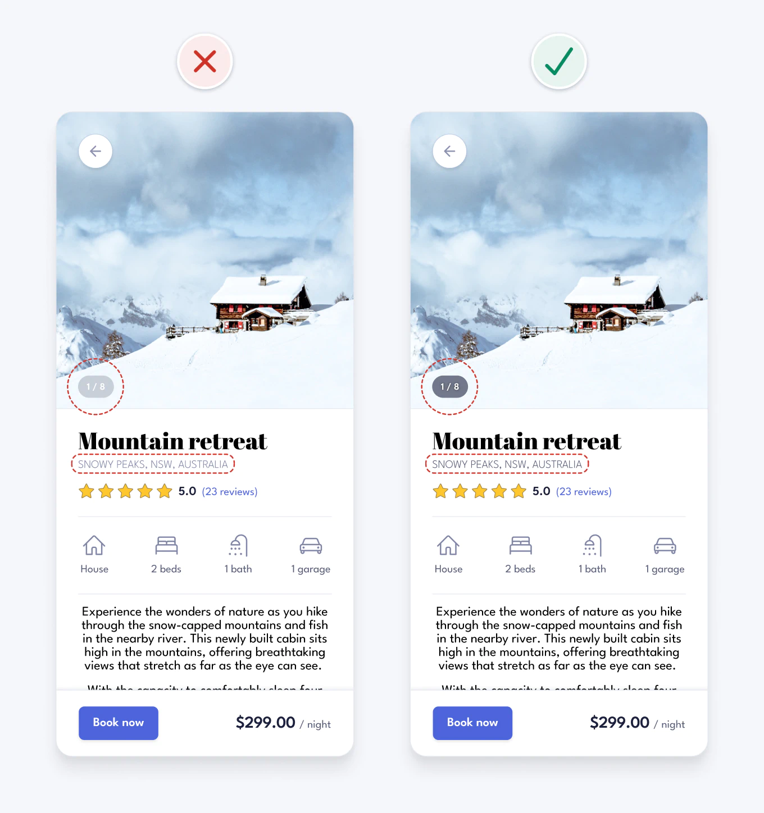

### 9. 색만으로 상태를 구분하지 않기

색각 이상 사용자는 색 차이를 구분하기 어려울 수 있습니다. 링크는 색뿐 아니라 밑줄, 아이콘, 형태 같은 추가 단서를 제공해야 합니다.

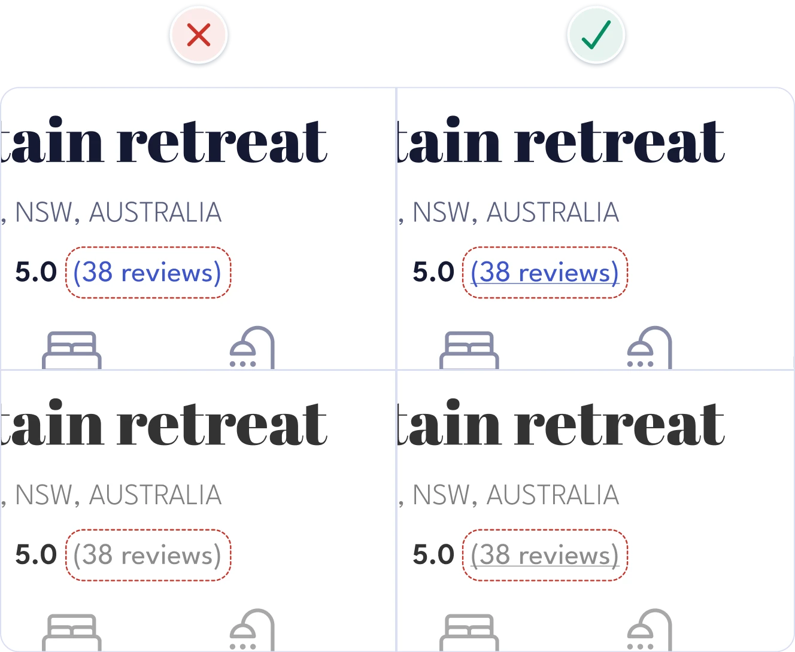

“reviews” 텍스트가 링크임을 나타내기 위해 파란색이 사용됩니다. 색이 제거되면 링크 텍스트가 다른 텍스트와 똑같이 보이므로, 색각 이상이 있는 사람은 그것이 링크인지 알 수 없습니다. 링크 텍스트에 밑줄을 그으면 색이 없어도 다른 텍스트와 명확하게 구분됩니다.

### 10. 하나의 산세리프 서체 사용하기

UI에서는 보통 단순하고 중립적인 산세리프 서체 하나로 시작하는 편이 안전합니다. 장식적인 서체는 개성을 줄 수 있지만 작은 화면에서는 가독성과 일관성을 해칠 수 있습니다.

본문 텍스트에 사용된 것과 같은 산세리프 서체로 단순화하면 사용성과 미학을 개선하는 데 도움이 됩니다.

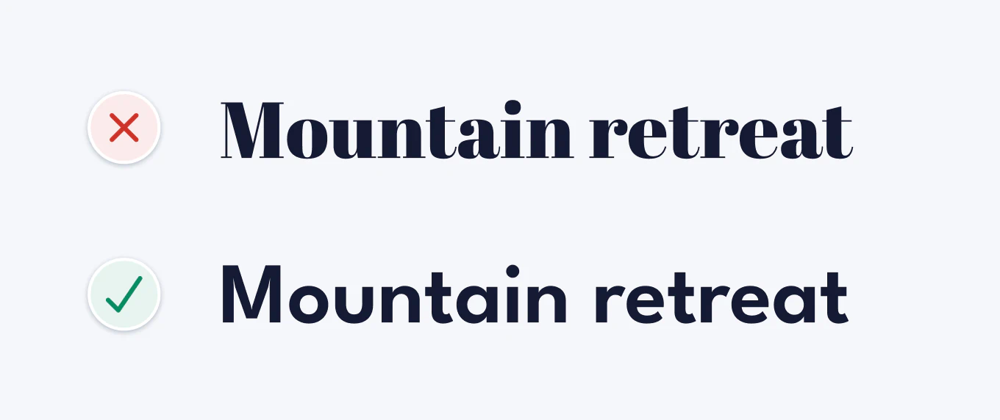

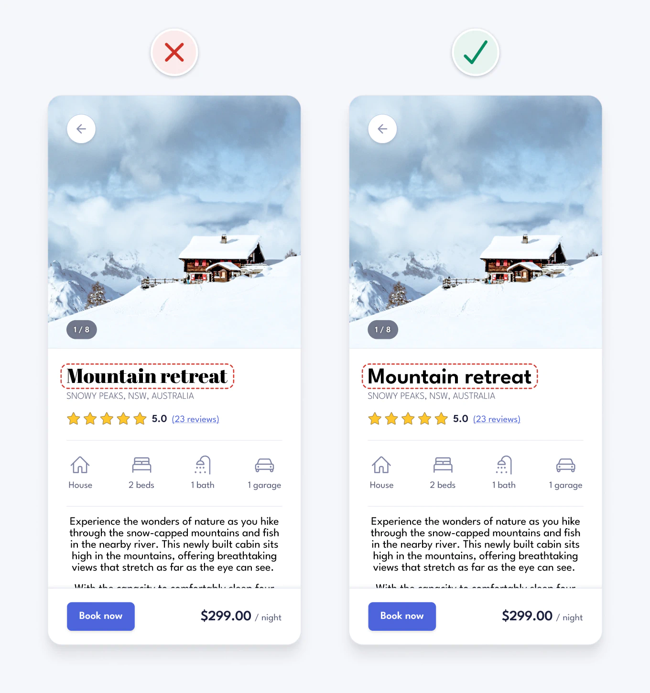

### 11. 소문자 높이가 큰 서체 선택하기

서체에서 소문자의 높이는 x-height라고 합니다.

작은 크기에서 읽기 쉬운 서체는 보통 x-height가 큽니다. 본문이나 보조 텍스트가 많은 UI에서는 Inter 같은 가독성 높은 서체가 유리합니다.

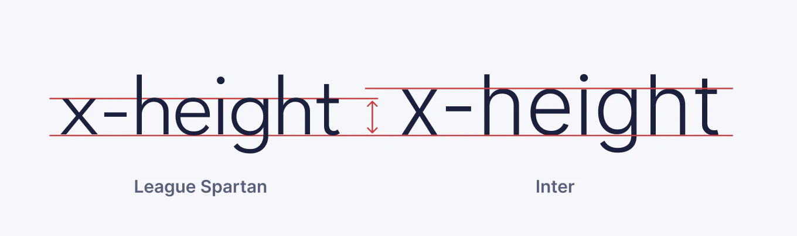

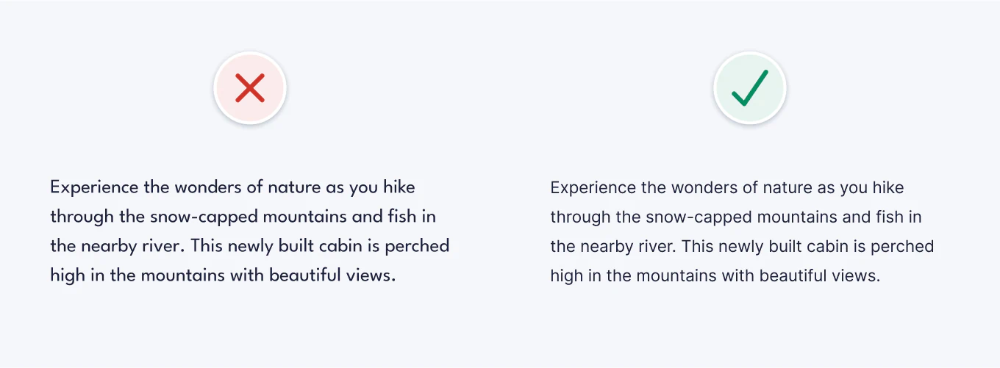

### 12. 대문자 사용 줄이기

글을 읽을 때 사람은 각 글자를 하나씩 보는 것이 아니라 단어의 형태를 봅니다. 그 형태는 단어를 더 빠르게 인식하는 데 도움이 됩니다. 대문자로 된 단어는 모두 같은 직사각형 형태를 갖습니다. 이는 각 글자를 하나씩 읽도록 강제합니다.

대문자는 단어의 외곽 형태가 비슷해져 읽기 속도를 떨어뜨립니다. 긴 라벨이나 위치 정보는 문장식 표기(sentence case)가 더 읽기 쉽습니다.

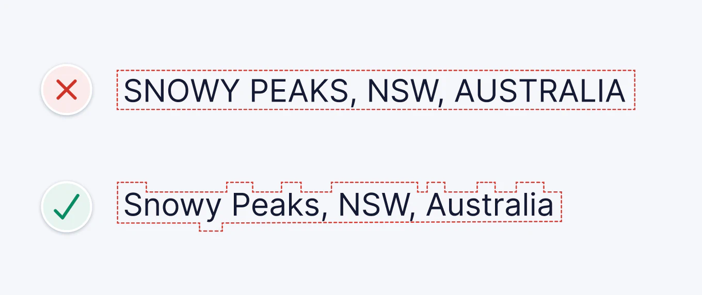

### 13. Regular와 Bold 중심으로 폰트 굵기 단순화하기

폰트 굵기를 많이 쓰면 화면이 복잡해지고 체계도 흐려집니다. 보통 제목은 bold, 나머지 텍스트는 regular로 두고, thin이나 extra bold는 큰 제목에만 제한적으로 사용합니다.

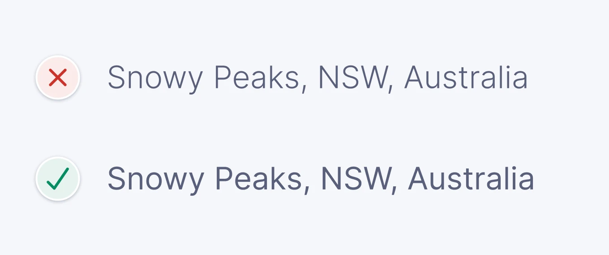

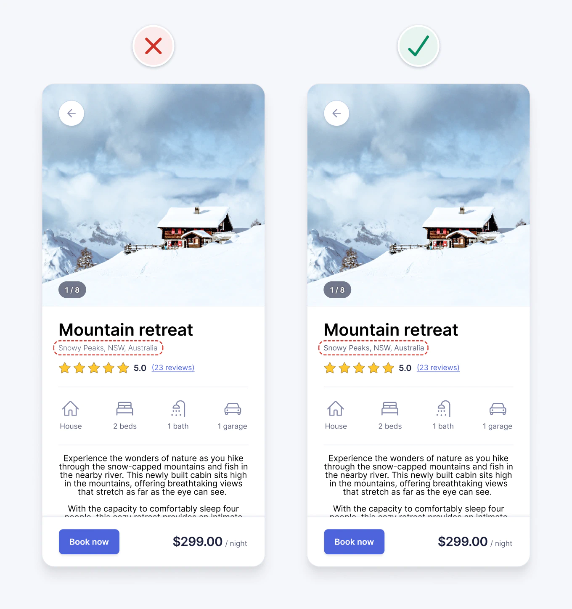

### 14. 순수 검정 텍스트 피하기

흰 배경 위 순수 검정은 대비가 너무 강해 피로감을 줄 수 있습니다. 주요 텍스트는 짙은 회색을 쓰고, 덜 중요한 설명문은 한 단계 연한 회색으로 낮춰 위계를 만듭니다.

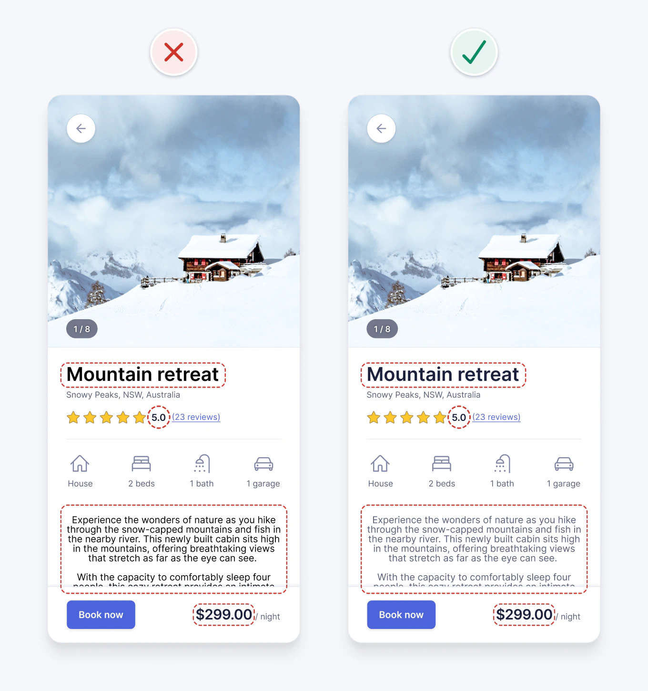

### 15. 텍스트는 왼쪽 정렬하기

긴 본문은 왼쪽 정렬이 가장 읽기 쉽습니다. 가운데 정렬은 짧은 제목에는 가능하지만, 긴 문장에서는 줄의 시작점이 매번 달라져 읽기 부담이 커집니다.

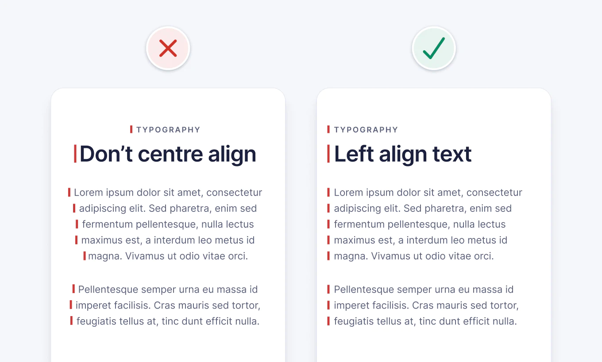

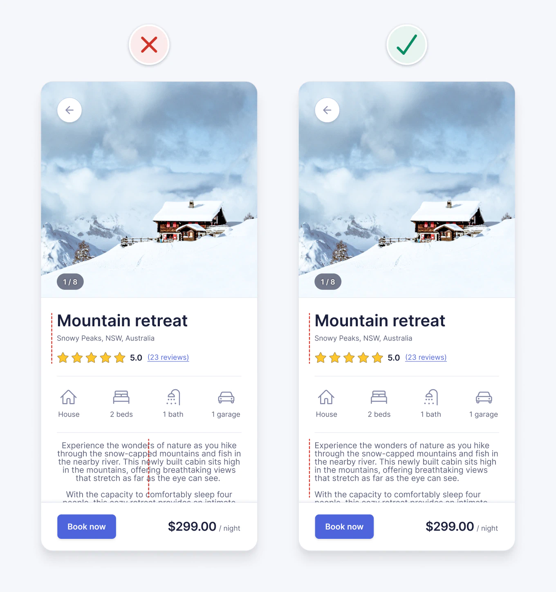

### 16. 본문 줄 높이는 최소 1.5로 설정하기

줄 사이 여백은 같은 줄을 다시 읽는 일을 줄이고, 긴 텍스트를 더 편하게 만듭니다. 본문은 line-height 1.5-2 범위에서 시작하는 것이 실무적으로 안정적입니다.

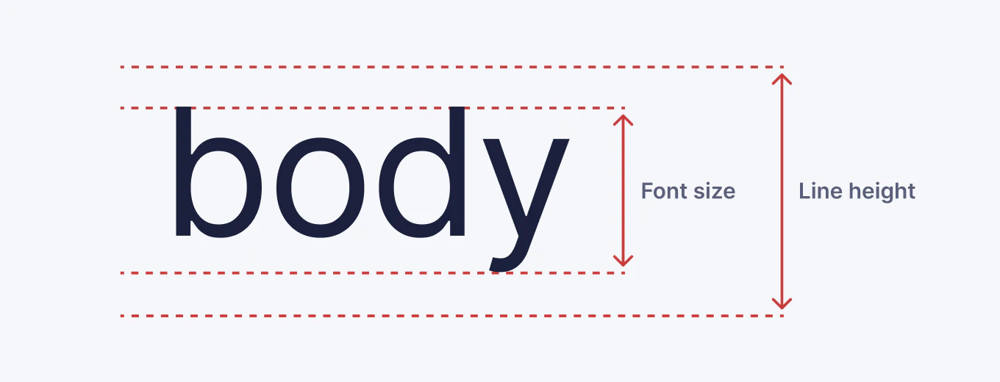

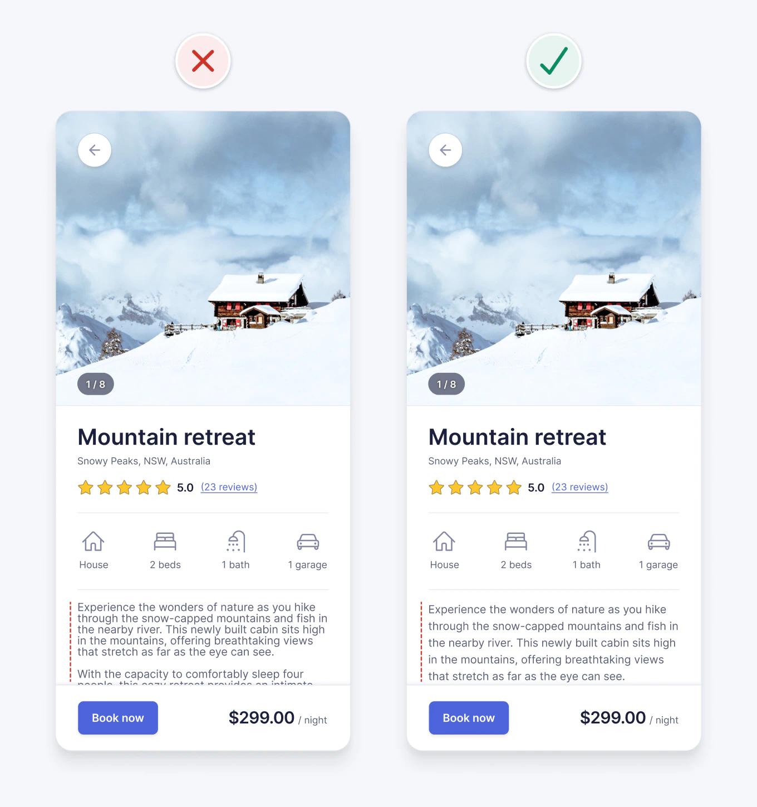

- UI 디자인 결정은 “예뻐 보이는가”보다 “사용자가 더 빨리 이해하고 더 적게 실수하는가”로 판단한다.
- 관련된 요소는 가까이 두고, 다른 기능은 다르게 보이게 만든다.
- 가장 중요한 정보와 주요 액션이 먼저 보이도록 시각적 위계를 만든다.
- 색은 장식보다 의미 전달에 사용한다.
- 접근성 기준에 맞는 대비와 읽기 쉬운 타이포그래피를 기본값으로 둔다.

## 출처

- 원문: [Adham Dannaway - 16 little UI design tips that make a big impact](https://www.adhamdannaway.com/blog/ui-design/ui-design-tips)
