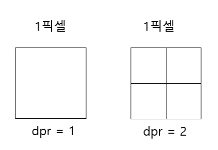

## Canvas의 2가지 영역

- `<canvas>` HTML 요소 자체의 영역
    - **DOM 요소 자체의 크기**
    - 화면에서 차지하는 **실제 공간**
    
    ```html
    <canvas style="width:300px; height:150px; border:1px solid black;"></canvas>
    ```
    
- 그리기 영역(Drawing Surface, 캔버스 좌표 공간)
    - **실제 그림, 선, 텍스트를 그리는 내부 좌표 공간**
    - `canvas.width`와 `canvas.height` 속성으로 정의
    - 그리기 영역의 기본값은 width: 300, height: 150
        - px을 붙이지 않은 양의 정수를 사용
    
    ```html
    <canvas width="600" height="300"></canvas>
    ```
    
- 그리기 영역과 캔버스 요소의 영역 크기가 다르다면?
    - 브라우저가 그리기 영역에 맞춰 canvas를 그린 뒤
    - 캔버스 요소의 크기에 맞춘다.

---

```jsx
      {/* 작은 캔버스 */}
      <canvas
        ref={canvasSmallRef}
        width={300}
        height={150}
        style={{
          border: '2px solid black',
        }}
      />
     
      {/* 큰 캔버스 */}
      <canvas
        ref={canvasLargeRef}
        style={{
          width:"600px",
          height:"300px",
          border: '2px solid black',
        }}
      />
```


```jsx
      {/* 작은 캔버스 */}
      <canvas
        ref={canvasSmallRef}
        width={300}
        height={150}
        style={{
          border: '2px solid black',
        }}
      />

      {/* 큰 캔버스 */}
      <canvas
        ref={canvasLargeRef}
        width={600}
        height={300}
        style={{
          border: '2px solid black',
        }}
      />
```


## DPR (Device Pixel Ratio)

- `DPR = 물리적 픽셀 ÷ 논리적 픽셀`
    - **논리적 픽셀(Logical/CSS Pixel)**
        - 브라우저가 레이아웃, 스타일 계산할 때 쓰는 **추상적인 픽셀 단위**
        - 예: `width: 100px` → 브라우저는 이 영역을 100 논리적 픽셀로 그립니다
    - **물리적 픽셀(Physical Pixel)**
        - 실제 화면 디스플레이가 가지는 **하드웨어 픽셀**
        - 모니터나 스마트폰에서 점 하나를 찍는 최소 단위
- DPR이 **1**이면 → 논리적 1픽셀이 물리적 1픽셀에 매핑됨
- DPR이 **2**면 → 논리적 1픽셀이 물리적 2×2 픽셀(총 4개)에 매핑됨
- DPR이 **3**이면 → 논리적 1픽셀이 물리적 3×3 픽셀(총 9개)에 매핑됨



- **DPR이 높을수록** 같은 논리적 픽셀이라도 화면에서 더 많은 물리적 픽셀로 그려져 **더 선명하게 보임**
- `window.devicePixelRatio`
    - DPR의 기본값은 1
    - 레티나 디스플레이일 경우 2
    - 이러한 이유로 **디스플레이마다 CSS 1픽셀을 그리는 데 사용되는 실제 픽셀 수가 다르기 때문**에 Canvas 크기를 DPR에 따라 보정해야 한다.

## canvas 흐려짐 현상 해결하기

- 물리적 픽셀에 맞게 그리기영역을 DPR에 맞게 늘려주고
- 화면에 보이는 크기는 그대로 유지
- `scale` 매서드로 좌표계를 보정해서 화면상의 크기 기준으로 그림을 그림


DPR을 고려하지 않은 canvas


DPR을 고려한 canvas

```jsx
    const canvas = canvasRef.current;
    const rect = canvas.getBoundingClientRect();
    const ctx = canvas.getContext("2d");

    // DPR
    const dpr = window.devicePixelRatio;

    const width = rect.width;
    const height = rect.height;

    // 캔버스 크기
    canvas.width = width * dpr;
    canvas.height = height * dpr;

    canvas.style.width = `${width}px`;
    canvas.style.height = `${height}px`;

    // 좌표 공간 스케일링
    ctx.scale(dpr, dpr);
```