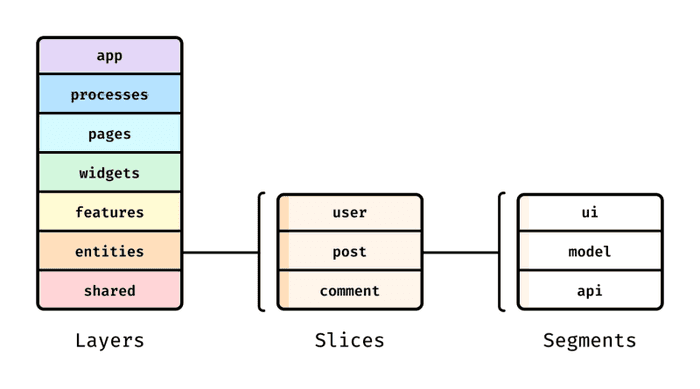

## ✔️기존 파일 구조의 불편함

1. 유형 기반 구조 → 기능간 코드가 분산되어 응집도가 낮아짐

   ```markdown
   src/
   ┣ components/
   ┣ pages/
   ┣ models/
   ┗ utils/
   ```

2. 폴더별 컴포넌트 구조 → UI 중심이라 비즈니스 로직과 분리가 어려움

   ```markdown
   src/
   ┣ components/
   ┃ ┣ atoms/
   ┃ ┣ molecules/
   ┃ ┣ organisms/
   ┣ pages/
   ┗ templates/
   ```

3. 경로 기반 구조 → 중복구조, 컴포넌트 재사용이 어려움

   ```markdown
   src/
   ┣ pages/
   ┃ ┣ home/
   ┃ ┣ about/
   ┃ ┣ product/
   ┃ ┃ ┃ ┣components/
   ┃ ┃ ┣ ┣hooks/
   ┃ ┃ ┣ ┣utils/
   ┃ ┃ ┣ ProductPage.tsx
   ```

- 보통 혼자 개발 → 도메인이 아닌 기능으로 배치
- 컴포넌트 간의 암묵적인 연결과 모듈의 복잡성 때문에 유지보수하기 어려워짐
- 어떻게 작성을 할까 고민을 많이 함 → 고민하는 시간을 줄이고 싶다 → 명확한 기준이 있었으면 좋겠다.

## ✔️**FSD**: 기능 분할 설계



- 폴더구조를 설명하는 이미지
  - Layers 폴더 하위에 Slices 하위에 Segments를 둘 수 있다.
- FSD의 컨셉은 RestAPI 처럼 경로를 통해 특정 코드의 위치를 파악할 수 있는 것

### 1. Layers

```markdown
📦src
┣ 📂app // 애플리케이션 로직이 초기화되는 곳 ex) provider, router, style
┣ 📂based(shared) // 비즈니스 로직에 종속적이지 않은 재사용 가능한 컴포넌트, 유틸
┣ 📂entities // 도메인 모델(데이터 중심) ex) user, posts, commnents, review
┣ 📂features // 사용자 기능 (유저 행동 중심) ex) 수정,삭제,등록
┣ 📂modules(widgets) // UI 블록 (조합 중심)
┣ 📂pages // 애플리케이션의 페이지
```

- 코드베이스를 조직화, 모듈화
- 하위 레이어는 상위 레이어의 컴포넌트를 사용할 수 없다. → 한방향으로 향하는 선형적 흐름

### 2. Slices

```markdown
📦src
┣ 📂entities
┃ ┣ 📂coupon
┃ ┣ 📂product
┃ ┣ 📂user
┣ 📂features
┃ ┣ 📂auth
┃ ┣ 📂cart
┃ ┣ 📂wishlist
┣ 📂modules(widgets)
┃ ┣ 📂ProductCard
┃ ┣ 📂CartSummary
┃ ┣ 📂OrderSummary
┃ ┣ 📂SearchResult
```

- 비즈니스 엔티티에 대한 것
- 폴더 이름은 비즈니스에 따라 달라질 수 있다.

### 3. Segments

```markdown
📦 src
┣ 📂 entities
┃ ┣ 📂 coupon
┃ ┃ ┣ 📂 api
┃ ┃ ┃ ┗ 📄 fetchCouponByCode.ts // 쿠폰 코드로 쿠폰 정보 불러오기
┃ ┃ ┣ 📂 ui
┃ ┃ ┃ ┗ 📄 CouponBadge.tsx // 쿠폰 할인 UI 배지 컴포넌트
┃ ┃ ┣ 📂 model
┃ ┃ ┃ ┣ 📄 index.ts // 쿠폰 타입 + 상태 정의 (Recoil/Zustand 등)
┃ ┃ ┃ ┗ 📄 useSelectCoupon.ts // 쿠폰 선택 로직 (예: 훅)
┃ ┃ ┣ 📂 constants
┃ ┃ ┃ ┗ 📄 couponLimits.ts // 최대 할인 금액, 만료일 등 상수
┃ ┃ ┗ 📄 index.ts // 공개 API: 외부 접근 지점
```

- api - 필요한 서버 요청
- UI - 슬라이스의 UI 컴포넌트
- model - 비즈니스 로직, 즉 상태와의 상호 작용. actions 및 selectors가 이에 해당
- lib - 슬라이스 내에서 사용되는 보조 기능
- config - 슬라이스에 필요한 구성값이지만 구성 세그먼트는 거의 필요하지 않음
- constants - 필요한 상수

### 캡슐화

```jsx
 ┣ 📂features
 ┃ ┣ 📂auth
 ┃ ┣ ┣ 📂model
 ┃ ┣ ┣ ┣ 📄 calculateDiscount.ts // <- 내부로직이다, 수정이 불가하다
 ┃ ┣ ┣ 📂ui
 ┃ ┣ ┣ ┣ 📄LoginForm.tsx
 ┃ ┣ ┣ 📄index.ts
```

```jsx
export { LoginForm } from './ui/ScheduleForm';
```

- "index.ts만 공식 출입구로 쓰고, 나머진 내부 구현으로 간주한다"는 **팀 차원의 규칙**
- 해당 레이어에 접근 가능한 공식 인터페이스를 명확히 지정해서 의존성과 유지보수 부담을 줄일 수 있다.
- 내부 파일 구조를 변경해도 `index.ts`만 유지하면 외부에 영향이 없다. → 대규모 리팩토링에 유리

### Next.js의 FSD

```jsx
/pages/index.tsx             ← Next.js 라우팅용 진입점
/src/pages/home/index.tsx    ← FSD 구조에서 실제 HomePage
```

```jsx
// /pages/index.tsx
import HomePage from '@/pages/home';

export default HomePage;
```

- **FSD는 "기능 중심"**구조를 지향하기 때문에 이 둘을 함께 쓰면 **pages 디렉토리** 와 앱 초기화(app layer)에서 충돌
- Next.js의 `pages/`는 루트(`/pages`)에 두고
- FSD의 기능 페이지들은 `/src/pages/`에 관리
- Next.js의 각 라우트 파일 안에서 FSD의 페이지를 import

---

### 장점

- RestAPI 처럼 경로만 보고 해당 파일의 목적이 유추 가능하다.
- 기능이 서로 강하게 묶여있지 않아 변경이 쉽다.
- 폴더구조, 책임 분리 방식이 정해져 있어서 모두가 같은 구조를 따른다.

### 단점

- 멘탈모델이 같아야 팀원들 모두가 같은 결과를 나오게 만드는데 이 아키텍쳐를 이해하는것 부터 비용이 적지 않다.
- 구조를 명확히 하려다 보면 애초에 설계 단계에서 어려움이 있다.
  - 설계 실수를 걸러낼 수 있어서 장기적으로는 이득이 될 수도있다.

---

## Ref

https://emewjin.github.io/feature-sliced-design/

https://feature-sliced.github.io/documentation/kr/## ✔️기존 파일 구조의 불편함

1. 유형 기반 구조 → 기능간 코드가 분산되어 응집도가 낮아짐

   ```markdown
   src/
   ┣ components/
   ┣ pages/
   ┣ models/
   ┗ utils/
   ```

2. 폴더별 컴포넌트 구조 → UI 중심이라 비즈니스 로직과 분리가 어려움

   ```markdown
   src/
   ┣ components/
   ┃ ┣ atoms/
   ┃ ┣ molecules/
   ┃ ┣ organisms/
   ┣ pages/
   ┗ templates/
   ```

3. 경로 기반 구조 → 중복구조, 컴포넌트 재사용이 어려움

   ```markdown
   src/
   ┣ pages/
   ┃ ┣ home/
   ┃ ┣ about/
   ┃ ┣ product/
   ┃ ┃ ┃ ┣components/
   ┃ ┃ ┣ ┣hooks/
   ┃ ┃ ┣ ┣utils/
   ┃ ┃ ┣ ProductPage.tsx
   ```

- 보통 혼자 개발 → 도메인이 아닌 기능으로 배치
- 컴포넌트 간의 암묵적인 연결과 모듈의 복잡성 때문에 유지보수하기 어려워짐
- 어떻게 작성을 할까 고민을 많이 함 → 고민하는 시간을 줄이고 싶다 → 명확한 기준이 있었으면 좋겠다.

## ✔️**FSD**: 기능 분할 설계


- 폴더구조를 설명하는 이미지
  - Layers 폴더 하위에 Slices 하위에 Segments를 둘 수 있다.
- FSD의 컨셉은 RestAPI 처럼 경로를 통해 특정 코드의 위치를 파악할 수 있는 것

### 1. Layers

```markdown
📦src
┣ 📂app // 애플리케이션 로직이 초기화되는 곳 ex) provider, router, style
┣ 📂based(shared) // 비즈니스 로직에 종속적이지 않은 재사용 가능한 컴포넌트, 유틸
┣ 📂entities // 도메인 모델(데이터 중심) ex) user, posts, commnents, review
┣ 📂features // 사용자 기능 (유저 행동 중심) ex) 수정,삭제,등록
┣ 📂modules(widgets) // UI 블록 (조합 중심)
┣ 📂pages // 애플리케이션의 페이지
```

- 코드베이스를 조직화, 모듈화
- 하위 레이어는 상위 레이어의 컴포넌트를 사용할 수 없다. → 한방향으로 향하는 선형적 흐름

### 2. Slices

```markdown
📦src
┣ 📂entities
┃ ┣ 📂coupon
┃ ┣ 📂product
┃ ┣ 📂user
┣ 📂features
┃ ┣ 📂auth
┃ ┣ 📂cart
┃ ┣ 📂wishlist
┣ 📂modules(widgets)
┃ ┣ 📂ProductCard
┃ ┣ 📂CartSummary
┃ ┣ 📂OrderSummary
┃ ┣ 📂SearchResult
```

- 비즈니스 엔티티에 대한 것
- 폴더 이름은 비즈니스에 따라 달라질 수 있다.

### 3. Segments

```markdown
📦 src
┣ 📂 entities
┃ ┣ 📂 coupon
┃ ┃ ┣ 📂 api
┃ ┃ ┃ ┗ 📄 fetchCouponByCode.ts // 쿠폰 코드로 쿠폰 정보 불러오기
┃ ┃ ┣ 📂 ui
┃ ┃ ┃ ┗ 📄 CouponBadge.tsx // 쿠폰 할인 UI 배지 컴포넌트
┃ ┃ ┣ 📂 model
┃ ┃ ┃ ┣ 📄 index.ts // 쿠폰 타입 + 상태 정의 (Recoil/Zustand 등)
┃ ┃ ┃ ┗ 📄 useSelectCoupon.ts // 쿠폰 선택 로직 (예: 훅)
┃ ┃ ┣ 📂 constants
┃ ┃ ┃ ┗ 📄 couponLimits.ts // 최대 할인 금액, 만료일 등 상수
┃ ┃ ┗ 📄 index.ts // 공개 API: 외부 접근 지점
```

- api - 필요한 서버 요청
- UI - 슬라이스의 UI 컴포넌트
- model - 비즈니스 로직, 즉 상태와의 상호 작용. actions 및 selectors가 이에 해당
- lib - 슬라이스 내에서 사용되는 보조 기능
- config - 슬라이스에 필요한 구성값이지만 구성 세그먼트는 거의 필요하지 않음
- constants - 필요한 상수

### 캡슐화

```jsx
 ┣ 📂features
 ┃ ┣ 📂auth
 ┃ ┣ ┣ 📂model
 ┃ ┣ ┣ ┣ 📄 calculateDiscount.ts // <- 내부로직이다, 수정이 불가하다
 ┃ ┣ ┣ 📂ui
 ┃ ┣ ┣ ┣ 📄LoginForm.tsx
 ┃ ┣ ┣ 📄index.ts
```

```jsx
export { LoginForm } from './ui/ScheduleForm';
```

- "index.ts만 공식 출입구로 쓰고, 나머진 내부 구현으로 간주한다"는 **팀 차원의 규칙**
- 해당 레이어에 접근 가능한 공식 인터페이스를 명확히 지정해서 의존성과 유지보수 부담을 줄일 수 있다.
- 내부 파일 구조를 변경해도 `index.ts`만 유지하면 외부에 영향이 없다. → 대규모 리팩토링에 유리

### Next.js의 FSD

```jsx
/pages/index.tsx             ← Next.js 라우팅용 진입점
/src/pages/home/index.tsx    ← FSD 구조에서 실제 HomePage
```

```jsx
// /pages/index.tsx
import HomePage from '@/pages/home';

export default HomePage;
```

- **FSD는 "기능 중심"**구조를 지향하기 때문에 이 둘을 함께 쓰면 **pages 디렉토리** 와 앱 초기화(app layer)에서 충돌
- Next.js의 `pages/`는 루트(`/pages`)에 두고
- FSD의 기능 페이지들은 `/src/pages/`에 관리
- Next.js의 각 라우트 파일 안에서 FSD의 페이지를 import

---

### 장점

- RestAPI 처럼 경로만 보고 해당 파일의 목적이 유추 가능하다.
- 기능이 서로 강하게 묶여있지 않아 변경이 쉽다.
- 폴더구조, 책임 분리 방식이 정해져 있어서 모두가 같은 구조를 따른다.

### 단점

- 멘탈모델이 같아야 팀원들 모두가 같은 결과를 나오게 만드는데 이 아키텍쳐를 이해하는것 부터 비용이 적지 않다.
- 구조를 명확히 하려다 보면 애초에 설계 단계에서 어려움이 있다.
  - 설계 실수를 걸러낼 수 있어서 장기적으로는 이득이 될 수도있다.

---

## Ref

https://emewjin.github.io/feature-sliced-design/

https://feature-sliced.github.io/documentation/kr/
