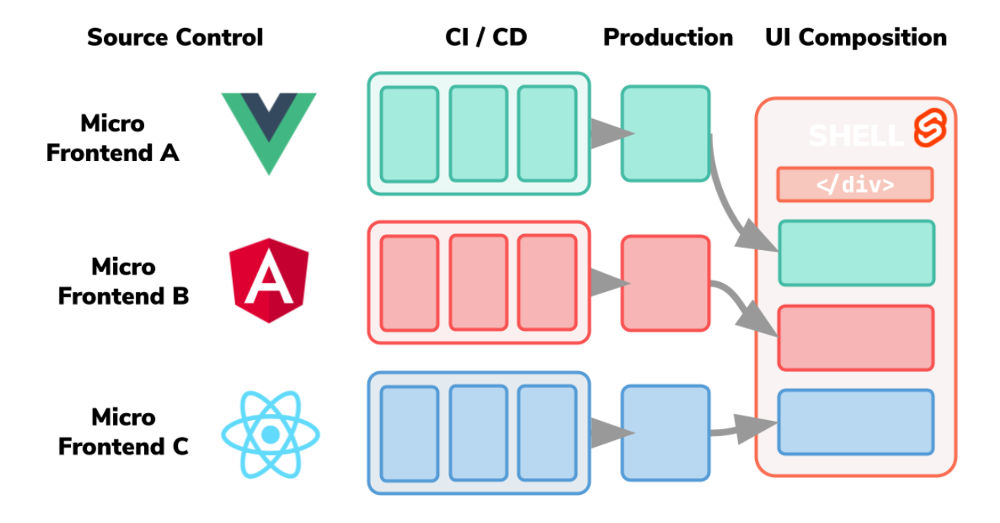

# MFA(Micro Frontend Architecture)

# MFA?



백엔드에서 기능별로 나눠 독립적으로 개발하고 관리하는 기술인 **마이크로 서비스** 개념이 있습니다.

프론트엔드에서도 기능을 작동시키는 화면(버튼, 검색창 등)에 마이크로 서비스 개념을 적용할 수 있습니다.

다양한 앱이 결합된 슈퍼앱이 글로벌 트렌드로 많이 떠오르면서 마이크로 서비스가 각광받고 있다고 합니다. 

## 마이크로 프론트엔드 특징

전체 소스코드를 하나의 저장소에서 개발하고 빌드, 배포까지 하나의 팀이 수행하는 개발 방식인 모놀리식(monolithic) 과 상반되는 개념으로

서로 독립된 프론트엔드 애플리케이션을 하나로 합쳐 큰 애플리케이션으로 구현하는 개념

- 대규모 서비스를 개발할 때 용이
- 단일 구조를 개발, 테스트 및 배포할 수 있는 작고 간단한 단위로 개발하는 패턴

### 장점

- 각 어플리케이션이 독립적으로 개발이 이루어지므로 자율적 팀조직 운영이 가능
- 라이브러리, 프레임워크의 업데이트가 있어도 모든 서비스가 아닌 개별적으로 업데이트가 가능
- 배포의 범위가 줄어들어 이슈 확률이 적어진다.

### 단점

- 배포 번들 사이즈의 크기가 크다.
- 운영/관리가 복잡해진다.

## 어플리케이션을 통합하는 방식

### 자바스크립트 런타임 통합

각 micro app을 `<script>` 태그를 사용해서 페이지에 삽입되고 로드시 전역 함수를 시작점으로 사용한다.

컨테이너 앱은 언제 어떻게 micro app들을 랜더링할지 결정하는 함수를 호출한다.

- 예시
    
    ```html
    <!-- 컨테이너 애플리케이션의 index.html -->
    
    <!DOCTYPE html>
    <html lang="en">
    <head>
        <meta charset="UTF-8">
        <meta name="viewport" content="width=device-width, initial-scale=1.0">
        <title>마이크로 프론트엔드 컨테이너</title>
    </head>
    <body>
        <!-- 마이크로 프론트엔드 앱들을 통합할 위치 -->
        <div id="app-container">
            <!-- 여기에 마이크로 프론트엔드 앱들이 런타임에 추가될 것임 -->
        </div>
    
        <!-- 마이크로 프론트엔드 앱들을 로드하고 통합하는 스크립트 -->
        <script src="path/to/micro-app1.js"></script>
        <script src="path/to/micro-app2.js"></script>
        <!-- 각 마이크로 앱은 전역 함수를 호출하여 시작점으로 사용함 -->
    
        <script>
            // 컨테이너 애플리케이션이 마이크로 프론트엔드 앱들을 렌더링할 때 호출할 함수를 정의
            function renderMicroApps() {
                // 마이크로 앱들을 렌더링하는 로직 작성
            }
        </script>
    </body>
    </html>
    
    ```
    

### iframe을 통한 런타임 통합

독립적인 하위페이지로 하나의 페이지를 만들 수 있다.

다른것보다 유연성이 떨어지는 경향

- 예시
    
    ```html
    <!-- 컨테이너 애플리케이션의 index.html -->
    
    <!DOCTYPE html>
    <html lang="en">
    <head>
        <meta charset="UTF-8">
        <meta name="viewport" content="width=device-width, initial-scale=1.0">
        <title>마이크로 프론트엔드 컨테이너</title>
    </head>
    <body>
        <!-- 각 마이크로 프론트엔드 앱을 iframe으로 렌더링 -->
        <iframe src="path/to/micro-app1.html" width="100%" height="300"></iframe>
        <iframe src="path/to/micro-app2.html" width="100%" height="300"></iframe>
        <!-- 각 앱은 독립된 HTML 페이지로써 동작 -->
    
    </body>
    </html>
    
    ```
    

### 웹 컴포넌트를 통한 런타임 통합

웹 컴포넌트의 커스텀 요소를 정의하고 해당 요소를 컨테이너에 추가하는 JavaScript 코드는 실제로 각 앱이 로드되는 시점에 실행된다.

- 예시
    
    ```html
    <!-- 컨테이너 애플리케이션의 index.html -->
    
    <!DOCTYPE html>
    <html lang="en">
    <head>
        <meta charset="UTF-8">
        <meta name="viewport" content="width=device-width, initial-scale=1.0">
        <title>마이크로 프론트엔드 컨테이너</title>
    </head>
    <body>
        <!-- 마이크로 프론트엔드 앱들을 통합할 위치 -->
        <div id="app-container">
            <!-- 여기에 마이크로 프론트엔드 앱들이 런타임에 추가될 것임 -->
        </div>
    
        <!-- 웹 컴포넌트 정의 -->
        <script src="path/to/web-components-bundle.js"></script>
    
        <!-- 마이크로 프론트엔드 앱들을 로드하고 통합하는 스크립트 -->
        <script>
            // 마이크로 프론트엔드 앱들을 로드하고 통합하는 로직
            // 예를 들어, Web Components의 customElements.define()을 사용하여 각 앱의 커스텀 요소를 정의하고
            // 컨테이너의 DOM에 추가하는 로직을 구현할 수 있습니다.
        </script>
    </body>
    </html>
    
    ```
    

### 빌드타임 통합

micro app을 패키지로 배포하고 컨테이너 앱에 dependency로 포함시키는 것

각 앱에 변경사항이 있다면 모든 마이크로 프론트 앱을 다시 컴파일하고 출시해야한다는 단점

## 고려할 점

### 1. 시각적 일관성

여러 프로젝트가 각자 운영되다 보니 디자인의 차이가 있을 수 있음

시각적 일관성을 위해서 재사용 가능한 공통 UI component 라이브러리를 사용해야한다.

### 2. 어플리케이션간 통신 설계

- 통신비용을 최소화 할 수 있게 설계
- 추후 유지보수 방식을 고려해야함

### 3. 백엔드 통신설계

- BFF(Backend for Frontend Pattern) 이용하기
    - 각 micro app 또는 각 프론트엔드 채널(웹, 앱)에 대한 백엔드를 의미
    - 컨테이너에서 인증관련 통신을 소유해서 각 micro app에 전달해 각 micro app과 서버인증 요청으로 통신하도록 한다.

## 토스 적용사례

`토스인터널` 서비스 기존 프로젝트는 jqeury,django로 개발 되어있었음

기술적 한계를 느껴 필요한 페이지에 리액트로 개발하기로 결정

기존의 코드베이스에 새로운 서비스가 탑승하는 방식으로 개발

각 서비스는 webpack entrypoint로 구분되지만

하나의 패키지에서 하나의 webpack 설정으로 한번에 빌드되는 구조

→ 서로 다른 서비스가 하나의 webpack빌드로 묶임

### 문제

1.  의존성 관리 힘들어짐
    - 서로 관련이 없는 A, B 서비스가 의존하는 X패키지가 있는데 B에서만 X패키지에 대한 문제 발생
    - X의 업데이트가 일어나면 A서비스에도 문제가 생김
    - 빠르게 변하는 프론트엔드 생태계 발맞추기 어려워짐
2. 긴 빌드시간
    - A서비스 코드 한줄만 수정해도 B-Z 서비스를 모두 새로 빌드해야함

### 마이크로 프론트엔드로 해결

1. 유지보수가 이뤄지는 단위로 독립적인 패키지로 분리
2. Yarn Workspace와 Lerna 사용
- 제품 전략면에서 독립된 제품들이 기술적으로도 독립 → **커뮤니케이션 비용 감소**
- 빌드시간 해결 → 내부 알고리즘을 통해 소스 코드가 바뀐 패키지만 빌드하고 나머지는 기존 **빌드 결과물을 재사용** 함으로써 빌드시간 `평균20분 → 평균3분`으로 단축

## Ref

[https://velog.io/@kylexid/마이크로프론트엔드-아키텍쳐](https://velog.io/@kylexid/%EB%A7%88%EC%9D%B4%ED%81%AC%EB%A1%9C%ED%94%84%EB%A1%A0%ED%8A%B8%EC%97%94%EB%93%9C-%EC%95%84%ED%82%A4%ED%85%8D%EC%B3%90)

https://www.lgcns.com/blog/cns-tech/cloud/50598/

https://youtu.be/DHPeeEvDbdo?si=7Zvod2faVYmmIhQv