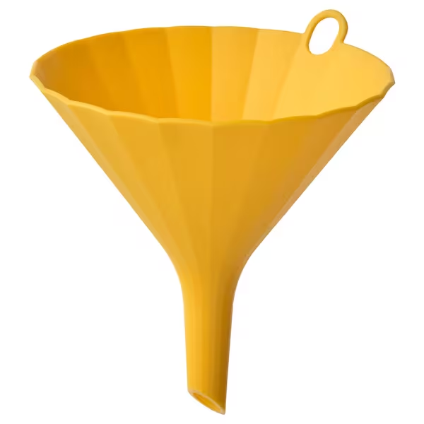
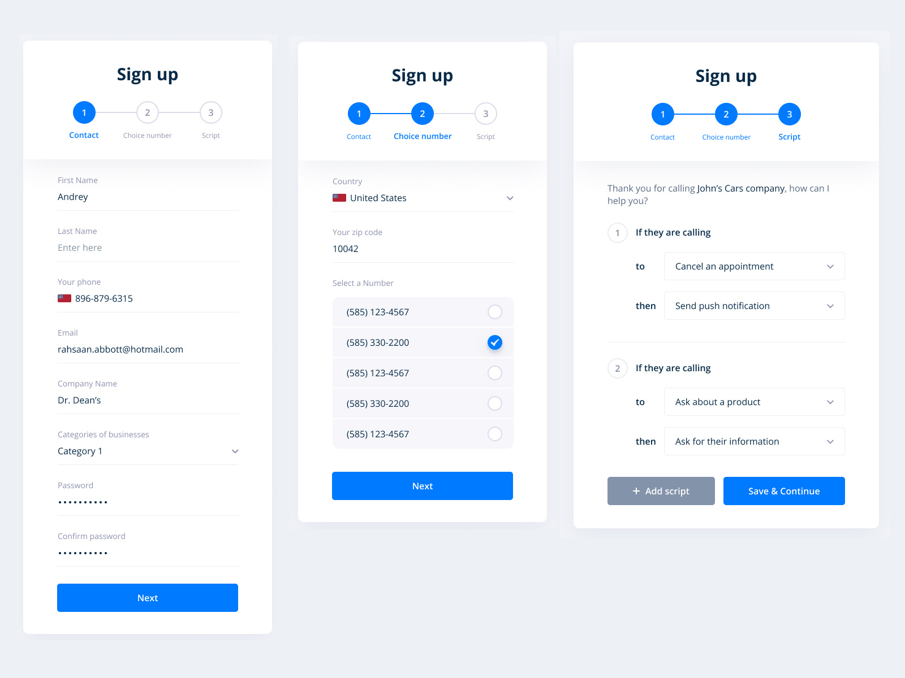

# Funnel



# ✅ **Funnel** : 깔때기

유저가 서비스에 들어와서 최종 목표지점까지 도달하는 모양이 깔때기와 같은 모양이라 하여 붙여진 이름



회원가입, 설문조사 같은 패턴에서 유저가 입력을 하면서 피로감을 덜 느끼도록 최소한의 입력폼을 만들어줍니다.

개발자는 단계별로 유저의 입력을 상태로 저장해서 다음페이지로 라우팅하고 마지막 단계에서 데이터를 서버로 전송해줍니다.

로직상 전혀 문제점이 없고 잘 동작하지만 **유지보수 관점**에서 보면 아래와 같은 문제점들이 있습니다.

1. 페이지 흐름을 파악하기 위해 라우터에 따라 **여러 파일**들을 넘나들어야 합니다.
2. 마지막 단계에서 사용하는 api에서 사용하는 상태가 **여러 페이지에 흩어져 있어** 추후 api 수정시 상태를 사용한 마지막 페이지 뿐만 아니라 앱 전체의 데이터 흐름을 확인해야 합니다.

---

## Step1. 응집도 높이기

응집도를 높이는 작업이란 연관된 코드를 가까운곳에 배치하는 것입니다.

```tsx
const [signupData, setSignupData] = useSate()
const [step, setStep] = useSate("이름")

return(
	<main>
		{step === "이름" && <이름입력UI onNext={(data) => {
			setSignupData(prev => ({...prev, 이름: data}))
			setStep("생년월일") />}
			}
		{step === "생년월일" && <생일입력UI onNext={() => {
			setSignupData(prev => ({...prev, 주소: data}))
			setStep("주소") />}
			}
		{step === "주소" && <주소입력UI onNext={async() => {
			await fetch(url, {data})
			setStep("가입완료") />}
			}
		{step === "가입완료" && <가입완료UI />}
	</main>
)
```

1. UI의 흐름을 한군데에서 관리 
2. api호출에 필요한 상태를 한군데에서 관리

➡️ 회원가입 하는데 필요한 정보가 추가 되더라도 유연하게 대처 가능, 전체적인 흐름 파악 개선

## Step2. 추상화

라이브러리화를 위해 공통로직만 분리하여 다른 코드에서도 문제없이 작동하도록 합니다.

현재 코드에서 **step상태에 따라 UI를 보여주는 부분을 추상화**하여 만든 코드가 **useFunnel** 입니다.

**useFunnel**은

1. 현재 step 상태를 알 수 있어야 함으로 내부에 step 상태를 가지고 있고 
2. Step 컴포넌트 name 프로퍼티와 현재 step 이 동일하면 해당 step 컴포넌트를 랜더링합니다.

```tsx
const [Funnel, setStep] = useFunnel("이름")

return(
	<Funnel>
		<Funnel.step name="이름">
			<이름입력 onNext={() => setStep("생년월일")} />
		</Funnel.step>
		//...
	</Funnel>
)
```

```tsx
function useFunnel(){
	const [step, setStep] = useState();

	const Step = (props) => {
		return <>{props.children}</>
	}

	const Funnel = ({children}) => {
		const targetStep = children.find(childStep => childStep.props.name === step);
		return Object.assign(targetStep, {step});
	}

return [Funnel, setStep]
}
```

---

## 💡 브라우저 히스토리 관리 기능

```tsx
     switch (setStepOptions?.stepChangeType) {
        case 'replace':
          router.replace(url, undefined, {
            shallow: true,
          });
          return;
        case 'push':
        default:
          router.push(url, undefined, {
            shallow: true,
          });
          return;
      }
```

단일 url 이지만 router의 **shallow push API**를 사용해 현재 URL을 변경하면서 페이지를 새로고침하지 않고

라우터 히스토리에 새 항목을 추가할 수 있으므로 뒤로가기를 해도 상태를 보존할 수 있습니다.

---

```tsx
/** @tossdocs-ignore */

import { assert } from '@toss/assert';
import { safeSessionStorage } from '@toss/storage';
import { useQueryParam } from '@toss/use-query-param';
import { QS } from '@toss/utils';
import deepEqual from 'fast-deep-equal';
import { useRouter } from 'next/router.js';
import { SetStateAction, useCallback, useEffect, useMemo, useRef, useState } from 'react';
import { useQuery } from 'react-query';
import { Funnel, FunnelProps, Step, StepProps } from './Funnel';
import { NonEmptyArray } from './models';

const DEFAULT_STEP_QUERY_KEY = 'funnel-step';

export const useFunnel = (
  steps,
  options?
) => {
  const router = useRouter();
  const stepQueryKey = options?.stepQueryKey ?? DEFAULT_STEP_QUERY_KEY;

  assert(steps.length > 0, 'steps가 비어있습니다.');

// export const Funnel = ({ steps, step, children }) => {
//   const validChildren = Children.toArray(children)
//     .filter(isValidElement)
//     .filter(i => steps.includes((i.props as Partial<StepProps<Steps>>).name ?? '')) as Array<
//     ReactElement<StepProps<Steps>>
//   >;

//   const targetStep = validChildren.find(child => child.props.name === step);

//   assert(targetStep != null, `${step} 스텝 컴포넌트를 찾지 못했습니다.`);

//   return <>{targetStep}</>;
// };

  const FunnelComponent = useMemo(
    () =>
      Object.assign(
        function RouteFunnel(props: RouteFunnelProps) {
          const step = useQueryParam(stepQueryKey) ?? options?.initialStep;

          assert(
            step != null,
            `표시할 스텝을 ${stepQueryKey} 쿼리 파라미터에 지정해주세요. 쿼리 파라미터가 없을 때 초기 스텝을 렌더하려면 useFunnel의 두 번째 파라미터 options에 initialStep을 지정해주세요.`
          );

          return <Funnel steps={steps} step={step} {...props} />;
        },
        {
          Step,
        }
      ),
    []
  );

  const setStep = useCallback(
    (step, setStepOptions?) => {
      const { preserveQuery = true, query = {} } = setStepOptions ?? {};

      const url = `${QS.create({
        ...(preserveQuery ? router.query : undefined),
        ...query,
        [stepQueryKey]: step,
      })}`;

      options?.onStepChange?.(step);

      switch (setStepOptions?.stepChangeType) {
        case 'replace':
          router.replace(url, undefined, {
            shallow: true,
          });
          return;
        case 'push':
        default:
          router.push(url, undefined, {
            shallow: true,
          });
          return;
      }
    },
    [options, router]
  );

  const setState = useCallback(
    (next: Partial<NextState> | ((next: Partial<NextState>) => NextState)) => {
      let nextStepValue: Partial<NextState>;
      if (typeof next === 'function') {
        nextStepValue = next(state);
      } else {
        nextStepValue = next;
      }

      if (nextStepValue.step != null) {
        nextPendingStepRef.current = nextStepValue.step;
      }
      nextStateRef.current = nextStepValue;

      _setState(next);
    },
    [_setState, state]
  );

  function withState(initialState: State) {
    if (!initializedRef.current) {
      setState(initialState);
      initializedRef.current = true;
    }
    return [FunnelComponent, state, setState] as const;
  }

  return Object.assign([FunnelComponent, setStep] as const, { withState })
};
```

## Next.js App router에 대한 이슈 🥲


# Ref

[React App에 useFunnel 원리를 적용한 사례](https://velog.io/@gene028/tify-useFunnel?utm_source=oneoneone)

[Slash Library useFunnel](https://slash.page/ko/libraries/react/use-funnel/README.i18n)

[토스 | SLASH 23 - 퍼널: 쏟아지는 페이지 한 방에 관리하기](https://youtu.be/NwLWX2RNVcw?si=tX7wEiSGZJjwhBB4)

[갓길종 블로그](https://xionwcfm.tistory.com/422)