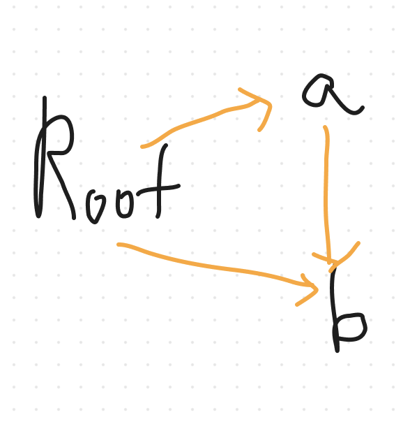
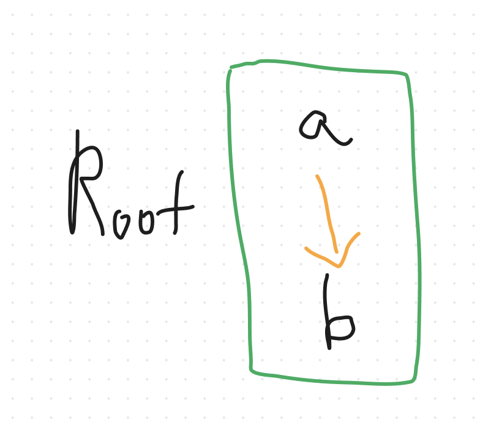
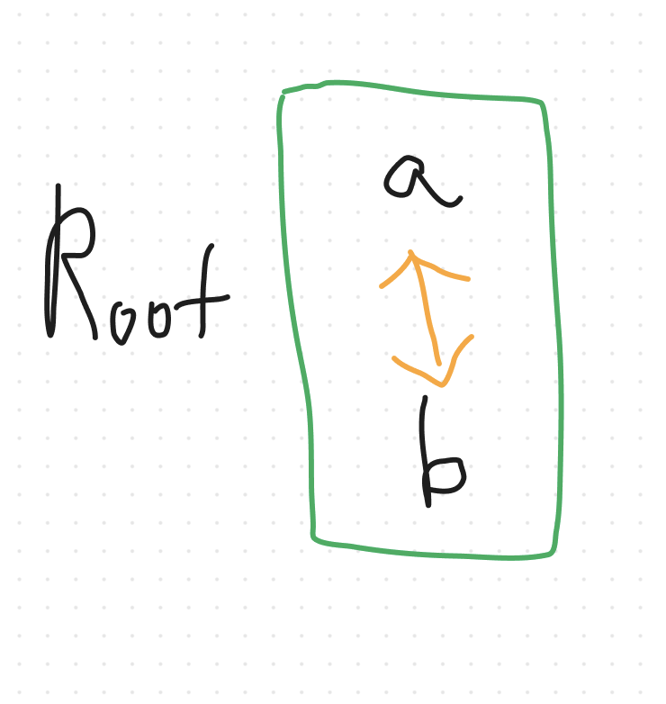

# 가비지 컬렉션
---
# 메모리 관리

가비지 컬렉터 등장 전에는 프로그래밍 언어에서 메모리 관리는 전적으로 개발자의 책임이었습니다.

개발자가 직접 메모리 관리를 하게 되면 성능상의 이점은 있지만

코드 작성하는데 시간이 더 걸리고 구현 난이도와 실수할 가능성이 높아집니다.

자바, 파이썬, 자바스크립트 같은 언어들을 보면 개발자가 메모리를 관리하지 않습니다.

왜냐하면 가비지 컬렉터가 해결해주니까요!

가비지 컬렉터는 할당한 메모리 공간을 주기적으로 검사하여 더 이상 사용되지 않은 메모리를 해제하는 기능을 말합니다.

가비지 컬렉터의 내부 동작원리는 다양한데요 그 중 가장 기본적인 두가지 방식을 소개합니다.

# 레퍼런스 카운팅

몇가지 방법으로 해당 객체에 접근할 수 있는지 뜻합니다.

해당 객체에 접근할 수 있는 방법이 하나도 없다면 레퍼런스 카운팅 0이 되면서 가비지 컬렉터의 대상이 됩니다.

```tsx
function count(){
	let a = {}; // RC(a) : 1
	{
		let b = {}; // RC(b) : 1
		a.test = b; // RC(b) : 2
	}
 // RC(b) : 1
}
count();
// RC(a) : 0 => a 삭제
// RC(b) : 0 => b 삭제
```

1. a 를 선언합니다. a라는 한 곳에서 참조를 하고 있으니 레퍼런스 카운트가 1이 증가합니다.
2. 블록 내부에서 b를 선언합니다. b라는 한 곳에서 참조를 하고 있으니 b의 레퍼런스 카운트가 1이 증가합니다.
3. a.test에 b를 할당합니다. 이제 b는 a.test로도 접근할 수 있습니다. b의 레퍼런스 카운트가 1이 증가되어 2가됩니다.
4. 블록을 벗어납니다. let은 블록레벨 스코프이므로 블록 바깥에서 접근할 수 없습니다. b의 레퍼런스 카운트가 1로 감소합니다.
5. 함수가 끝이나면 a에 접근할 수 없습니다. a의 레퍼런스 카운트가 0이 됩니다. → 가비지 컬렉터의 대상이 됩니다.=
6. a.test로 참조하고 있던 b의 레퍼런스 카운트가 감소하여 0이 됩니다. → 가비지 컬렉터의 대상이 됩니다.

객체마다 레퍼런스 카운트 하나씩 주고 그때 그때 계산만 하면 돼서 쉽다.

### 레퍼런스 카운팅의 문제점

```tsx
{
	let a = {}; //RC(a):1
	let b = {}; //RC(b):1

	a.test = b  //RC(a):2
	b.test = a  //RC(b):2
}

// RC(a):1,RC(b):1
```

블럭 바깥에서 a와 b에 접근할 방법이 없습니다.

하지만 a와 b는 여전히 레퍼런스카운트가 1로 가비지 컬렉터의 대상이 될 수 없습니다.

프로그램이 동작하는 동안 계속 메모리에 남아있게 되고 메모리 누수의 원인이 됩니다.

# Mark & Sweep

```tsx
{
	let a = {};
	let b = {};

	a.test = b;

	// 코드블럭 안에서 작동했을 때
}
```



M&S 방식은 RC 방식과 다르게 참조하는 개수를 카운트 하는게 아니라 선언을 한 출처와 연결을 합니다.

변수 a,b는 상위 코드가 없습니다. 시작하는 노드(여기서는 예를들어 Root)에 연결됩니다.

### 1. Mark

그래프에 연결된 모든 노드들을 순회하면서 마킹을 합니다.

일단 깊이 우선으로 탐색을 해보면

1. Root에 마크를 합니다.
2. Root에 연결된 a에 마크를 합니다.
3. a에 연결된 b에 마크를 합니다.
4. b에 연결된 노드가 없으므로 Root로 돌아갑니다.
5. Root에 연결된 b에 들어갑니다. b는 이미 3번에서 마크되었습니다.
6. 탐색을 종료합니다.

### 2. Sweep

객체 전체를 순서대로 마킹을 확인을 합니다.

마킹이 안되어있으면 Root랑 연결이 안되어있단 뜻입니다.

그것은 곧 가비지 컬렉터의 대상이 됩니다.

```tsx
{
	let a = {};
	let b = {};

	a.test = b;
}
	// 코드블럭 밖에서 작동했을 때
```



### 1. Mark

1. 코드 블럭 바깥에서는 Root노드와 연결이 끊겼습니다.
2. Root는 연결된 노드가 없습니다. 어떠한 노드도 마킹이 되지 않습니다.

### 2. Sweep

1. a와 b에 마킹이 안되어있으므로 가비지 컬렉터의 대상이 됩니다.

```tsx
{
	let a = {};
	let b = {};

	a.test = b;
	b.test = a;
}
// 여기서 가비지 컬렉팅 시작
```



Mark and Sweep 방식은 레퍼런스 카운팅의 문제점이었던 순환참조의 문제를 해결할 수 있습니다.

코드 블럭 바깥에서 가비지 컬렉팅이 일어날 때 Root부터 순회를 하는데

연결된 노드가 없으므로 마킹이 안된 a와 b의 메모리는 가비지 컬렉터의 대상이 됩니다.

# 그럼 Mark and Sweep 방식이 좋나요?

레퍼런스 카운팅 방식에서는 가비지 체크를 그때 그때 하면되었습니다.

참조 카운트가 0이면 그냥 지우면 되지만

Mark and Sweep 방식에서는 매번 선언된 객체 전체를 다 훑어봐야합니다.

프로그램이 조금만 복잡해져도 선언된 변수가 한두개가 아닐텐데요,

이걸 다 훑으면서 그때 그때 확인한다 ? 정말 무거운 작업입니다.

그렇기 때문에 Mark and Sweep 방식의 가비지 컬렉션은 최적화가 많이 필요합니다.

언제 가비지 컬렉션을 돌릴지부터 시작해서 비용이 가장 적게 돌릴 수 있는 방법을 고안하는 등 여러가지 개선을 해서 사용해야합니다.

# 결론

자바스크립트 가비지 컬렉션이 자동으로 이루어져서 메모리 관리 부분은 프론트엔드와 직접적인 관련이 없다고 생각했는데요, 클로저를 잘못 사용하거나 타이머를 해제하지 않는 등 특정한 상황에 의해 메모리 누수로 성능 문제를 접할 수 있습니다. 문제를 찾아서 해결하는 방법까지 제시할 수 있는 그날까지 열심히 공부하겠습니다… ! 

# Ref

**[자바스크립트 v8 엔진의 가비지 컬렉션 동작 방식](https://fe-developers.kakaoent.com/2022/220519-garbage-collection/)**

**[당신이 모르는 자바스크립트의 메모리 누수의 비밀](https://ui.toast.com/posts/ko_20210611)**