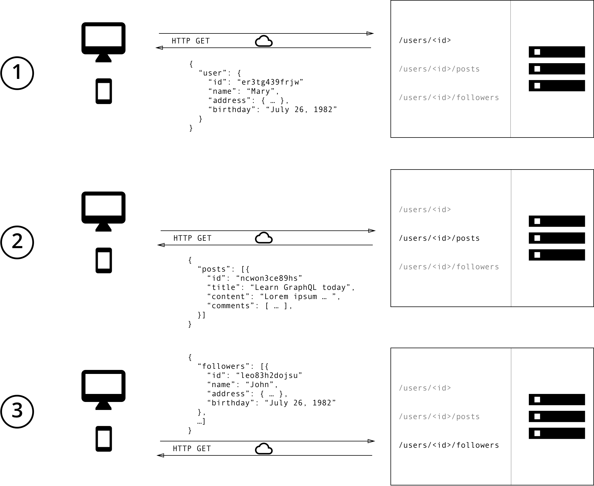

# GraphQL

- RestAPI의 문제점
  - 오버패칭
    - RestAPI는 특정 엔드포인트에 있는 자원을 가지고 온다.
    - 그런데 화면에 따라 응답 데이터의 일부만 필요할 수 도 있다.
  - 언더패칭
    - 필요한 데이터들을 한번에 받아 올 수 없어 여러번 쿼리를 날려야 하는 경우
  ⇒ 화면마다 필요한 데이터 응답만 받는 API를 모두 만들 수 없다.

- GraphQL
  - 오버패칭, 언더패칭 문제 해결
    - 클라이언트단에서 필요한 데이터만 유연하게 응답받을 수 있다.
  - 엔드포인트
    - `/graphql` 로 요청을 보내면 돼서 DB모델을 참고해서 원하는 필드를 요청 쿼리에 담아 보내면된다. ⇒ 의사소통 비용이 줄어든다.
- GraphQL 한계
  - 캐싱이 어렵다.
    - RestAPI는 엔드포인트별로 캐싱이 가능했지만 graphQL은 어렵다.
    - Apollo Client라이브러리를 사용해서 캐싱 옵션을 걸어두면 가능하다.
  - 에러 핸들링이 어렵다.
    - 여러개의 쿼리를 한번에 담아 보내면 성공한 쿼리는 data 필드에 실패한 쿼리는 error 필드에 담긴다. 여러개의 요청중 에러가 발생한 요청을 파악해서 대응해야하기 때문에 에러 처리가 힘들다.
    - Apollo Client 라이브러리를 사용하면 데이터 흐름 제어할 수 있는 Link 기능 활용
  - 백엔드 설계가 복잡해진다.
    - 클라이언트에서 보낸 쿼리들의 조합들을 모두 대응하고 있어야한다.
    - 많이 요청하면 그만큼 응답데이터가 무거워지므로 서버에 부담 주지 않기 위해 쿼리 제한 사항을 고려해야한다.
    - 따라서 작은 프로젝트에서 작은 데이터를 주고받는 경우에 graphQL을 도입한다면 오버엔지니어링 일 수 있다.

# Ref

https://blog.postman.com/graphql-vs-rest/
