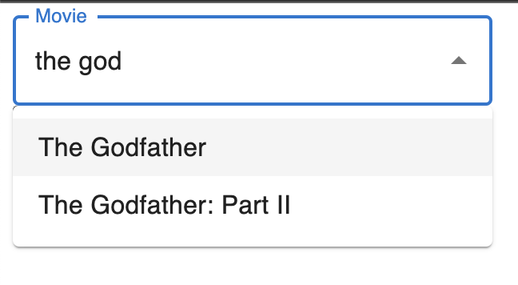
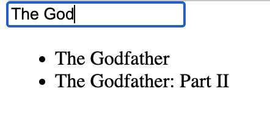

# Headless?

‘**머리가 없는**’ 이라고 직역될 수 있는 이 단어는

실제로 크롤링할 때 **Headless browser** 방식으로 브라우저 창을 띄우지 않고

실제 브라우저와 동일하게 동작하는 방식을 일컬을때도 사용합니다.

그렇다면 보여주지 않는다는 의미를 가졌다고 생각해 볼 수 있는데

보여지는 화면이 중요한 프론트엔드에서는 어떻게 해석할 수 있을까요?

# UI Library

**Mui**나 **Ant Design** 같은 UI라이브러리를 사용하면

바로 사용 가능한 마크업과 스타일이 제공되지만

번들 크기가 크고 기능 추가나 디자인 변경이 어렵다는 단점이 있습니다.

만에하나 해당 라이브러리에 심각한 버그가 발생하거나

유지보수를 종료한다면 그 나머지 몫은 오롯이 개발자가 감당하게 됩니다.

Headless UI 라는 개념은 바로 이런 문제를 해결하기 위한

**`기능은 있지만 스타일이 없는 컴포넌트`**를 의미합니다.

디자인이 중요하지 않고 커스텀할 부분이 많지 않다면

**Component 기반 라이브러리**를,

반응형에 따라 디자인이 달라지거나 기능 변경이 발생한다면

**Headless 라이브러리**를 사용하는것이 유지보수에 더 좋을것 같습니다.



MUI Autocomplete Component



Headless Autocomplete Component

```tsx
//mui	
      <Autocomplete
        disablePortal
        id='combo-box-demo'
        options={top100Films}
        sx={{ width: 300 }}
        renderInput={(params) => <TextField {...params} label='Movie' />}
      />

//headless ui
  const [selectedPerson, setSelectedPerson] = useState("");
  const [query, setQuery] = useState("");

  const filteredFilm =
    query === ""
      ? []
      : top100Films.filter((film) => {
          return film.label.toLowerCase().includes(query.toLowerCase());
        });

      <Combobox value={selectedPerson} onChange={setSelectedPerson}>
        <Combobox.Input placeholder='Movie' onChange={(event) => setQuery(event.target.value)} />
        <Combobox.Options>
          {filteredFilm.map((film) => (
            <Combobox.Option value={film.label}>
              {film.label}
            </Combobox.Option>
          ))}
        </Combobox.Options>
      </Combobox>

```

# Headless

라이브러리의 경우가 아니더라도

프론트엔드 어플리케이션에서도 Headless 개념을 적용하여

유지보수가 용이한 컴포넌트를 만들어 볼 수 있습니다.

위 두 라이브러리를 비교해보았을때 알 수 있는 Headless라는 개념은

**스타일링을 담당하게 되는 부분을 제외**하고 **상태와 관련된 부분**만을 다루는 것입니다.

## 관심사의 분리

관심사를 분리하는 것은 변경 가능성에 따른 분리를 하는것으로,

스타일링을 담당하는 코드와 상태를 다루는 코드를 분리하는 것입니다.

이런 저런 변경에 대응하기 위해 코드가 복잡해지는것을 예방할 수 있습니다.

## 유지보수 용이

변경에 취약한 UI를 고려하여 외부로 공개되는 인터페이스가 많아질수록

**관리가 어려워지기 때문에** 각각 관리함으로써 보다 코드를 잘 관리할 수 있습니다.

# Headless Component 작성해보기

```tsx
import { useState } from "react";

export default function Input() {
  const [inputValue, setInputValue] = useState("");

  return (
    <div>
      <label>What is your name? </label>
      <input
        type='text'
        value={inputValue}
        onChange={(e) => setInputValue(e.target.value)}
      />
    </div>
  );
}
```

이 Input 컴포넌트를 다른곳에서도 사용할 수 있게 하려면

1. 어떤 입력값을 받는지에 대한 label
2. input의 value
3. input의 onChange 로직

을 받아야 합니다.

```tsx
import { useState } from "react";
import Input from "./components/Input";

export default function App() {
  const [inputValue, setInputValue] = useState("");

  return (
    <Input
      label='What is your name?'
      value={inputValue}
      onChange={(e) => setInputValue(e.target.value)}
    />
  );
}
```

```tsx
export default function Input({ label, value, onChange }) {

  return (
    <>
      <label>{label} </label>
      <input
        type='text'
        value={value}
        onChange={onChange}
				//className = {p-2 border border-gray-300 `${props ? border-gray-500: null}`}
      />
    </>
  );
}
```

만약 InputBox를 사용하는 모든곳에서 디자인이 동일하다면 이렇게 사용해도 문제가 없을 것입니다.

하지만 특정 페이지나 컴포넌트에서 색상을 다르게 하거나

input의 위치를 옮기는 등의 레이아웃 변경이 일어나게 된다면 어떻게 해야할까요?

디자인이 조금 다르다는 이유로 내부에서 분기처리해서 수정하기 시작한다면 유지보수가 점점 힘들어집니다.

이럴때 Headless 컴포넌트를 만들면 좋을것 같습니다.

## Compound Component Pattern

```tsx
import { useState } from "react";
import InputWrapper from "./components/InputWrapper";

export default function App() {
  const [inputValue, setInputValue] = useState("");

  return (
    <InputWrapper
      value={inputValue}
      setInputValue={(e) => setInputValue(e.target.value)}
    >
      <InputWrapper.Label>What is your name?</InputWrapper.Label>
      <InputWrapper.Input/>
    </InputWrapper>
  );
}
```

```tsx
import { createContext, useContext } from "react";

const InputContext = createContext({
  value: "",
  onChange: () => {},
});

const InputWrapper = ({ value, onChange, children }) => {
  return (
    <InputContext.Provider value={value} onChange={onChange}>
      {children}
    </InputContext.Provider>
  );
};

const useInputContext = () => {
  const context = useContext(InputContext);
  return context;
};

const Input = ({ ...props }) => {
  const { value, onChange } = useInputContext();
  return <input type='text' value={value} onChange={onChange} {...props} />;
};

const Label = ({ children, ...props }) => {
  return <label {...props}>{children}</label>;
};

InputWrapper.Input = Input;
InputWrapper.Label = Label;

export default InputWrapper;
```

컴포넌트 내부에서 상태를 공유하기 위해 **Context API**를 사용하기 때문에

꽤 많은 양의 코드를 작성한것 같습니다.

**InputWrapper** 컴포넌트 사용부에서는 내부에 어떤 컴포넌트가 있는지 볼 수 있어

독립적으로 props를 추가할 수 있어 내용이나 위치를 수정하기 쉽습니다.

## Function as Child Component

```jsx
import InputHeadless from "./components/InputHeadless";

export default function App() {
  return (
    <InputHeadless>
      {({ inputValue, onChange }) => {
        return (
          <label>
            What is your name?
            <input type='text' value={inputValue} onChange={onChange} />
          </label>
        );
      }}
    </InputHeadless>
  );
}
```

```tsx
import { useState } from "react";

const InputHeadless = (props) => {
  const [inputValue, setInputValue] = useState("");

  if (!props.children || typeof props.children !== "function") return null;

  return props.children({
    inputValue,
    onChange: (e) => setInputValue(e.target.value),
  });
};

export default InputHeadless;
```

컴파운드 패턴보다 작성해야하는 코드가 현저히 줄었습니다.

컴포넌트 내부에서 로직과 상태를 관리하기 때문에

관련코드가 모여있는 응집도가 높아져 가독성도 높아졌습니다.

```tsx
//react beautiful dnd
<Droppable droppableId="droppable">
  {(provided, snapshot) => (
    <div ref={provided.innerRef} {...provided.droppableProps}>
      {...}
      {provided.placeholder}
    </div>
  )}
</Droppable>
```

## Custom Hooks

```jsx
import { useInput } from "./components/useInput";

export default function App() {
  const { inputValue, onChange } = useInput();

  return (
    <label>
      What is your name?
      <input type='text' value={inputValue} onChange={onChange} />
    </label>
  );
}
```

```jsx
import { useState } from "react";

export const useInput = () => {
  const [inputValue, setInputValue] = useState("");

  return {
    inputValue,
    onChange: (e) => setInputValue(e.target.value),
  };
};
```

위 두 방식보다 확실히 간단하고 직관적이어졌습니다.

```tsx
//tanstack-table

const {
    getState,
    getSelectedRowModel,
    setPageIndex,
    getCanPreviousPage,
    getPageCount,
    getCanNextPage,
    getRowModel,
    setPageSize,
    getFilteredRowModel,
    resetRowSelection,
    getCenterTotalSize,
    getHeaderGroups,
    previousPage,
    nextPage,
  } = useReactTable({
    columns,
    data,
    columnResizeMode,
    getCoreRowModel: getCoreRowModel(),
    getPaginationRowModel: getPaginationRowModel(),
  });
```

# Ref

[Headless UI Library란?](https://blog.jbee.io/react/Headless+UI+Library%EB%9E%80%3F)

[Headless Component](https://www.howdy-mj.me/design/headless-components)

[TanStack Table - Introduction](https://tanstack.com/table/v8/docs/guide/introduction)