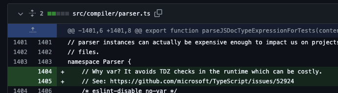
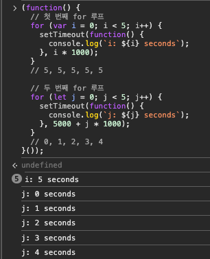
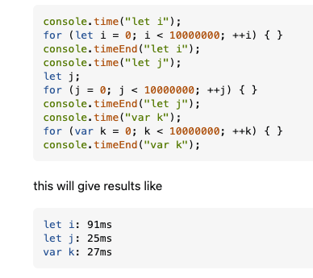
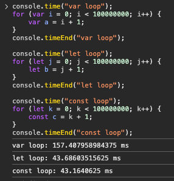
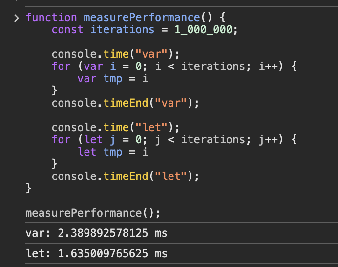
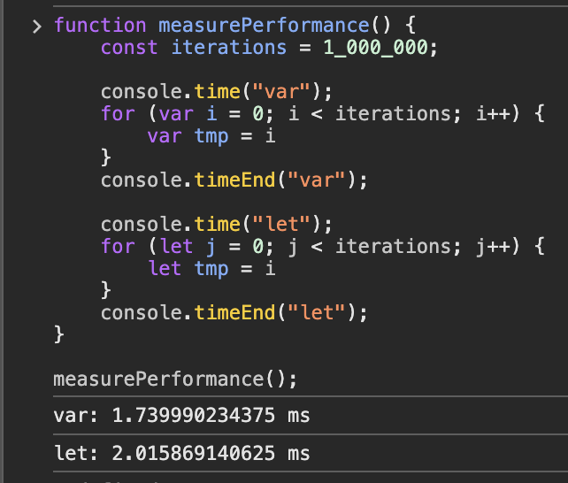

## 1. 타입스크립트의 컴파일러 코드 let,const → var 변경

### let,const가 느린 이유


- ESM사용을 위해서 es5에서 es2018로 컴파일러 타겟을 변경했다.
- 간결한 문법을 사용할 수 있었지만 성능저하가 일어났다.
    1. 합리적인 스코핑 규칙 - let/const는 블록 스코프를 벗어나지 않는다.
    2. 명확한 선언 검사 - 선언이 평가되기 전에는 let/const 변수에 접근할 수 없다.

⇒ 자바스크립트 엔진은 변수가 선언되기 전에 접근하려는 시도를 감지하고, 블록의 시작과 끝을 추적하여 변수의 유효 범위를 관리해야한다.

```tsx
function f() {
    let result = g();
    let x = 10;
    return result;

    function g() {
        return x;
    }
}

f() //ReferenceError: Cannot access 'x' before initialization
```

- `x`는 선언되기 전에 `g()`를 호출할 때 참조
- 이 기간이 "Temporal Dead Zone(TDZ)"
- 자바스크립트 런타임은 실제로 선언 지점에 도달했는지 추적해야 하며, 이는 런타임 비용 발생

### 그래서 var로 바꾸었더니 빨라졌다!

```jsx
        const downlevelLetConst = true;
        if (downlevelLetConst) {
            options.plugins = (options.plugins ?? []).concat({
                name: "let-const",
                setup: build => {
                    build.onEnd(async () => {
                        await exec(process.execPath, [
                            "./node_modules/@babel/cli/bin/babel.js",
                            "--plugins",
                            "@babel/plugin-transform-block-scoping",
                            outfile,
                            "--compact",
                            "false",
                            "--out-file",
                            outfile,
                        ]);
                    });
                },
            });
        }
```

- Babel 변환을 사용하여 let과 const를 var로 변환하여 TDZ 체크를 제거하였더니
    - 이전 타입스크립트와 똑같이 동작했다.
    - 코드가 실행되는 시간이 약 8%가 절약되었다.

### 그래서 타입스크립트가 어떻게 변경되었나



- parser: 스캐너 및 파서에서 최상위 변수들을 var로 변경 ([#52832](https://github.com/microsoft/TypeScript/pull/52832/files), 약 10-13% 절약)
    
    ```jsx
        // Share a single scanner across all calls to parse a source file.  This helps speed things
        // up by avoiding the cost of creating/compiling scanners over and over again.
        const scanner = createScanner(ScriptTarget.Latest, /*skipTrivia*/ true);
        var scanner = createScanner(ScriptTarget.Latest, /*skipTrivia*/ true);
    ```
    
    - 새로운 scanner 객체를 반복 생성하는 대신 코드 최상위 스코프에서 한번 생성하고 하위 함수들이 공유해서 사용한다.
    - 자바스크립트 엔진은 `const` 로 선언된 변수를 참조할 때마다 TDZ검사를 해야했지만 `var` 로 선언방식이 변경되면서 검사 비용을 줄일 수 있었다.
- binder:  바인더에서 최상위 변수를 var로 변경 ([#52903](https://github.com/microsoft/TypeScript/pull/52903/files), 약 1-3% 절약)
- checker: 타입 체커에서 클로저 상태를 var로 변경 ([#52835](https://github.com/microsoft/TypeScript/pull/52835), 약 3-5% 절약)
- Emitter/Printer/Writer:  var로 변경 ([#52906](https://github.com/microsoft/TypeScript/pull/52906/files), 약 1.5-3% 절약)

### 그래서  var로 바꾸는게 무조건 좋을까?

모든 코드가 자동으로 var를 사용해야 한다고 생각하지는 않습니다. 우리는 **잘 이해된 타협**을 기반으로 최적화를 적용했으며, 다른 사람들도 광범위한 리팩토링을 수행하기 전에 신중한 판단과 프로파일링/성능 테스트를 권장합니다.

## 2. var가 더 빠른 이유를 자세히 알아보자

```
A Lexical Environment is a specification type used to define the association of Identifiers to specific variables and functions based upon the lexical nesting structure of ECMAScript code. (중략) Usually a Lexical Environment is associated with some specific syntactic structure of ECMAScript code such as a FunctionDeclaration, a BlockStatement, or a Catch clause of a TryStatement and anew Lexical Environment is created each time such code is evaluated.

(발번역 주의) 렉시컬 환경은 ECMAScript 코드의 렉시컬 중첩구조를 기반으로 식별자(identifier)와 특정 변수 및 함수와의 연관성을 정의하기 위한 스펙 유형이다. 렉시컬 환경은 일반적으로 Function Declaration, Block Statement, try구문의 catch 절과 같은 ECMAScript 코드의 특정 구문 구조와 연결되며,이러한 코드가 평가될 때마다 새로운 렉시컬 환경이 생성된다.
```

- 렉시컬 환경
    - 자바스크립트에서 함수나 블록 내에서 변수와 함수 선언이 관리되는 구조
    - 각 렉시컬 환경은 변수와 함수의 이름과 값, 상위 스코프에 대한 참조를 포함
- 스코프 종류
    - 블록 스코프 :  `const` `let` 으로 선언된 변수는 블록 스코프를 가지며, `{}` 로 정의된 블록 내에서만 유효. 블록 스코프는 블록 내부의 렉시컬 환경에 할당된다.
    - 함수 스코프 : `var` 로 선언된 변수는 함수 스코프를 가지며, 함수의 전체 블록 내에서 접근 가능
- 비용적 측면
    - 블록 스코프 변수
        - `if` `for` `while` 등의 블록 내에서 선언된다.
        - 블록이 시작될 때 새로운 렉시컬 환경이 생성되어 블록의 시작과 끝에서 새로운 환경을 설정하고 해제해야 하므로 시스템적 비용이 발생
        - 이러한 변수들은 블록의 시작 지점에 초기화 되며, 해당 블록이 끝날 때까지 유효
    - 함수 스코프 변수
        - `함수의 시작 부분`에서 선언되고 초기화된다.
        - 함수 내에서는 단일 렉시컬 환경이 사용되며 블록이 내부적으로 있어도 함수 전체에서 동일한 환경을 공유
        - 함수 스코프 변수는 블록이 끝나도 영향을 받지 않고, 함수가 종료될 때까지 유효
        - 따라서 함수 스코프 변수는 블록 스코프 변수에 비해 상대적으로 적은 시스템적 비용이 발생



```
let이나 const의 경우 블록 스코프를 가지고 있기 때문에 블록 영역에서 매번 새롭게 스코프가 설정이되는 반면 `var`는 함수 스코프를 가지기 때문에 함수 내에서 스코프가 한번 생성되기 때문에 비용이 비교적 덜 발생한다.
```

### 실제로 `var` 가 더 빠를까?









- [2016년 크롬 버그 리포트](https://issues.chromium.org/issues/42208116)에 따르면 `Low performance when use "let" in "for" loop` 라는 제목으로 성능에 대한 이슈가 제기 되었고  v8 자바스크립트 엔진은 최적화가 되었다.
- `let` 과 `const` 는 2015년 ES6문법이라 브라우저가 최적화를 덜 한 상태에서 이슈가 있었던것
- 성능차이는 미미하거니와 `var` 로 선언함으로써 나타나는 문제점이 더 위험하기 때문에 `let` 과 `const` 를 사용하는것이 더 안정적이라고 생각

### Ref

https://blinders.tistory.com/101

https://roy-jung.github.io/170110_let-vs-var-performance-compare/

https://stackoverflow.com/questions/40070631/v8-javascript-performance-implications-of-const-let-and-var

https://stackoverflow.com/questions/21467642/is-there-a-performance-difference-between-let-and-var-in-javascript