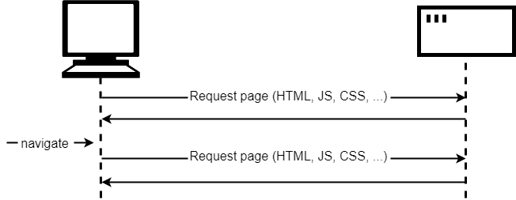
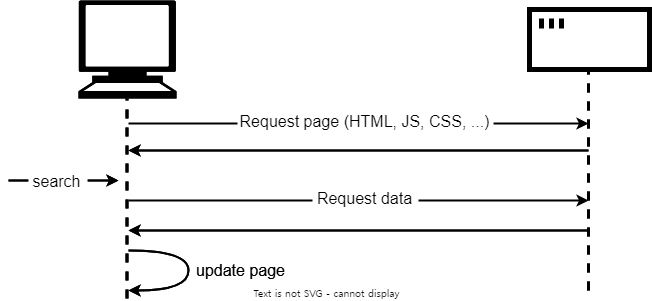

`AJAX`는 Asynchronous Javascript And XML의 약자 입니다.

자바스크립트를 사용해서 비동기 방식으로 브라우저가 서버에게 데이터를 요청하고

응답 받은 데이터를 가지고 웹 페이지를 동적으로 업데이트를 하는 `프로그래밍 방식`입니다.

### XML

비동기, 자바스크립트는 알겠는데 XML은 무엇일까요?

XML(Extensible Markup Language)은 확장 가능한 마크업 언어 입니다.

HTML(Hyper Text Markup Language)와 비슷하지만 html과 달리 미리 정의된 태그가 없는 마크업 언어 입니다.

```jsx
<svg width="100" height="100" xmlns="http://www.w3.org/2000/svg">
    <!-- 파란색 원 -->
    <circle cx="50" cy="50" r="40" stroke="black" stroke-width="3" fill="blue" />
    
    <!-- 빨간색 사각형 -->
    <rect x="10" y="10" width="30" height="30" stroke="black" stroke-width="3" fill="red" />
    
    <!-- 초록색 선 -->
    <line x1="0" y1="0" x2="100" y2="100" stroke="green" stroke-width="2" />
    
    <!-- 텍스트 -->
    <text x="50" y="95" font-family="Verdana" font-size="12" fill="black" text-anchor="middle">SVG Example</text>
</svg>
```

```jsx
<?xml version="1.0" encoding="UTF-8" ?>
<rss version="2.0">
    <channel>
        <title>Example RSS Feed</title>
        <link>http://www.example.com/</link>
        <description>This is an example RSS feed</description>
        <language>en-us</language>
        <pubDate>Sun, 04 Aug 2024 00:00:00 +0000</pubDate>
        
        <item>
            <title>Example Article 1</title>
            <link>http://www.example.com/article1</link>
            <description>This is the first example article.</description>
            <author>author@example.com (Author Name)</author>
            <pubDate>Sun, 04 Aug 2024 00:00:00 +0000</pubDate>
            <guid>http://www.example.com/article1</guid>
        </item>
        
        <item>
            <title>Example Article 2</title>
            <link>http://www.example.com/article2</link>
            <description>This is the second example article.</description>
            <author>author@example.com (Author Name)</author>
            <pubDate>Sun, 04 Aug 2024 01:00:00 +0000</pubDate>
            <guid>http://www.example.com/article2</guid>
        </item>
    </channel>
</rss>
```

```jsx
{
  "rss": {
    "version": "2.0",
    "channel": {
      "title": "Example RSS Feed",
      "link": "http://www.example.com/",
      "description": "This is an example RSS feed",
      "language": "en-us",
      "pubDate": "Sun, 04 Aug 2024 00:00:00 +0000",
      "items": [
        {
          "title": "Example Article 1",
          "link": "http://www.example.com/article1",
          "description": "This is the first example article.",
          "author": "author@example.com (Author Name)",
          "pubDate": "Sun, 04 Aug 2024 00:00:00 +0000",
          "guid": "http://www.example.com/article1"
        },
        {
          "title": "Example Article 2",
          "link": "http://www.example.com/article2",
          "description": "This is the second example article.",
          "author": "author@example.com (Author Name)",
          "pubDate": "Sun, 04 Aug 2024 01:00:00 +0000",
          "guid": "http://www.example.com/article2"
        }
      ]
    }
  }
}
```

- `XML`은 [`SVG`](https://developer.mozilla.org/ko/docs/Web/SVG)(Scalable Vector Graphics)나 [`RSS`](https://developer.mozilla.org/ko/docs/Glossary/RSS)(Really Simple Syndication)에 주로 사용합니다.

```jsx
xhr.setRequestHeader('Content-Type', 'application/xml');
```

- `AJAX`를 사용하던 초기에는 요청/전송되는 데이터의 형식으로 트리구조를 가진 `XML`을 사용했지만 요즘은 키-쌍 값을 가진 `JSON`을 많이 사용합니다.
    - `JSON` 은 구문 분석기가 따로 필요한 `XML` 과 달리 표준 자바스크립트 객체로 파싱해서 구문 분석을 더 빠르게 할 수 있고 가독성도 더 좋습니다.
    - `JSON` 은 `XML` 보다 안전합니다. `XML` 은 무단 수정에 취약하며 외부 엔티티 삽입(XXE), 비정형외부 문서 형식 선언(DTD) 에도 취약합니다.
    - `XML` 은 한정된 범위의 데이터 유형만 지원하는 `JSON` 보다 복잡한 데이터 유형을 지원합니다.

## XMLHttpRequest vs fetch vs axios

### XMLHttpRequest

```jsx
<!DOCTYPE html>
<html>
<head>
  <title>AJAX Example</title>
  <script>
    function loadData() {
      var xhr = new XMLHttpRequest();
      xhr.onreadystatechange = function() {  
				 //1. UNSENT (숫자 0) : XMLHttpRequest 객체가 생성됨.
				 //2. OPENED (숫자 1) : open() 메소드가 성공적으로 실행됨.
				 //3. HEADERS_RECEIVED (숫자 2) : 모든 요청에 대한 응답이 도착함.
				 //4. LOADING (숫자 3) : 요청한 데이터를 처리 중임.
				 //5. DONE (숫자 4) : 요청한 데이터의 처리가 완료되어 응답할 준비가 완료됨.
        if (xhr.readyState == 4 && xhr.status == 200) {
          document.getElementById("data").innerHTML = xhr.responseText;
        }
      };
      // open 메서드의 3번째 인자는 비동기식 호출 여부를 의미
      xhr.open("GET", "http://www.example.org/example.txt", true); 
      xhr.send();
    }
  </script>
</head>
<body>
  <button onclick="loadData()">Load Data</button>
  <div id="data"></div>
</body>
</html>
```

- `send()` 메서드를 사용하면 응답이 언제 오는지 알 수 없다.
- 현재 요청상태를 나타내는 `readyState` 프로퍼티가 변경될 때마다 발생하는 `readystatechange` 이벤트를 통해 HTTP 요청의 현재 상태를 확인해야한다.

# fetch

```jsx
fetch('https://api.example.com/nonexistent-endpoint')
  .then(response => response.json()) // 이 블록은 HTTP 상태 코드가 200인 경우만 성공적으로 작동합니다.
  .then(data => {
    console.log(data);
  })
  .catch(error => {
    console.error('Error caught by catch:', error); // 네트워크 오류만 잡아냅니다.
  });
```

- `fetch` 함수가 반환하는 프로미스는 `404`, `500` 에러 등 HTTP 에러가 발생해도 `reject` 를 실행하지 않고 응답의 `Response` 객체의 `ok` 상태를 `false`로 설정해서 `resolve` 한다.
- 네트워크 장애나 CORS 등에 의해 **요청이 완료되지 못한 경우**에만 `catch` 블록이 실행된다.

```jsx
fetch('https://api.example.com/nonexistent-endpoint')
  .then(response => {
    if (!response.ok) {
      throw new Error('HTTP error! status: ' + response.status); // 상태 코드가 200이 아닌 경우 오류를 발생시킵니다.
    }
    return response.json(); // 상태 코드가 200인 경우에만 JSON 파싱을 시도합니다.
  })
  .then(data => {
    console.log(data);
  })
  .catch(error => {
    console.error('Error caught by catch:', error); // HTTP 상태 코드 오류와 네트워크 오류를 모두 잡아냅니다.
  });

```

# axios

```jsx
axios.getAdapter = adapters.getAdapter;
```

```jsx
const knownAdapters = {
  http: httpAdapter, // node.js
  xhr: xhrAdapter,
  fetch: fetchAdapter
}

export default {
  getAdapter: (adapters) => {
   //...
      if (!isResolvedHandle(nameOrAdapter)) {
        adapter = knownAdapters[(id = String(nameOrAdapter)).toLowerCase()];

        if (adapter === undefined) {
          throw new AxiosError(`Unknown adapter '${id}'`);
        }
      }
   //...
    return adapter;
  },
  adapters: knownAdapters
}
```

```jsx
// adapters/xhr.js
const isXHRAdapterSupported = typeof XMLHttpRequest !== 'undefined';

export default isXHRAdapterSupported && function (config) {
    let request = new XMLHttpRequest();

    request.open(_config.method.toUpperCase(), _config.url, true);

    if ('onloadend' in request) {
      // Use onloadend if available
      request.onloadend = onloadend;
    } else {
      // Listen for ready state to emulate onloadend
      request.onreadystatechange = function handleLoad() {
        if (!request || request.readyState !== 4) {
          return;
        }

        // The request errored out and we didn't get a response, this will be
        // handled by onerror instead
        // With one exception: request that using file: protocol, most browsers
        // will return status as 0 even though it's a successful request
        if (request.status === 0 && !(request.responseURL && request.responseURL.indexOf('file:') === 0)) {
          return;
        }
        // readystate handler is calling before onerror or ontimeout handlers,
        // so we should call onloadend on the next 'tick'
        setTimeout(onloadend);
      };
    }

    // Remove Content-Type if data is undefined
    requestData === undefined && requestHeaders.setContentType(null);

    // Add headers to the request
    if ('setRequestHeader' in request) {
      utils.forEach(requestHeaders.toJSON(), function setRequestHeader(val, key) {
        request.setRequestHeader(key, val);
      });
    }

    // Add withCredentials to request if needed
    if (!utils.isUndefined(_config.withCredentials)) {
      request.withCredentials = !!_config.withCredentials;
    }

    // Add responseType to request if needed
    if (responseType && responseType !== 'json') {
      request.responseType = _config.responseType;
    }

    // Handle progress if needed
    if (onDownloadProgress) {
      ([downloadThrottled, flushDownload] = progressEventReducer(onDownloadProgress, true));
      request.addEventListener('progress', downloadThrottled);
    }

    // Not all browsers support upload events
    if (onUploadProgress && request.upload) {
      ([uploadThrottled, flushUpload] = progressEventReducer(onUploadProgress));

      request.upload.addEventListener('progress', uploadThrottled);

      request.upload.addEventListener('loadend', flushUpload);
    }

    // Send the request
    request.send(requestData || null);
  });
}
```

```jsx

export default isFetchSupported && (async (config) => {
  try {
    request = new Request(url, {
      ...fetchOptions,
      signal: composedSignal,
      method: method.toUpperCase(),
      headers: headers.normalize().toJSON(),
      body: data,
      duplex: "half",
      credentials: withCredentials
    });

    let response = await fetch(request);

      response = new Response(
        trackStream(response.body, DEFAULT_CHUNK_SIZE, onProgress, () => {
          flush && flush();
          isStreamResponse && onFinish();
        }, encodeText),
        options
      );
    }

    return await new Promise((resolve, reject) => {
      settle(resolve, reject, {
        data: responseData,
        headers: AxiosHeaders.from(response.headers),
        status: response.status,
        statusText: response.statusText,
        config,
        request
      })
    })
  } catch (err) {
    onFinish();

    if (err && err.name === 'TypeError' && /fetch/i.test(err.message)) {
      throw Object.assign(
        new AxiosError('Network Error', AxiosError.ERR_NETWORK, config, request),
        {
          cause: err.cause || err
        }
      )
    }

    throw AxiosError.from(err, err && err.code, config, request);
  }
});
```

# Ref

[axios github](https://github.dev/axios/axios)