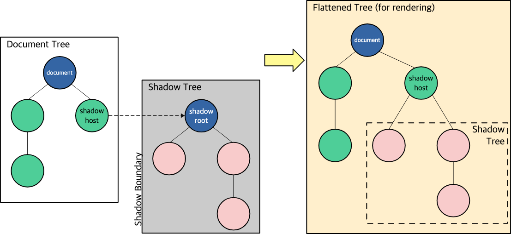
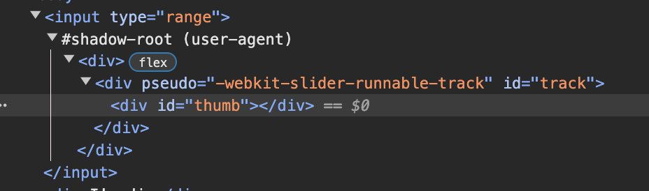
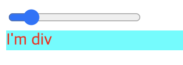
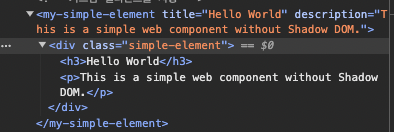
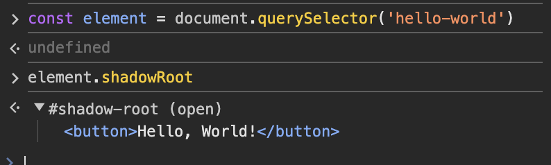
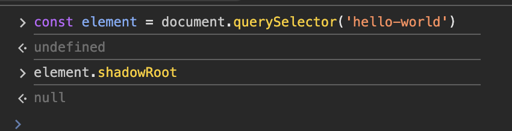
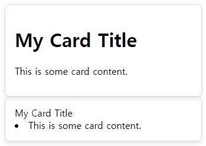

- 웹 컴포넌트는 그 기능을 나머지 코드로부터 `캡슐화`하여 `재사용 가능한 커스텀 엘리먼트`를 생성하고 웹 앱에서 활용할 수 있도록 해주는 다양한 기술들의 모음
    - 재사용 가능한 UI 컴포넌트
    - 표준화된 방식으로 프레임워크로부터 독립적
    - 브라우저가 기본적으로 지원하는 표준 기술이기 때문에 다양한 브라우저에서 일관되게 동작

## Web Component 사용 방법

1. `class` 문법을 사용해서 웹 컴포넌트 기능을 명시 `extends HTMLElement` 
2. `customElement.define()` 새로운 커스텀 엘리먼트를 등록
    1. 필요한 경우 `Element.attachShadow()` 메소드를 사용해 **shadow DOM** 을 커스텀 엘리먼트에 추가
    2. 필요한 경우, `<template>` 과 `<slot>` 을 사용해 HTML **템플릿**을 정의
3. 일반적인 HTML의 element처럼 필요한 곳에서 자유롭게 사용

### Custom Element

```html
<!-- 전통적 마크업 방식 -->
<div class="card">
  
  <div class="card-content">
    <h3>Title 1</h3>
    <p>Description for image 1</p>
  </div>
</div>

<div class="card">
  
  <div class="card-content">
    <h3>Title 2</h3>
    <p>Description for image 2</p>
  </div>
</div>

<!-- Web Component -->
<my-card title="Title 1" image="image1.jpg" description="Description for image 1"></my-card>
<my-card title="Title 2" image="image2.jpg" description="Description for image 2"></my-card>
```

```jsx
// card.js
class MyCard extends HTMLElement {
  constructor() {
    super();
		//...
  }
}

customElements.define('my-card', MyCard);
```

- Full Code
    
    ```html
    <!DOCTYPE html>
    <html lang="en">
    <head>
      <meta charset="UTF-8">
      <meta name="viewport" content="width=device-width, initial-scale=1.0">
      <title>Custom Card Component</title>
      <style>
        /* 전역 스타일 */
        my-card .card {
          border: 1px solid #ccc;
          padding: 16px;
          border-radius: 8px;
          box-shadow: 2px 2px 12px rgba(0, 0, 0, 0.1);
          background-color: white;
          width: 300px;
          margin: 20px;
        }
    
        my-card .card img {
          width: 100%;
          height: auto;
          border-bottom: 1px solid #ccc;
        }
    
        my-card .card-content {
          padding: 8px;
        }
    
        my-card h3 {
          font-size: 1.5em;
          margin: 0;
        }
    
        my-card p {
          font-size: 1em;
          color: #666;
        }
      </style>
    </head>
    <body>
    
      <!-- 커스텀 엘리먼트 사용 -->
      <my-card title="Title 1" image="image1.jpg" description="Description for image 1"></my-card>
    
      <script>
        // 커스텀 엘리먼트 정의
        class MyCard extends HTMLElement {
          constructor() {
            super();
    
            // Wrapper div 생성
            const wrapper = document.createElement('div');
            wrapper.className = 'card';
    
            // 이미지 엘리먼트 생성
            const image = document.createElement('img');
            image.src = this.getAttribute('image');
            image.alt = this.getAttribute('title');
    
            // Content div 생성
            const content = document.createElement('div');
            content.className = 'card-content';
    
            // 제목 엘리먼트 생성
            const title = document.createElement('h3');
            title.textContent = this.getAttribute('title');
    
            // 설명 엘리먼트 생성
            const description = document.createElement('p');
            description.textContent = this.getAttribute('description');
    
            // DOM 트리에 추가
            content.appendChild(title);
            content.appendChild(description);
            wrapper.appendChild(image);
            wrapper.appendChild(content);
    
            this.appendChild(wrapper);
          }
        }
    
        // 커스텀 엘리먼트를 등록
        customElements.define('my-card', MyCard);
      </script>
    
    </body>
    </html>
    
    ```
    

### shadow DOM

- 웹 컴포넌트의 핵심 키워드는 `캡슐화`
- `shadow DOM` 은 **마크업 구조, 스타일, 동작을 숨기고** 페이지의 다른 코드로부터의 분리하여 각기 다른 부분들이 **충돌하지 않게 하고**, **코드를 깔끔하게 유지**
    
    
    
    - `Element.attachShadow()` 메서드로  `DOM` 의 어느곳에서나 부착하여 새로운 `shadow DOM` 을 형성할 수 있다.
    - `DOM` 과 정확히 똑같이 동작하지만 다른점은 **외부 `DOM` 에 전혀 영향을 끼치지 않는다**. ⇒ `캡슐화`
        
        
        
        <input type=”range”/>
        
    
    ```html
    	<head>
    		<style>
    			* {
    				color: red;
    			}
    
    			div {
    				background-color: aqua;
    			}
    		</style>
    	</head>
    	<body>
    		<input type="range" />
    		<div>I'm div</div>
    	</body>
    ```
    
    
    
    
    
    shadow DOM을 쓰지 않은 경우 캡슐화가 되지 않는다.
    

```jsx
let shadow = elementRef.attachShadow({ mode: "open" });
```

- 컴포넌트의 내부를 외부 스크립트에서 제어하거나 조작할 필요한 경우



```jsx
let shadow = elementRef.attachShadow({ mode: "closed" });
```

- 보안이나 무결성이 중요한 UI 요소나 위젯을 만들 때



### iframe

- `iframe` 도 전역 CSS에 영향을 받지 않고 독립적인 스크립트 컨텍스트를 가진다는 점에서 `Web Component` 와 비슷한 느낌이 들지만
    - 별도의 HTML 문서를 로드해야 하므로, 불필요한 HTTP 요청이 발생,  성능 면에서 비효율적
    - 로드되는 페이지가 다른 도메인에 있을 경우, 보안상의 이유로 두 페이지 간의 상호작용이 제한

### <template>,<slot>

- 구조와 스타일을 미리 정의 해놓은 `template` 을 재사용 할 수 있다.

```html
    <template id="my-card-template">
      <style>
        .card {
          border: 1px solid #ddd;
          border-radius: 8px;
          padding: 16px;
          box-shadow: 0 4px 8px rgba(0, 0, 0, 0.1);
          max-width: 300px;
        }
      </style>
      <div class="card">
        <slot name="title"></slot>
        <slot name="content"></slot>
      </div>
    </template>
```

```html
    <my-card>
      <h1 slot="title">My Card Title</h1>
      <p slot="content">This is some card content.</p>
    </my-card>

    <my-card>
      <div slot="title">My Card Title</div>
      <li slot="content">This is some card content.</li>
    </my-card>
```

```html
    <script>
      class MyCard extends HTMLElement {
        constructor() {
          super();
          const template = document.getElementById("my-card-template");
          const shadowRoot = this.attachShadow({ mode: "open" });
          shadowRoot.appendChild(template.content.cloneNode(true));
        }
      }

      customElements.define("my-card", MyCard);
    </script>
```


## React 에서의 shadow DOM의 활용

- 전역 스타일 스코프로부터의 격리

```jsx
import { useEffect, useRef } from 'react'

export default function Shadow() {
  const shadowRef = useRef(null)

  useEffect(() => {
    const shadowRoot = shadowRef.current.attachShadow({ mode: 'open' })
    const style = document.createElement('style')
    style.textContent = `
      .shadow-content {
        color: red;
        background-color: lightgray;
        padding: 20px;
        border-radius: 10px;
      }
    `
    shadowRoot.appendChild(style)

    const content = document.createElement('div')
    content.className = 'shadow-content'
    content.textContent = 'This is inside a Shadow DOM!'
    shadowRoot.appendChild(content)
  }, [])

  return <div ref={shadowRef}></div>
}
```



```jsx
import root from 'react-shadow';
import styles from './styles.css';

export default function Quote() {
    return (
        <root.div className="quote">
            <q>There is strong shadow where there is much light.</q>
            <span className="author">― Johann Wolfgang von Goethe.</span>
            <style type="text/css">{styles}</style>
        </root.div>
    );
}
```

# Ref

[MDN](https://developer.mozilla.org/ko/docs/Web/API/Web_components)

[**(번역) Shadow DOM을 스타일링 하는 8가지 방법**](https://velog.io/@superlipbalm/8-ways-to-style-the-shadow-dom)

[Web Component](https://velog.io/@park-moen/WEB-Component#-shadow-dom)

[**웹 컴포넌트(3) - 쉐도우 돔(#Shadow DOM)**](https://ui.toast.com/posts/ko_20170721)

[**shadow DOM으로 신규 프로젝트의 스타일을 지키는 방법**](https://tech.inflab.com/202208-shadow-root/)