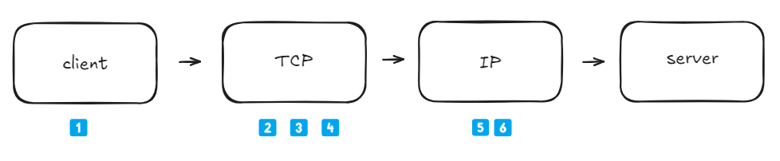
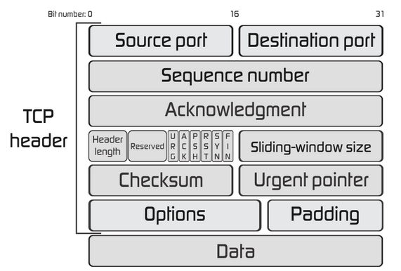

- 클라이언트와 서버가 데이터를 주고받기 위해 3-Way Handshake를 통해 `TCP` 연결을 설정한 후 HTTP 요청/응답을 주고받는다.

## TCP(Transmission Control Protocol)

- Transmission : 명사; 전파, 전달/전송, 송신 ⇒ 전송을 제어하는 통신 규약
- `TCP` 연결은 어플리케이션 사이에서 **데이터를 안전하게 통신**할 수 있는 규약

  - `NCP` 프로토콜은 **패킷 교환(Packet Switching)** 방식을 사용했는데 다음과 같은 문제 발생하여 `TCP` 통신으로 해결

  1. 데이터 손실

     ❌ 수신 측에서 패킷 다 받지 못하면 데이터 손상됨

     ✅ 수신자가 데이터를 받았다는 응답 보냄 (ACK)

     ❌ 인터넷이 불안정하면 패킷 유실 될 수 있음

     ✅ ACK를 못 받으면 데이터 재전송

  2. 패킷 순서 문제

     ❌ 데이터가 여러개의 패킷으로 나뉘어 전송되는데, 네트워크 경로가 다르면 순서가 뒤죽박죽 될 수 있음

     ✅ 시퀀스 번호를 사용해 패킷 순서를 보장, 수신자가 패킷을 조립해서 원래 순서대로 정렬

  3. 데이터 중복

     ❌ 네트워크에서 동일한 패킷이 여러 번 전송될 가능성이 있음. (예: 재전송 과정에서 중복 발생)

     ✅ 같은 시퀀스 번호를 가진 패킷이 오면 무시

  4. 흐름 제어

     ❌ 송신자가 너무 빠르게 데이터를 보내면 수신자가 처리하지 못하고 버퍼 오버플로우 발생

     ✅ 수신자가 처리할 수 있는 만큼만 데이터를 보내도록 조절

  5. 혼잡 제어

     ❌ 네트워크가 과부하 상태가 되면 모든 패킷이 느려지거나 손실됨

     ✅ 네트워크 상황을 감지하고 전송 속도를 동적으로 조절

## TCP 통신 과정

1️⃣ **애플리케이션 데이터 전송** → 애플리케이션이 전송할 데이터를 TCP에 전달

2️⃣ **바이트 스트림 처리** → TCP가 데이터를 연속된 바이트 스트림으로 인식

3️⃣ **데이터 분할** → 데이터를 적절한 크기로 나누어 처리

4️⃣ **TCP 세그먼트 생성** → 각 데이터 조각에 TCP 헤더를 추가하여 **`세그먼트`** 생성

5️⃣ **IP 데이터그램 변환** → **`TCP 세그먼트`**를 IP 데이터그램(패킷)으로 변환

6️⃣ **전송 및 수신** → 패킷이 네트워크를 통해 목적지 애플리케이션으로 전달됨

### TCP 세그먼트 (헤더 + 데이터)

- **소스 포트(Source Port)** : 송신 측 애플리케이션의 포트 번호
- **목적지 포트(Destination Port)** : 수신 측 애플리케이션의 포트 번호
- **시퀀스 번호(Sequence Number)** : 패킷의 순서를 맞추기 위한 번호 (분할된 데이터의 순서)
- **확인 응답 번호(Acknowledgment Number)** : 받은 데이터를 확인**`(ACK)`**하고 다음으로 기대하는 데이터의 Sequence Number를 보내는 것
  1️⃣ 송신측이 **Sequence Number = 1000**인 세그먼트를 보냄 (1000~1499 바이트 전송)
  2️⃣ 수신측이 데이터를 잘 받았으면 **ACK = 1500**을 보냄
  - 즉, "나는 1000~1499까지 받았고, 이제 **1500부터 받고 싶어!**" 라는 의미

<aside>
💡

통신 과정에서 분할된 데이터가 순서대로 오지 않거나 다른 경로로 이탈되더라도 TCP 헤더로 수신 어플리케이션에서 데이터를 안전하고 정확하게 복구할 수 있다.

</aside>

## TCP 핸드쉐이크

- 데이터 송신, 수신 측 어플리케이션 모두 **준비가 됐다는 것을 보장하기 위해서** 네트워크 연결 설정을 한다.
- TCP 연결을 생성할 때는 **`3-way 핸드쉐이크`**를 이용한다.

1️⃣ **SYN** : 클라이언트가 서버에게 **SYN 플래그** 메세지 보냄

- “연결을 시작하고 싶다” 는 신호
- 사용할 초기 시퀀스 번호 A

2️⃣ **SYN-ACK** : 서버는 클라이언트의 **SYN**에 응답하여 **SYN-ACK** 메세지를 보냄

- 서버의 시퀀스 번호 B
- 클라이언트의 시퀀스 번호 A+1

3️⃣ **ACK** : 클라이언트는 서버로부터 받은 **SYN**에 대해 **ACK** 메세지 전송.

- 서버의 시퀀스 번호 B+1 포함

이 과정이 끝나면 TCP 연결이 완전히 확립 되고 실제 전송이 시작된다.

### **3-Way Handshake 완료 후 동작**

1️⃣ **클라이언트 → 서버: ACK 전송**

- TCP 연결이 확립되며, 데이터 전송 준비 완료

2️⃣ **데이터 전송**

- 클라이언트와 서버는 **TCP 세그먼트를 통해 데이터**를 송수신하고, 이 데이터들은 계속해서 **시퀀스 번호와 ACK**를 사용하여 순차적으로 확인되고 관리됨

3️⃣ **흐름 제어와 오류 검사**

- 데이터가 주고받는 동안 **윈도우 크기**(flow control: 한 번에 받을 수 있는 데이터 크기), **체크섬**(error checking: 데이터 오류 검사) 등을 통해 데이터의 신뢰성을 보장하고, 흐름 제어

4️⃣ **연결 종료**

- **데이터 전송이 끝나면**, 클라이언트 또는 서버는 **FIN** 플래그를 설정하여 연결 종료 절차를 시작
  - **FIN**을 보내는 측은 연결 종료를 요청하고, 상대방은 **ACK**로 응답
  - 이 과정은 **4-Way Handshake**로 종료

### **4-Way Handshake**

1️⃣ **FIN (연결 종료 요청) 클라이언트 → 서버**

- **클라이언트**가 데이터 전송을 끝내고 **연결 종료**를 요청하는 **FIN** 플래그를 설정한 패킷을 서버에 전송
  - **FIN(Finish)** 플래그 : “나는 더 이상 데이터를 보낼 게 없으니 연결을 닫고 싶다”
- 이때, **클라이언트의 시퀀스 번호**를 포함

2️⃣ **ACK (연결 종료 확인) 서버 → 클라이언트**

- **서버**는 클라이언트의 **FIN**을 받으면 **ACK**를 보내면서 이를 **확인**
- 이 **ACK**에는 **클라이언트의 시퀀스 번호 + 1**이 포함
- 서버는 아직 데이터를 전송할 수 있으므로 연결은 아직 종료되지 않는다.

3️⃣ **FIN (연결 종료 요청) 서버 → 클라이언트**

- 서버가 데이터를 모두 전송한 후, **연결 종료**를 요청하는 **FIN**을 클라이언트에게 전송
- 서버는 **자신의 시퀀스 번호**를 포함해 **FIN 전송**

4️⃣ **ACK (연결 종료 확인) 클라이언트 → 서버**

- **클라이언트**는 **서버의 FIN**을 받고 **ACK**를 보내서 서버의 종료 요청을 확인
- 이때 **서버의 시퀀스 번호 + 1**을 포함한 **ACK**가 전송

# Ref

https://docs.tosspayments.com/resources/glossary/tcp
