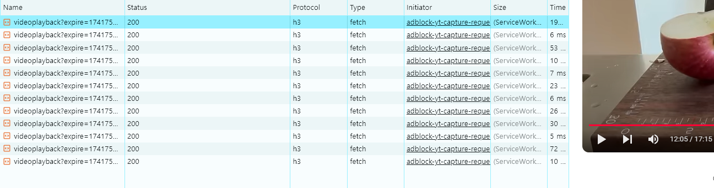
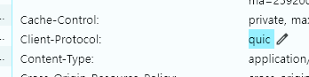

https://medium.com/@karan99/system-design-tcp-and-udp-dfb8e368a6f2

- TCP 전송은 서버와 클라이언트가 3-way-handshake로 연결을 하고 4-way-handshake로 연결을 안전하게 해제하며 데이터 전송 과정 중에서도 패킷의 시퀀스 번호 등의 정보로 데이터의 순서와 안정성을 보장합니다.
- 하지만 인터넷의 발달로 다양한 데이터를 브라우저에서 다루게 되었고 동영상 같이 큰 데이터를 전송할때 TCP 전송은 **근본적인 문제**로 인해 전송 속도에 한계가 발생했습니다.
  - 데이터 하나를 전송하기 위한 **밑작업**들이 많다.
    - **추가적인 패킷 교환**과 **시간 소모**
    - 이러한 오버헤드는 데이터를 전송하는 데 필요한 **기본적인 작업**이지만, **속도**와 **효율성**이 중요한 상황에서는 성능을 저하시킬 수 있다.
    - 실시간성이 중요한 환경(스트리밍, 게임, 인터넷 전화 등) 에서는 불필요한 지연시간이 생길 수 있다.

https://medium.com/@karan99/system-design-tcp-and-udp-dfb8e368a6f2

## UDP

### TCP 연결과 다른점

1. 전송 순서를 보장하지 않는다.
2. 손실된 패킷을 재전송하지 않는다.
   - 오류 검출을 위한 **체크섬** 기능이 있지만 패킷을 폐기할 뿐 재전송하지 않는다.
   - 유튜브같은 스트리밍 서비스에서 동영상이 정상적으로 재생되지 않거나 끊기거나 왜곡 될 수 있다.
3. 비연결 지향적 프로토콜로, 데이터 전송 전에 연결을 설정하지 않는다.
   - 데이터가 도달하지 않거나 순서가 바뀌더라도, 그에 대한 복구나 확인이 없다.
   - 오버헤드가 적어 속도가 빠르다.
4. 신뢰성이 낮다.
5. 암호화가 기본 지원되지 않는다.

<aside>
💡

데이터의 정확성보다 **실시간성**이 중요한 상황에서 사용 (실시간 스트리밍, 게임, 인터넷 전화 등)

</aside>

## QUIC(Quick UDP Internet Connections)

- Google이 개발한 HTTP/3의 기본 전송 프로토콜로 신뢰성이 부족한 UDP 한계 극복
- 특징
  1. QUIC는 UDP 기반으로 빠른 연결을 하며 데이터 전송이 빠름
  2. TLS 1.3(데이터를 안전하게 암호화하여 전송하는 프로토콜)이 내장되어있어 데이터 암호화가 기본적으로 이루어짐
  3. 같은 스트림 내에서 패킷 순서 보장
  4. 멀티 플렉싱 지원
     - 하나의 통신 채널을 통해 여러 개의 데이터를 동시에 전송하는 기술
     - HTTP/2도 멀티플렉싱을 지원하지만, **TCP 기반이라 패킷 하나라도 손실되면 전체가 지연됨**
     - **QUIC은 각 스트림을 독립적으로 관리**하여 하나의 데이터가 지연되더라도 다른 데이터는 정상 전송 가능

# Ref

https://inpa.tistory.com/entry/NW-%F0%9F%8C%90-%EC%95%84%EC%A7%81%EB%8F%84-%EB%AA%A8%ED%98%B8%ED%95%9C-TCP-UDP-%EA%B0%9C%EB%85%90-%E2%9D%93-%EC%89%BD%EA%B2%8C-%EC%9D%B4%ED%95%B4%ED%95%98%EC%9E%90#udp_-_%EC%82%AC%EC%9A%A9%EC%9E%90_%EB%8D%B0%EC%9D%B4%ED%84%B0%EA%B7%B8%EB%9E%A8_%ED%94%84%EB%A1%9C%ED%86%A0%EC%BD%9C

https://f-lab.kr/insight/understanding-tcp-udp-differences-20240805?gad_source=1&gclid=CjwKCAjwvr--BhB5EiwAd5YbXrkq21sKnyrOgnlgLS8i8o1BWpg-QC7p_4zi2eorg3PwYNeU7cOS5BoCP5AQAvD_BwE

https://www.cloudflare.com/ko-kr/learning/ddos/what-is-a-quic-flood/
