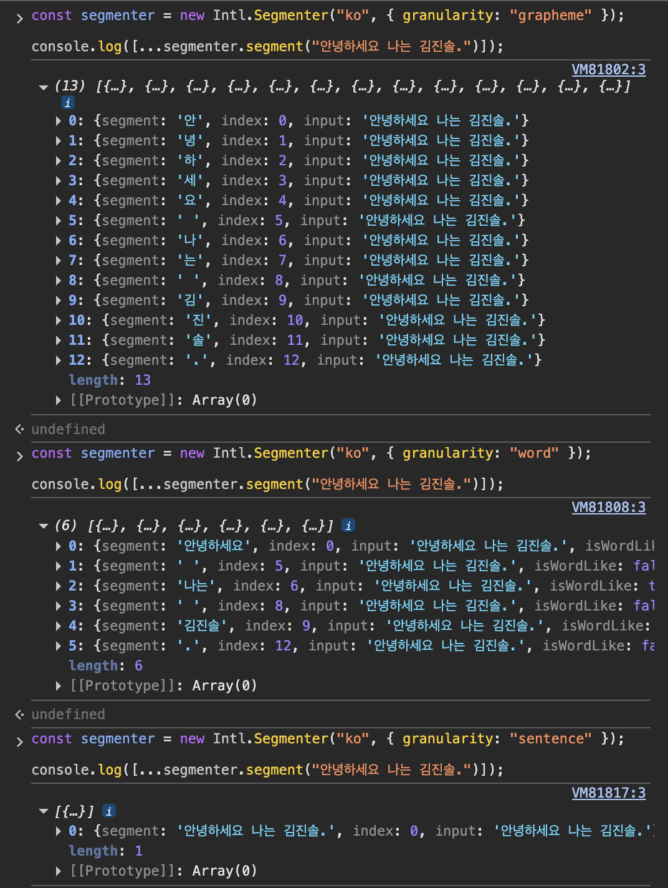
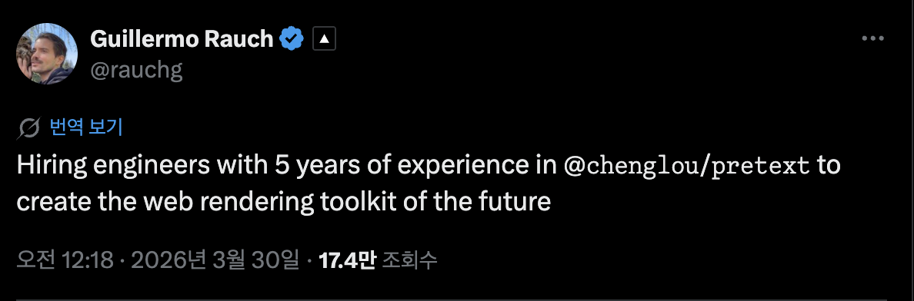

https://www.threads.com/@choi.openai/post/DWf5Ms-Dwlw/%EC%9B%B9%EC%9D%B4-%EA%B0%91%EC%9E%90%EA%B8%B0-%EC%9D%B4%EC%83%81%ED%95%B4%EC%A1%8C%EB%8B%A4%EB%8A%94-%EB%A7%90%EA%B9%8C%EC%A7%80-%EB%82%98%EC%98%A4%EA%B3%A0-%EC%9E%88%EC%8A%B5%EB%8B%88%EB%8B%A4pretext-%ED%95%98%EB%82%98%EB%A1%9C-%ED%8F%89%EB%B2%94%ED%95%9C-%ED%85%8D%EC%8A%A4%ED%8A%B8%EA%B0%80-%EA%B2%8C%EC%9E%84-%EC%9D%B8%ED%84%B0%EB%9E%99%EC%85%98-%EC%9B%B9%EC%9C%BC%EB%A1%9C-%EB%B0%94%EB%80%8C%EB%8A%94-%EC%82%AC%EB%A1%80%EB%93%A4%EC%9D%B4-%EC%8F%9F%EC%95%84%EC%A7%80%EB%8A%94-%EC%A4%91%EC%9E%85%EB%8B%88%EB%8B%A4%EA%B8%B0%EC%A1%B4-

---

## 브라우저는 왜 텍스트 높이를 바로 알 수 없을까?

- 브라우저에서 텍스트 높이는 단순히 문자열 길이만으로 결정되지 않는다.
- 실제로는 텍스트가 **어떤 너비의 박스 안에 들어가는지**, **어떤 폰트와 줄바꿈 규칙을 쓰는지**, **주변 요소 배치가 어떤지**에 따라 줄 수와 높이가 달라진다.
- 같은 문장이라도 다음 조건에 따라 결과가 달라진다.
    - 컨테이너 너비
    - 폰트 종류와 크기
    - `line-height`
    - `white-space`
    - `word-break`
    - 언어별 줄바꿈 규칙
    - 이모지·특수문자
    - 주변 레이아웃 문맥
- 브라우저가 “이 텍스트의 최종 높이가 몇 px인가?”를 알려주려면, 결국 **실제 레이아웃 계산(Layout)**을 수행해야 한다.

---

### 브라우저 렌더링 과정

```
HTML 파싱 → DOM
CSS 파싱  → CSSOM
             ↓
         Render Tree
             ↓
     Layout (크기·위치 계산)
             ↓
          Paint
```

- **Layout** 단계는 각 요소가
    - 어디에 위치하는지
    - 얼마나 넓고 높은지
    - 텍스트가 몇 줄로 감기는지
- 를 계산하는 단계다.

⇒ 텍스트 높이 역시 이 단계가 끝나야 알 수 있다.

---

### **브라우저는 왜 변경을 바로 계산하지 않을까?**

- 브라우저는 보통 DOM이나 스타일이 바뀌었다고 해서 **매 줄의 JavaScript 실행마다 바로 Layout을 수행하지 않는다.**

```jsx
element.style.width = '320px'
element.style.padding = '12px'
element.style.borderWidth = '1px'
```

- 브라우저는 각 변경을 즉시 계산하기보다
    1. 변경 사항을 기록해두고
    2. 다음 렌더 타이밍에
    3. Style 계산, Layout, Paint를 한꺼번에 처리하려고 한다.
- 즉 브라우저는 원래 **변경을 모아서 한 번에 처리하는 방향**으로 최적화되어 있다.

---

### Forced Reflow (동기 레이아웃)

```jsx
element.style.width = '320px'   // 변경 → "나중에 처리할게" 표시
const h = element.offsetHeight  // 읽기 → "아 지금 당장 처리해야 하네"
```

- `offsetHeight`, `clientHeight`, `getBoundingClientRect()` 같은 API를 호출하는 순간, 브라우저는 미뤄뒀던 레이아웃 계산을 즉시 끝내야 한다.

> 이 요소의 width가 320px로 바뀌었으니
→ 텍스트가 몇 줄이 되지?
→ 그럼 이 요소의 height는?
→ 이 요소 아래에 있는 다른 요소들 위치는 또 어떻게 바뀌지?
→ 부모 컨테이너 높이는?
→ ...
> 
- 원래는 나중에 하려던 Layout 계산을 **JS 실행 중간에 강제로 앞당겨 수행**

### Layout Thrashing

DOM 변경과 측정을 번갈아 반복하면 비용이 커진다.

```jsx
element.style.width = '320px'
const h1 = element.offsetHeight  // 재계산 1

element.style.height = `${h1}px`
const h2 = element.offsetHeight  // 재계산 2
```

결과 → 스크롤 끊김 / 입력 지연 / 프레임 드랍 / 채팅·피드 UI에서 레이아웃 점프

---

## Pretext의 해결 아이디어

> **DOM에 물어보지 말고, Canvas measureText로 미리 재두자**
> 

```jsx
const ctx = canvas.getContext('2d')
ctx.font = '16px Inter'
ctx.measureText('Hello').width  // → 37.5px, DOM 건드림 없음
```

- `canvas.measureText()`는 화면에 요소를 실제로 배치해보는 대신, 텍스트 자체의 가로 길이만 측정한다.
- 그래서 DOM 레이아웃 재계산 없이 폭을 알 수 있다.
- Forced Reflow (동기 레이아웃)을 줄일 수 있다.

```jsx
DOM + CSSOM
↓
Render Tree   ← "어떤 요소가 화면에 보이는가"
↓
Layout Tree   ← "각 요소가 정확히 어디에, 얼마나 크게 있는가"
↓
Paint
```

---

## 동작 원리

```jsx
import { prepare, layout } from '@chenglou/pretext'

// prepare(text, font, options?)
// 각 세그먼트의 폭과 줄바꿈 계산에 필요한 내부 캐시 정보
const prepared = prepare('안녕하세요 반갑습니다', '16px Inter')

// layout(prepared, maxWidth, lineHeight)
const result = layout(prepared, 200, 24)
// result.lineCount  -> 몇 줄인지
// result.height     -> 전체 높이(px)
```

### 세그먼트(Segment)란?

- 텍스트를 **줄바꿈과 레이아웃 계산이 가능하도록 나눈 조각**

```
"안녕하세요 반갑습니다"
        ↓
["안녕하세요 ", "반갑습니다"]
  = 78px        = 64px
```

- 각 세그먼트의 가로 폭을 미리 측정해두면, 컨테이너 너비 안에 어디까지 들어갈 수 있는지 빠르게 계산할 수 있다.
- 또한 한·중·일, 아랍어(bidi), 이모지 등 언어별 줄바꿈 규칙을 반영해 세그먼트를 분석한다.

### prepare() 단계 — 일회성 비용

1. 공백 정규화 (whitespace normalization)
    - 줄바꿈과 관계없는 연속 공백을 CSS `white-space: normal`처럼 정규화
2. 레이아웃용 텍스트 세그먼트 분해
    - `analyzeText(...)`가 텍스트를 공백, 텍스트, 줄바꿈 등 레이아웃 계산용 단위로 분해한다.
    - 이 과정에서 `Intl.Segmenter`는 grapheme 단위 보조 도구로 사용되며, CJK 처리나 긴 단어 분할처럼 더 세밀한 줄바꿈 계산에 활용된다.
    
    ```jsx
    let sharedGraphemeSegmenter: Intl.Segmenter | null = null
    
    function getSharedGraphemeSegmenter(): Intl.Segmenter {
      if (sharedGraphemeSegmenter === null) {
        sharedGraphemeSegmenter = new Intl.Segmenter(undefined, { granularity: 'grapheme' })
      }
      return sharedGraphemeSegmenter
    }
    ```
    
    
    
3. 줄바꿈 시 따로 떨어지면 어색한 문자들을 앞뒤 텍스트에 붙여 처리하는 규칙적용(글루 규칙)
    - `"better."`를 `"better"`와 `"."`로 나누지 않고 하나의 단위로 처리하는 방식
4. `canvas.measureText()`로 각 세그먼트 폭 측정
    - `getSegmentMetrics(...)`와 `getCorrectedSegmentWidth(...)`를 통해 세그먼트 폭을 구하고, 그 값을 `widths` 배열에 저장
    - `layout()`에서 이 값을 순서대로 더해가며 어디서 줄이 바뀌는지, 몇 줄이 되는지 계산하는 데 쓰인다.
        
        ```jsx
        const textMetrics = getSegmentMetrics(text, cache)
        const width = getCorrectedSegmentWidth(text, textMetrics, emojiCorrection)
        
        widths.push(width)
        ```
        
5. 세그먼트 폭과 줄바꿈 계산에 필요한 정보를 담은 `PreparedText` 반환 → `layout()`에서 DOM 접근 없이 줄 수와 높이를 계산하는 데 사용
    
    ```jsx
    import { prepare } from '@chenglou/pretext'
    
    const prepared = prepare('안녕하세요 반갑습니다', '16px Inter')
    ```
    

### layout() 단계 — 순수 산술, 반복 실행 가능

1. `PreparedText`와 `maxWidth(컨테이너 최대 너비)`를 입력받는다
    - 텍스트를 다시 분석하거나 측정하지 않고, 이미 준비된 결과를 재사용
    
    ```jsx
    export function layout(prepared: PreparedText, maxWidth: number, lineHeight: number): LayoutResult {
      const lineCount = countPreparedLines(getInternalPrepared(prepared), maxWidth)
      return { lineCount, height: lineCount * lineHeight }
    }
    ```
    
2. 캐시된 세그먼트 폭을 순회하며 줄 수를 계산한다
    
    ```jsx
    let lineWidth = 0, lineCount = 1
    
    for (const seg of segments) {
      if (lineWidth + seg.width > maxWidth) {
        lineCount++           // 줄바꿈
        lineWidth = seg.width
      } else {
        lineWidth += seg.width
      }
    }
    
    return { height: lineCount * lineHeight, lineCount }
    ```
    
3. `lineCount × lineHeight`로 높이를 구한다
    
    ```jsx
    return { lineCount, height: lineCount * lineHeight }
    ```
    
4. DOM 접근 없이 반복 실행할 수 있다
    - DOM에 다시 접근하지 않고, 캐시된 세그먼트 폭과 줄바꿈 정보를 이용해 줄 수와 높이를 계산한다.
    - 실제 구현에서는 공백 처리, 긴 단어 분할, hard break 등 CSS와 유사한 줄바꿈 규칙도 함께 고려한다.
    
    ```jsx
    // Line breaking rules:
    //   - Break before any non-space segment that would overflow the line
    //   - Trailing whitespace hangs past the line edge
    //   - Segments wider than maxWidth are broken at grapheme boundaries
    ```
    

---

## Pretext를 사용하기 좋은 경우

- **채팅 / 메시지 UI:**  메시지별 높이 예측, shrink-wrap 말풍선, 스크롤 점프 방지
- **가상 스크롤 목록**: 렌더 전 아이템 높이를 알아야 스크롤 위치를 정확히 계산 가능
- **Masonry(높이가 제각각인 카드들을 벽돌처럼 빈틈 적게 쌓는 배치 방식)레이아웃**: 카드 높이를 DOM 없이 미리 계산해서 열 배치 결정
- **리사이즈가 잦은 UI**: `prepare()`는 재사용하고 `layout()`만 전체 재실행
- **Canvas / SVG 텍스트**: DOM 없이 줄 단위 텍스트 렌더링

---

## 주의사항

- `system-ui` 폰트는 macOS에서 부정확
    - DOM에서 보이는 폰트, canvas에서 측정에 쓰이는 폰트 해석이 완전히 같지 않을 수 있어서 오차 가능성이 있음
    - 명시적 폰트명 사용 필수 (Inter, Pretendard 등)
- CSS `font` 선언과 `prepare()`의 `font` 파라미터를 정확히 동기화해야 측정값이 맞음
    
    ```jsx
    // css
    font: 500 16px Inter;
    
    // js
    prepare(text, '16px Inter')
    ```
    
    - `font-weight: 500` 정보를 빼먹으면,Pretext는 **다른 폰트 폭**으로 계산할 수 있다.
- `letter-spacing`, `font-variant` 등 비표준 CSS는 미지원
- 서버 사이드 렌더링은 아직 미지원 (개발 중)
- 극단적으로 좁은 너비에서는 `overflow-wrap: break-word` 특성상 단어 중간에서도 줄바꿈 발생 가능
    
    ```jsx
    hello
    
    hel
    lo
    ```
    
    - 보통 공백 기준으로 줄바꿈하는 게 자연스럽지만, 너비가 너무 좁아서 단어 전체가 안 들어가면 브라우저도 `break-word` 규칙에 따라 **단어 중간을 끊어버릴 수 있다.**

---

# Ref

https://velog.io/@tap_kim/youre-looking-at-the-wrong-pretext-demo?utm_source=substack&utm_medium=email

https://wikidocs.net/blog/@jaehong/10301/

