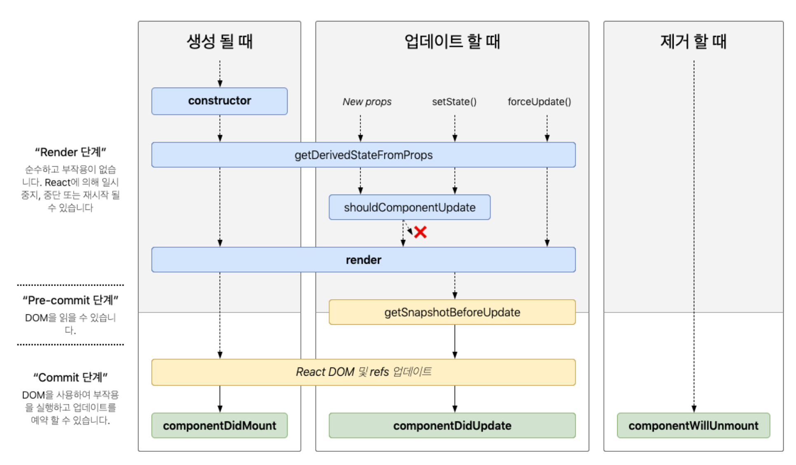

# 클래스 컴포넌트

Hooks가 등장한 리액트 16.8 버전에는 클래스 컴포넌트가 널리 사용되었습니다.

그때 당시에도 함수 컴포넌트는 존재했는데요,

생명주기를 다룰 수 있는 메서드를 적용할 수 없으므로 

상태가 없는 정적 렌더링에 사용되었다고 합니다.

## 클래스 컴포넌트

```tsx
import React, { Component } from 'react';

class MyComponent extends Component {
  constructor(props) {
    super(props);
    this.state = {
      count: 0
    };
    this.incrementCount = this.incrementCount.bind(this);
  }

  incrementCount() {
    this.setState(prevState => ({
      count: prevState.count + 1
    }));
  }

  render() {
    return (
      <div>
        <h2>클래스형 컴포넌트 예제</h2>
        <p>카운트: {this.state.count}</p>
        <button onClick={this.incrementCount}>카운트 증가</button>
      </div>
    );
  }
}

export default MyComponent;

```

### 클래스 컴포넌트의 생명주기 메서드

- 컴포넌트의 생명주기는 크게 3가지의 시점으로 나눌 수 있습니다.
    - 마운트: 컴포넌트가 생성되는 시점
    - 업데이트: 이미 생성된 컴포넌트가 변경 되는 시점
    - 언마운트: 컴포넌트가 존재하지 않는 시점



### render()

- UI 렌더링
- 마운트, 업데이트
- 부수효과가 없는 순수함수 여야 한다.
    
    → state를 직접 업데이트하는 this.setState를 호출 할 수 없다.
    

### componentDidMount()

- 컴포넌트가 생성되고 준비되는 즉시 실행
- render()와 달리 state 변경 가능
- this.setState를 호출했다면 즉시 상태가 변경이 되고 리렌더링이 일어난다.
    
    → 브라우저가 실제로 UI를 업데이트 하기 전에 실행된다.
    

### componentDidUpdate()

- 컴포넌트 업데이트가 일어난 후 실행
- state, props 변경에 따라 DOM을 업데이트
- state 변경 가능하나 if문으로 분기하지 않는다면 계속해서 실행됨

```tsx
  componentDidUpdate(prevProps, prevState) {
    if (prevState.count !== this.state.count) {
      console.log('카운트가 변경되었습니다.');
    }
  }
```

### componentWillUnmount()

- 컴포넌트가 언마운트 되거나 더 이상 사용되지 않기 직전에 호출
- 메모리 누수나 불필요한 작동을 막기 위한 클린업 함수
- state 변경 불가능
- 이벤트, 타이머 지우기

```tsx
  componentDidMount() {
    // 컴포넌트가 마운트된 후에 1초마다 count를 증가시키는 인터벌을 시작
    this.intervalId = setInterval(() => {
      this.setState((prevState) => ({
        count: prevState.count + 1,
      }));
    }, 1000);
  }

  componentWillUnmount() {
    // 컴포넌트가 언마운트되기 전에 인터벌을 제거
    clearInterval(this.intervalId);
  }
```

### shouldComponentUpdate()

- state, props 변경으로 인한 리렌더링 방지하는 메서드
- `componentDidUpdate()` 와 달리 업데이트 전에 실행되고 boolean값을 리턴

```tsx
  shouldComponentUpdate(nextProps, nextState) {
    // count가 변경되었을 때만 렌더링하도록 설정
    if (this.state.count !== nextState.count) {
      return true;
    }
    return false;
  }
```

### static getDerivedStateFromProps()

- render()를 호출하기 직전에 호출되는 메서드
- 반환하는 객체는 해당 객체의 내용이 모두 state로 들어가게 된다.
- 모든 render()시에 호출

```tsx
  static getDerivedStateFromProps(nextProps, prevState) {
    // 부모 컴포넌트로부터 받은 color props가 변경되면 배경색을 업데이트합니다.
    if (nextProps.color !== prevState.backgroundColor) {
      return {
        backgroundColor: nextProps.color,
      };
    }
    return null;
  }
```

### getSnapShotBeforeUpdate()

- DOM이 업데이트 되기 직전에 호출되는 메서드
- 반환하는 값은 `componentDidUpdate`로 전달된다.
- DOM이 렌더링되기 전에 윈도우 크기조절하거나, 스크롤 위치 조정하는 등의 작업을 처리할때 유용

```tsx
  componentDidMount() {
    this.scrollToBottom();
    setInterval(() => {
      this.setState((prevState) => ({ count: prevState.count + 1 }));
      this.scrollToBottom();
    }, 1000);
  }

  scrollToBottom() {
    this.myRef.current.scrollTop = this.myRef.current.scrollHeight;
  }
  
  //이전 스크롤 위치를 기억하고 이를 스냅샷으로 반환
  getSnapshotBeforeUpdate(prevProps, prevState) {
    if (prevState.count !== this.state.count) {
      return this.myRef.current.scrollHeight - this.myRef.current.scrollTop;
    }
    return null;
  }
  
  //업데이트된 후에 스크롤 위치를 조정
  componentDidUpdate(prevProps, prevState, snapshot) {
    if (snapshot !== null) {
      this.myRef.current.scrollTop = this.myRef.current.scrollHeight - snapshot;
    }
  }
```

## Error Boundary

### getDerivedStateFromError()

- 자식 컴포넌트에서 에러가 발생했을 때 호출되는 에러 메서드

```tsx
import React, { Component } from 'react';

class ErrorBoundary extends Component {
  constructor(props) {
    super(props);
    this.state = {
      hasError: false,
      errorMessage: '',
    };
  }

  static getDerivedStateFromError(error) {
    // 에러가 발생하면 에러 상태를 설정합니다.
    return { hasError: true, errorMessage: error.toString() };
  }

  render() {
    // 에러가 발생한 경우 에러 메시지를 렌더링합니다.
    if (this.state.hasError) {
      return <div>에러 발생: {this.state.errorMessage}</div>;
    }
    // 에러가 발생하지 않은 경우 자식 컴포넌트를 그대로 렌더링합니다.
    return this.props.children;
  }
}

class MyComponent extends Component {
  render() {
    // 특정 조건에서 에러를 발생시키도록 설정합니다.
    if (this.props.triggerError) {
      throw new Error('에러가 발생했습니다.');
    }
    return <div>자식 컴포넌트의 렌더링이 정상적으로 처리되었습니다.</div>;
  }
}

class App extends Component {
  render() {
    return (
      <div>
        <h1>에러 처리 예시</h1>
        <ErrorBoundary>
          {/* 자식 컴포넌트를 ErrorBoundary 컴포넌트로 감싸 에러를 처리합니다. */}
          <MyComponent triggerError={true} />
        </ErrorBoundary>
      </div>
    );
  }
}

export default App;

```

- 반드시 state값을 반환해서 자식 컴포넌트 렌더링 여부를 알려주어야 한다.
- 렌더링과정에서 호출되는 메서드이기 때문에 부수효과를 발생하면 안된다.
    - 에러 state 이외의 console.error() 에러 로깅 같은 작업

### componentDidCatch()

```tsx
  componentDidCatch(error, errorInfo) {
    this.setState({ hasError: true });
    // 여기에서 에러를 기록하거나, 에러 리포팅 서비스로 전송할 수 있습니다.
    console.error(error, errorInfo);
  }

  render() {
    if (this.state.hasError) {
      // 에러가 발생했을 때 표시할 문구
      return <div>에러가 발생했습니다.</div>;
    }
    return this.props.children;
  }
```

- 렌더단계가 아닌 커밋단계에서 실행되기 때문에 getDerivedStateFromError() 메서드에서 하지 못했던 부수효과를 처리할 수 있다.
- ErrorBoundary경계 외부에 있는 에러는 잡을 수 없다. 따라서 ErrorBoundary를 여러 개 선언해서 컴포넌트별로 에러 처리를 다르게 적용할 수 있다.

# 클래스 컴포넌트의 한계

- 생명주기에 따라 데이터의 흐름을 따라가기 어렵다.
- 어플리케이션 내부 로직 재사용이 어렵다.
    - 내부 로직을 props로 넘겨주거나 고차컴포넌트로 처리할 수 있지만 wrapper hell 발생
- 코드 크기를 최적화 하기 어렵다.
    - 사용하지 않는 메서드도 트리쉐이킹이 되지 않고 같이 빌드된다.
- 핫 리로딩시 인스턴스가 새로생성되어 상태가 초기화된다.
    - 코드 변경시 새로 실행하지 않고 변경 사항만 빠르게 업데이트 적용하는 기법
    - 최초 랜더링시 인스턴스가 생성이되고 인스턴스 내부에 있는 매서드를 수정하게되면 초기화되어 상태를 유지할 수 없다.