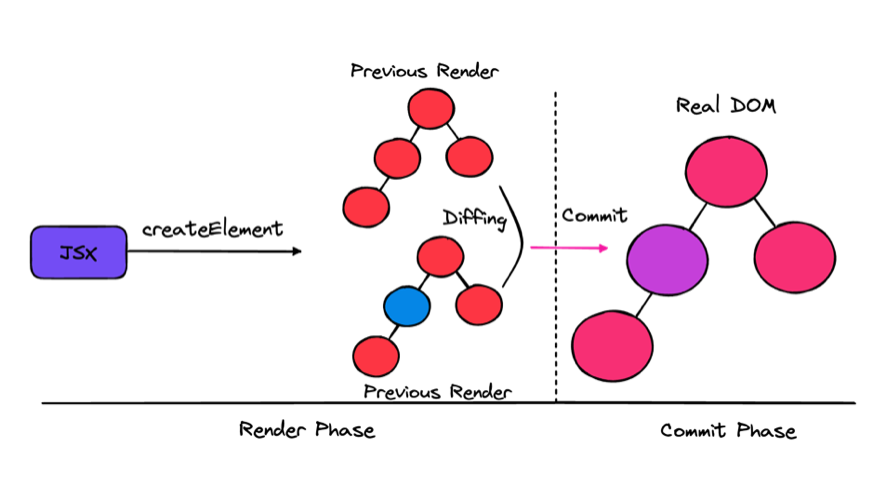

# React의 렌더링

저는 렌더링 하면 브라우저에서의 렌더링 과정만을 생각했습니다.

하지만 렌더링은 리액트에서도 이루어지는데요,

리액트 렌더링이란 브라우저가 렌더링에 필요한 **DOM 트리를 만드는 과정**을 의미합니다.

## 리액트 렌더링

애플리케이션 트리 안에 있는 모든 컴포넌트들이

현재 자신들이 가지고 있는 props와 state의 값을 기반으로 어떻게 UI를 구성하고

이를 바탕으로 어떤 DOM 결과를 브라우저에 제공할 것인지 **계산하는 일련의 과정** 

## 리액트의 렌더링이 일어나는 이유

1. 최초 렌더링
2. 리렌더링
    1. 상태 변경 함수가 실행될 때 (useState의 setState, useReducer의 dispatch)
    2. key props가 변경되는 경우
    3. props가 변경되는 경우
    4. 부모 컴포넌트가 리렌더링 될 경우

## 리액트의 렌더링 과정

컴포넌트가 jsx를 반환하면 자바스크립트 파일로 컴파일되면서 `React.createElement()`를 호출 하는 구문으로 변환됩니다.

`createElement` 는 브라우저의 UI 구조를 설명할 수 있는 일반적인 **자바스크립트 객체를 반환**합니다.

이런 과정을 거쳐서 각 컴포넌트의 렌더링 결과물을 수집한 다음

리액트의 가상 DOM과 비교해 실제 DOM에 반영하기 위한 **모든 변경 사항을 수집**합니다.

이렇게 계산하는 과정인 `리액트의 재조정`과정이 모두 끝나면

모든 변경 사항을 DOM에 적용해 변경된 결과물이 보이게됩니다.

```tsx
export default function App() {
  console.log(createElement("h1", null, "Hello World!")); //아래 이미지
  
  return <h1>Hello World!</h1>
  return React.createElement("h1", null, "Hello World!");
}
```


## 렌더와 커밋



1. 렌더(Render Phase): 컴포넌트를 렌더링하고 **변경 사항을 계산**하는 모든 작업
    1. 컴포넌트를 실행해 이 결과와 이전 가상 DOM을 비교하는 과정을 거쳐 **변경이 필요한 컴포넌트를 체크하는 단계**
    2. 크게 3가지 비교 **type**(element.type), **props**, **key**
2. 커밋(Commit Phase): 렌더 단계의 **변경 사항**을 실제 DOM에 적용해 사용자에게 보여주는 과정
    1. DOM을 커밋 단계에서 업데이트 하면
    2. 만들어진 모든 DOM노드 및 인스턴스를 리액트 내부의 참조를 가리키도록 업데이트
    3. useLayoutEffect 훅 호출
3. 브라우저 렌더링 발생

→ 렌더링이 일어난다고 해서 무조건 DOM 업데이트가 일어나는 것은 아닙니다.

→ 변경사항을 계산했는데 변경사항이 없다면 커밋단계는 생략 가능합니다.

→ 리액트의 렌더링은 브라우저 렌더링 처럼 가시적인 변경이 일어나지 않아도 발생할 수 있습니다.

리액트의 렌더링은 항상 동기식으로 작동했습니다.

따라서 렌더링 과정이 길어질 수록 성능 저하로 이어졌습니다.

하지만 만약에 한 컴포넌트의 렌더링 작업이 오래걸린다면

상대적으로 빠른 렌더링이 가능한 컴포넌트를 보여줄 수 있는

비동기 렌더링, **동시성 렌더링**이 리액트 18버전에서 도입 되었습니다.

렌더링 중 렌더 단계가 비동기로 작동해 특정 렌더링의 우선순위를 조절할 수 있습니다.

따라서 동기 작업을 차단하지 않으면서 백그라운드에서 작업을 할 수 있어

사용자 경험을 더 좋게 만들 수 있습니다.

[🔗 동시성 렌더링](https://beomy.github.io/tech/react/concurrent-rendering/)