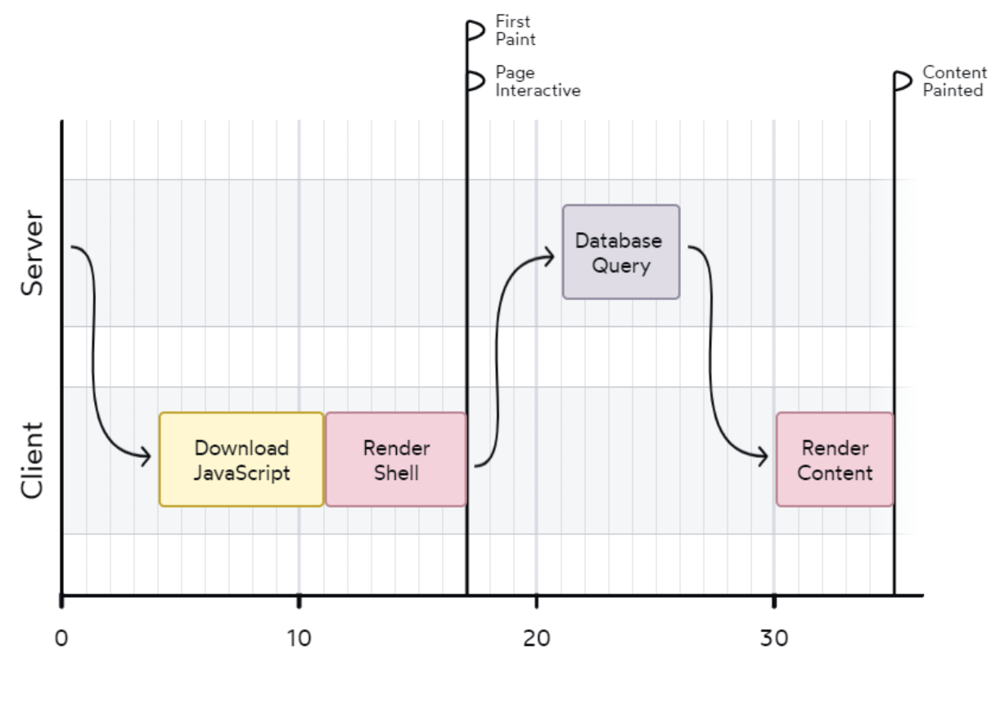
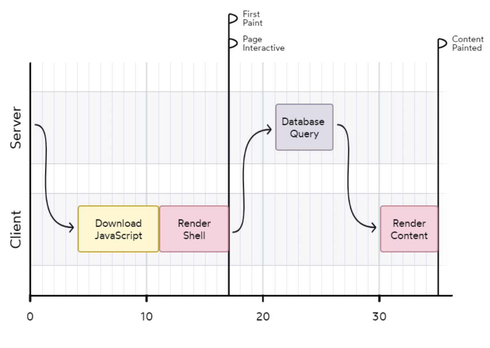
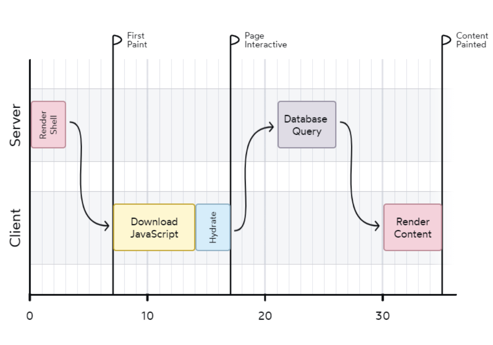
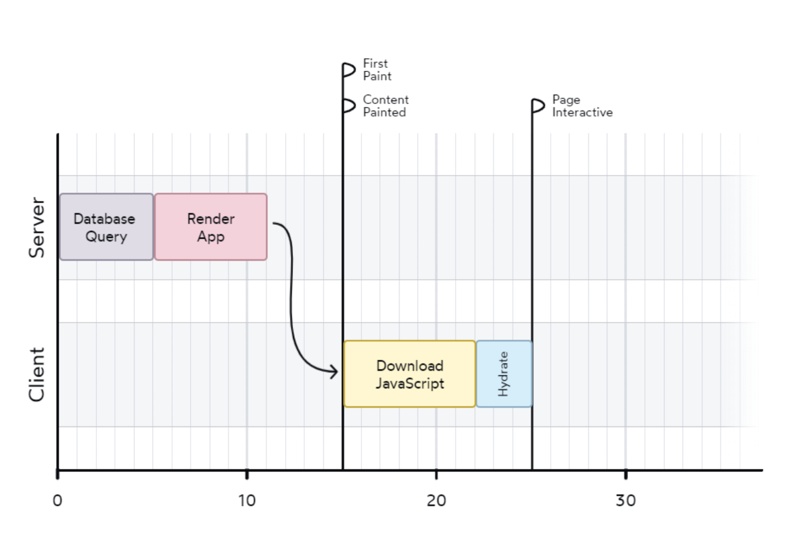

# React Server Component

React Server Component(이하 RSC) react 18버전에서 도입된 개념입니다.

이름에서 알 수 있듯이 **서버에서 동작하는 컴포넌트**를 의미합니다.

# CSR & SSR

CSR 과정

- 자바스크립트가 다운로드되고 파싱이 완료되면 DOM을 불러와 비어있는 html에 저장합니다.
- 이러한 방식은 작업 수행 시간이 걸리고 사용자는 그동안 텅빈 화면을 볼 수밖에 없습니다.
- 자바스크립트 번들 사이즈가 커지면 작업 수행 시간도 늘어납니다.

SSR 과정

- 서버에서 HTML을 생성해서 클라이언트로 넘겨줍니다.
- 리액트는 처음부터 DOM을 하나씩 만드는 대신 하이드레이션 과정을 거칩니다.

> “하이드레이션은 '건조한' HTML에 상호작용성(interactivity)과 이벤트 핸들러라는 '물'을 공급하는 것과 같습니다.” - 댄 아브라모브
> 
- 서버가 초기 HTML을 생성해주기 때문에 사용자는 어느 정도 콘텐츠가 있는 페이지를 볼 수 있습니다.
- 그런 다음 서버의 리액트가 중단한 부분을 클라이언트의 리액트가 이어받아 DOM을 적용하고 상호작용성을 추가합니다.

# 데이터 패칭

CSR 데이터 패칭

- 비어있는 흰색 페이지에서 데이터 패칭을 하는 동안 사용자는 텅 빈 로딩 화면을 보게 됩니다.
    
    
    
    SSR 데이터 패칭
    
- 텅 빈 로딩 화면이라도 바로 볼 수 있지만 역시나 의미 있는 데이터를 가져오려면 시간이 걸립니다.

- 클라이언트와 서버를 왔다 갔다 하는 대신 완전히 채워진 UI를 사용자에게 전달할 수 있습니다.
- 이 방법이 동작하려면 **서버에서만 실행되는 코드**를 리액트에 전달해서 데이터 베이스 쿼리 작업을 할 수 있어야 합니다.
    
    → Next.js는 이와 같은 문제를 해결하기 위해 서버에서 실행되는 함수를 만들었습니다.
    서버에서 **getServerSideProps** 와 같은 함수가 호출하여 props 객체를 리턴시킵니다.
    해당 프로퍼티를 컴포넌트로 전달해서 **서버에서 먼저 랜더링** 되고 **클라이언트에서 하이드레이션** 하였습니다.
    
    - 하지만 **루트레벨**에서만 동작하기 때문에 데이터가 필요한 depth까지 props drilling이 생기고
    - 프레임워크 마다 접근방식이 달랐으며
    - 어쨌든 모든 컴포넌트가 하이드레이션되어야 했습니다.

# RSC의 등장

- next.js13 에서는 모든 컴포넌트가 기본적으로 RSC입니다.
- RSC가 자바스크립트 **번들에 포함되지 않으므로**
→ ****다운로드 해야하는 JS의 양과 하이드레이션 해야하는 컴포넌트의 수가 줄어들었습니다.
    
    → SSR을 사용한다고 해도 CSR과 동일한 사이즈의 JS 번들을 받기 때문에 TTI 에 메리트가 없었지만 번들 사이즈 최소화로 TTI 개선이 가능합니다.
    
    → RSC 랜더링에 영향을 주는 라이브러리의 코드가 서버 컴포넌트에서 사용된다면 JS번들에 포함되지 않기 때문에 라이브러리의 크기를 걱정하지 않아도 됩니다.
    
- **컴포넌트 내부에서 Data Fetch를 실행 할 수 있습니다.** 
RSC는 그 자체가 **서버에서 렌더링되므로,** 컴포넌트 내부에서 Data Fetch를 실행 할 수 있습니다. 앞서 루트레벨에서만 사용할 수 있었던 서버 접근 함수인 **getServerSideProps 함수로 인한 props drilling**을 피할 수 있습니다.
- **점진적 랜더링이 가능합니다.** 
next.js 13부터는 컴포넌트가 서버에서 렌더링이 되고 그 결과물로 JSON이 생성됩니다. 
클라이언트는 그 결과물을 스트림 형태(데이터를 조각조각으로 나눠서 전송하고, 클라이언트가 일부 데이터를 받은 즉시 처리할 수 있게 하는 방식)로 수신합니다.
스크린의 모든 화면정보를 수신할 때까지 기다릴 필요 없이, **클라이언트는 먼저 수신된 부분부터 반영하기 시작하여 화면에 띄워줄 수 있게 됩니다.**

# RSC & SSR

브라우저에 화면을 보여주려면 

1. 리액트 컴포넌트를 실행하고 해석하고 → RSC 

2. 해석한 데이터를 바탕으로 html을 생성합니다. → SSR

- 즉 SSR없이 RSC는 **클라이언트 쪽 자바스크립트 번들에 포함되지 않게 서버에서만 실행**될 수 있도록 할 수 있지만 초기 HTML을 생성하려면 SSR에 의존해야합니다.

# Ref

https://yozm.wishket.com/magazine/detail/2271/

[https://velog.io/@2ast/React-서버-컴포넌트React-Server-Component에-대한-고찰#rsc의-동작-방식](https://velog.io/@2ast/React-%EC%84%9C%EB%B2%84-%EC%BB%B4%ED%8F%AC%EB%84%8C%ED%8A%B8React-Server-Component%EC%97%90-%EB%8C%80%ED%95%9C-%EA%B3%A0%EC%B0%B0#rsc%EC%9D%98-%EB%8F%99%EC%9E%91-%EB%B0%A9%EC%8B%9D)