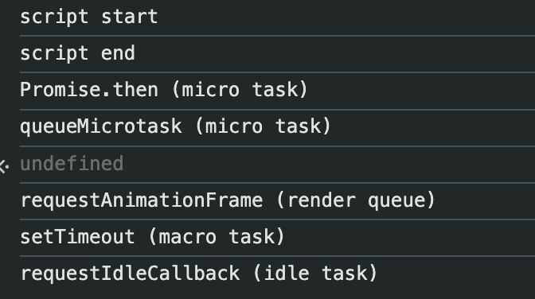

- **`queueMicrotask`** API는 브라우저의 이벤트 루프로 통제권이 넘어가기 전, 안전한 시점에 실행할 마이크로태스크를 큐에 추가합니다.

  - 즉 콜스택이 비워 진 후 가장 먼저 실행되는 마이크로태스크 큐에 실행할 작업을 추가
  - 이벤트 루프 순서
    - 콜스텍 종료
      → 마이크로태스크 큐(Promise.then, queueMicrotask)
      → 렌더링(렌더링 전: requestAnimationFrame)
      → 매크로테스크 큐(setTimeout, setInterval)
      → Idle Callback(requestIdleCallback)

  ```jsx
  console.log('script start');

  // 1️⃣ 매크로태스크
  setTimeout(() => {
    console.log('setTimeout (macro task)');
  }, 0);

  // 2️⃣ 마이크로태스크
  Promise.resolve().then(() => {
    console.log('Promise.then (micro task)');
  });

  // 3️⃣ 마이크로태스크
  queueMicrotask(() => {
    console.log('queueMicrotask (micro task)');
  });

  // 4️⃣ 렌더링 전에 실행 (매크로태스크처럼 보이지만 렌더링 큐에 가까움)
  requestAnimationFrame(() => {
    console.log('requestAnimationFrame (render queue)');
  });

  // 5️⃣ 브라우저가 한가할 때 실행
  requestIdleCallback(() => {
    console.log('requestIdleCallback (idle task)');
  });

  console.log('script end');
  ```

  

### 리액트에서 queueMicrotask

- React 18부터 동시성 모드(Concurrent Mode)가 도입되면서
  - 모든 업데이트가 바로 렌더링 되는 것이 아니라
  - 우선순위에 따라 밀거나, 나눠서, 천천히 처리할 수 있게 됨.
- `queueMicrotask`의 역할

  - 여러 번의 상태 업데이트가 발생해도, React는 해당 Root들을 일괄로 처리하기 위해 Root 전체 순회를 단 한 번의 `queueMicrotask`로 예약
  - 이렇게 예약된 마이크로태스크는 콜스택 종료 직후 실행되며, 그 안에서 모든 Root를 순회해 상태 업데이트가 필요한 Root만 렌더링
  - `setTimeout`보다 빠르고 콜스택 종료 직후 실행되므로 React 상태의 일관성을 유지하기에 적합

    ```jsx
    function App() {
      const [count, setCount] = useState(0);

      const handleClick = () => {
        setCount(1);
        setCount(2);
        setCount(3);
      };

      return <button onClick={handleClick}>Click me: {count}</button>;
    }
    ```

    1. `setCount(1)` 실행 → 업데이트 Fiber에 enqueue
    2. `setCount(2)` 실행 → 업데이트 Fiber에 enqueue
    3. `setCount(3)` 실행 → 업데이트 Fiber에 enqueue

       → 즉시 렌더링하지 않고, Root 전체 스케줄링을 위해 마이크로태스크로 예약
       → 모든 Root 순회
       → 마지막 값(3)으로 한 번만 렌더링

  - `setTimeout`으로 했다면
    ```jsx
    setTimeout(() => {
      setState(1);
    });
    setTimeout(() => {
      setState(2);
    });
    ```
    → 별개의 이벤트 루프에서 실행되어 여러 번 스케줄됨
    → 여러 번 렌더링 가능성 있음

- `scheduleImmediateRootScheduleTask`

  - Fiber Root에 대한 스케줄을 마이크로태스크로 예약하는 함수

    ```jsx
    function scheduleImmediateRootScheduleTask() {
      if (supportsMicrotasks) {
        scheduleMicrotask(() => {
          // In Safari, appending an iframe forces microtasks to run.
          // https://github.com/facebook/react/issues/22459
          // We don't support running callbacks in the middle of render
          // or commit so we need to check against that.
          const executionContext = getExecutionContext();
          if ((executionContext & (RenderContext | CommitContext)) !== NoContext) {
            // Note that this would still prematurely flush the callbacks
            // if this happens outside render or commit phase (e.g. in an event).

            // Intentionally using a macrotask instead of a microtask here. This is
            // wrong semantically but it prevents an infinite loop. The bug is
            // Safari's, not ours, so we just do our best to not crash even though
            // the behavior isn't completely correct.
            Scheduler_scheduleCallback(
              ImmediateSchedulerPriority,
              processRootScheduleInImmediateTask,
            );
            return;
          }
          processRootScheduleInMicrotask();
        });
      } else {
        // If microtasks are not supported, use Scheduler.
        Scheduler_scheduleCallback(
          ImmediateSchedulerPriority,
          processRootScheduleInImmediateTask,
        );
      }
    }
    ```

    - **React가 이미 렌더링 중인데 또 마이크로태스크에서 작업을 수행하면 무한 루프나 상태 꼬임이 발생할 수 있음.**
    - **렌더링/커밋 중일 때는 microtask를 수행하지 않고, `Scheduler`로 매크로태스크로 우회 예약**

## Ref

https://github.com/facebook/react/blob/main/packages/react-reconciler/src/ReactFiberRootScheduler.js

https://goidle.github.io/react/in-depth-react18-concurrent_render/
