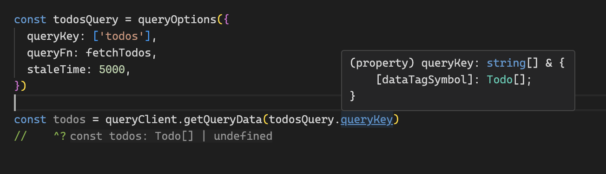

QueryOptions는 정말 좋습니다. 왜냐하면 같은 설정을 다양한 유즈케이스에 사용할 수 있기 때문입니다.

- Tanstack Query 의 메인테이너 TKDodo를 아시나요? (볼때마다 독도로 읽히는..)
- 불과 며칠전에 게시한 트윗에도 queryOptions의 사용을 강조하고 있습니다!

```tsx
//v4
useQuery(['todos', todoId], fetchTodoById);

//v5
useQuery({
  queryKey: ['todos', todoId],
  queryFn: fetchTodoById,
});
```

- Tanstack Query가 무엇인지 간단히 짚고 넘어가자면 **비동기 데이터 상태관리 라이브러리** 입니다.
- 비동기 데이터가 로딩중인지, 패칭이 실패했는지 성공했는지 등등 비동기 데이터의 상태를 쉽게 관리할 수 있습니다.
- 크게 useQuery와 useMutation 훅으로 패칭된 데이터 상태를 관리할 수 있습니다.
- 그 중 useQuery는 ‘queryKey’값으로 캐싱을 관리할 수 있습니다.
    - queryKey 가 같다면 데이터를 중복 요청하지 않고 캐싱된 값을 가지고 옵니다.
- v4에서는 useQuery에 순서대로 인자를 넣어줄 수 있었지만 v5에서는 옵션을 정의한 객체 하나를 인자로 넘겨줍니다.

```tsx
const todosQuery = {
  queryKey: ['todos'],
  queryFn: fetchTodos,
  staleTime: 5000,
}

// ✅ works
useQuery(todosQuery)

// 🤝 sure
queryClient.prefetchQuery(todosQuery)

// 🙌 oh yeah
useSuspenseQuery(todosQuery)

// 🎉 absolutely
useQueries([{
  queries: [todosQuery]
}]

```

- 따라서 옵션객체를 변수로 선언해서 여러 함수 간에 공유하고 싶을 때 재사용할 수 있습니다.
- 다만 이점은 한가지 문제점이 있습니다.

# TypeScript

```tsx
import { useQuery } from '@tanstack/react-query'

type Todo = {
    id: number
}

declare function fetchTodos(): Promise<Array<Todo>>

useQuery({
  queryKey: ['todos'],
  queryFn: fetchTodos,
  stallTime: 5000,
})
```

- useQuery의 인자로 들어가는 객체는 타입 검사를 진행하게 됩니다. 따라서 오타가 난다면 아래와 같은 경고문을 볼 수 있습니다.

<aside>
💡

'UseQueryOptions<Todo[], Error, Todo[], string[]>'. Did you mean to write 'staleTime'?

</aside>

```tsx
const todosQuery = {
  queryKey: ['todos'],
  queryFn: fetchTodos,
  stallTime: 5000,
}

useQuery(todosQuery)
// 'stallTime'이라는 오타가 있더라도 에러가 일어나지 않는다.
```

- 그러나 여러 함수에서 재사용하기 위해서 쿼리 옵션을 정의한 변수를 useQuery의 인자로 넘겨주게 되면 에러가 발생하지 않습니다.
- TypeScript는 해당 변수가 필수값인 queryKey를 제외하고 추가적인 속성을 가질 수 있다고 판단해 추가적인 속성에 대해 에러를 발생시키지 않습니다.

# **queryOptions**

```tsx
import { useQuery, queryOptions } from '@tanstack/react-query'

type Todo = {
    id: number
}

declare function fetchTodos(): Promise<Array<Todo>>

const todosQuery = queryOptions({
  queryKey: ['todos'],
  queryFn: fetchTodos,
  stallTime: 5000,
})

useQuery(todosQuery)
```

<aside>
💡

Object literal may only specify known properties, but 'stallTime' does not exist in type 'UndefinedInitialDataOptions<Todo[], Error, Todo[], string[]>'. Did you mean to write 'staleTime'?

</aside>

## **DataTag**

```tsx
const todos = queryClient.getQueryData(['todos']) // unknown
```

- Tanstack Query에서 `queryClient.getQueryData`를 호출하면 캐싱된 데이터를 반환합니다.
- Tanstack Query는 데이터의 타입을 한곳에 모아서 **관리하지 않기 때문에**, 반환되는 데이터가 어떤 타입인지 확신할 수 없습니다. 따라서 `unknown` 타입을 반환합니다.

```tsx
const data = queryClient.getQueryData(['todos']);

// 에러 발생: 'unknown' 타입에서는 'length' 속성을 사용할 수 없음
console.log(data.length);
```

```tsx
const todos = queryClient.getQueryData<Array<Todo>>(['todos'])
// const data: Todo[] | undefined
// 제네릭을 통해 TypeScript가 반환값의 타입을 Array<Todo>로 추론
```

- 즉, TypeScript는 `data`의 구조를 알 수 없고, 타입 체크도 불가능합니다.
- `unknown` 타입은 안전한 접근을 보장하지만, 데이터의 타입을 사용할 때는 **명시적 타입 단언 (type assertion)** 또는 **타입 가드**가 필요합니다.

```tsx
import { useQuery, queryOptions, QueryClient } from '@tanstack/react-query'

type Todo = {
    id: number
}
declare function fetchTodos(): Promise<Array<Todo>>

const queryClient = new QueryClient()

const todosQuery = queryOptions({
  queryKey: ['todos'],
  queryFn: fetchTodos,
  staleTime: 5000,
})

const todos = queryClient.getQueryData(todosQuery.queryKey)
// const todos: Todo[] | undefined
```



- todosQuery.queryKey 에서 string[] 뿐만 아니라 반환 타입에 대한 정보도 얻을 수 있습니다.

# **Query Factories**

```jsx
import { useQuery, useMutation } from '@tanstack/react-query';

// todos 목록 조회
const useTodosList = (filters: string) => {
  return useQuery({
    queryKey: ['todos', 'list', filters],
    queryFn: () => fetchTodos(filters),
  });
};

// 특정 todo 상세 조회
const useTodoDetail = (id: number) => {
  return useQuery({
    queryKey: ['todos', 'detail', id],
    queryFn: () => fetchTodo(id),
    staleTime: 5000,
  });
};

// todos 관련 데이터 삭제
const useDeleteTodo = () => {
  return useMutation({
    mutationFn: (id: number) => deleteTodo(id),
  });
};
```

```tsx
const todoQueries = {
  all: () => ['todos'],
  lists: () => [...todoQueries.all(), 'list'],
  list: (filters: string) =>
    queryOptions({
      queryKey: [...todoQueries.lists(), filters],
      queryFn: () => fetchTodos(filters),
    }),
  details: () => [...todoQueries.all(), 'detail'],
  detail: (id: number) =>
    queryOptions({
      queryKey: [...todoQueries.details(), id],
      queryFn: () => fetchTodo(id),
      staleTime: 5000,
    }),
}
```

```tsx
// ✅ 모든 Todos 쿼리를 제거
queryClient.removeQueries({
  queryKey: todoQueries.all(),
});

// ✅ Todos 리스트와 관련된 모든 쿼리 무효화
queryClient.invalidateQueries({
  queryKey: todoQueries.lists(),
});

// ✅ 특정 Todo 데이터를 미리 가져오기 (ID가 42인 Todo)
const todoId = 42;
queryClient.prefetchQuery({
  queryKey: todoQueries.detail(todoId).queryKey,
  queryFn: todoQueries.detail(todoId).queryFn,
});
```

```tsx
- src
  - features
    - Profile
      - index.tsx
      - queries.ts
    - Todos
      - index.tsx
      - queries.ts
```

# Ref

https://tkdodo.eu/blog/the-query-options-api

https://tkdodo.eu/blog/effective-react-query-keys