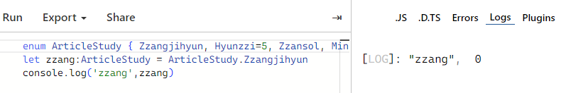
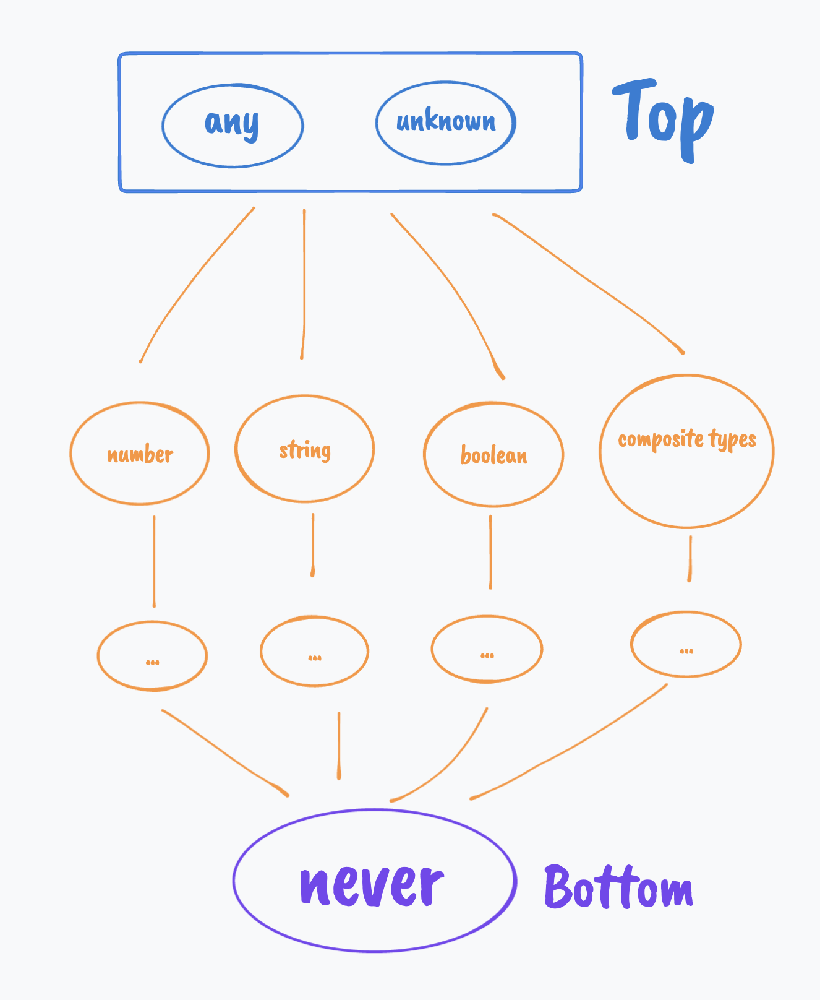
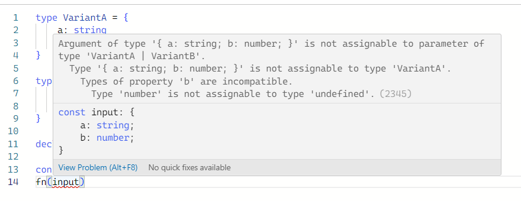

## 타입스크립트 기본 타입

- Boolean
- Number
- String
- Object
- Array
- **Tuple**
- **Enum**
- any
- void
- null
- undefined
- **never**

---

### **Tuple**

- 배열의 **길이가 고정**되고 각 **요소의 타입이 지정**되어있는 **배열 형식**

```tsx
type Coordinates = [number,number]
const point:Coordinates = [10, 20];

// 잘못된 형식으로 할당하면 타입 에러가 발생
// point = ["hello", 20]; // 에러: "hello"은 number 타입과 호환되지 않습니다.
```

- `readonly`

```tsx
type Coordinates = [number,number]
const point:Coordinates = [10,20]

point.push(30)
console.log(point) // [10,20,30] //오류가 발생하지 않는다.
```

```tsx
type Coordinates = readonly [number,number]
point.push(30)
//Property 'push' does not exist on type 'Coordinates'.typescript(2339)
```

- `Named Tuples`

```tsx
type Coordinates = [lng:number, lat:number, hgt:number]
```

### **Enum**

- 특정 값들의 집합
    - 숫자형 이넘
    
    ```tsx
    enum ArticleStudy { Zzangjihyun, Hyunzzi, Zzansol, MinZzoo, Zzangmin, ZzaeHwan }
    let zzang:ArticleStudy = ArticleStudy.Zzangjihyun // 0
    ```
    
    ```tsx
    enum ArticleStudy { Zzangjihyun = 5, Hyunzzi, Zzansol, MinZzoo, Zzangmin, ZzaeHwan }
    let zzang:ArticleStudy = ArticleStudy.Zzansol // 7
    ```
    
    
    
    ```tsx
    enum HttpStatusCode {
        OK = 200,
        BadRequest = 400,
        Unauthorized = 401,
        NotFound = 404,
        InternalServerError = 500
    }
    
    function handleResponse(statusCode: HttpStatusCode) {
        switch (statusCode) {
            case HttpStatusCode.OK:
                console.log("요청이 성공했습니다.");
                break;
            case HttpStatusCode.BadRequest:
                console.log("잘못된 요청입니다.");
                break;
            case HttpStatusCode.Unauthorized:
                console.log("인증되지 않았습니다.");
                break;
            case HttpStatusCode.NotFound:
                console.log("찾을 수 없는 리소스입니다.");
                break;
            case HttpStatusCode.InternalServerError:
                console.log("내부 서버 오류입니다.");
                break;
                
            default:
                console.log("처리되지 않은 상태 코드입니다.");
        }
    }
    
    handleResponse(HttpStatusCode.OK); // 출력: "요청이 성공했습니다."
    handleResponse(500); // 출력: "내부 서버 오류입니다."
    ```
    
    - 문자형 이넘
    
    ```tsx
    enum Weekday {
        Sunday = "Sunday",
        Monday = "Monday",
        Tuesday = "Tuesday",
        Wednesday = "Wednesday",
        Thursday = "Thursday",
        Friday = "Friday",
        Saturday = "Saturday"
    }
    
    function printWeekday(day: Weekday) {
        console.log("Today is " + day);
    }
    
    printWeekday(Weekday.Sunday); // 출력: Today is Sunday
    ```
    
    - 런타임 시점에서 Enum의 특징
        - Enum은 런타임시 실제 객체 형태로 존재한다.
        
        ```tsx
        enum E {
          X,
          Y,
          Z,
        }
        
        function getX(obj: { X: number }) {
          return obj.X;
        }
        const a = getX(E); // 이넘 E의 X는 숫자이기 때문에 정상 동작
        console.log(a); // 0
        ```
        
        - 객체랑 다른점
        1. 일반적으로 숫자나 문자열을 가진다.
        2. 멤버는 정적이며 컴파일 시점에 정의되며 변경할 수 없다.
        3. 데이터를 구조화하고 조작하는데 사용되는 객체와 달리 Enum은 상수 값을 정의한다.
        4. 열거된 값에 대한 타입을 엄격하게 지정한다.

### **never**

- 값의 공집합

    

- void와 다른점?
    - `**void**` : 함수가 어떤 값도 반환하지 않음을 나타낸다. 이는 함수가 명시적으로 return 문을 사용하여 값을 반환하지 않을 때 사용한다.
    
    ```tsx
    function sayHello(): void {
        console.log("Hello!");
        // 아무런 반환도 없음
    }
    ```
    
    - `**never` :** 함수가 어떤 값을 반환하지 않을 뿐만 아니라 **함수의 실행이 끝나지 않음**을 의미한다. 일반적으로 **예외를 던지거나** **무한루프**를 실행하는 함수에서 사용한다.
    
    ```tsx
    function throwError(message: string): never {
        throw new Error(message);
        // 함수가 예외를 던지면 반환되지 않음
    }
    
    function infiniteLoop(): never {
        while (true) {
            // 무한 반복
        }
        // 함수가 끝나지 않음
    }
    ```
    
- `Never`
    - 숫자의 0 처럼 문자에도 **불가능**을 나타내기 위한 타입
        - 값을 포함할 수 없는 빈 타입
        - 실행이 끝날 때 호출자에게 제어를 반환하지 않는 함수의 반환 타입
            - Node의 `process.exit`
        - 거부된 프로미스에서 처리된 값의 타입
            
            ```tsx
            const p = Promise.reject('foo') // const p: Promise<never>
            ```
            
    
    ```tsx
    type Res = never | string // string -> 유니언 타입에서 없어진다.
    type Res = never & string // never -> 교차 타입을 덮어쓴다.
    ```
    
- `Never` 의 쓰임새
    - `switch`, `if-else` ****문의 모든 상황을 보장
    
    ```tsx
    function unknownColor(x: never): never {
        throw new Error("unknown color");
    }
    
    type Color = 'red' | 'green' | 'blue'
    
    function getColorName(c: Color): string {
        switch(c) {
            case 'red':
                return 'is red';
            case 'green':
                return 'is green';
            default:
                return unknownColor(c); // 'string' 타입은 'never' 타입에 할당할 수 없음
        }
    }
    ```
    
    - 부분 타이핑을 허용하지 않는다.
    
    ```tsx
    type VariantA = {
        a: string,
    }
    
    type VariantB = {
        b: number,
    }
    
    declare function fn(arg: VariantA | VariantB): void
    
    const input = {a: 'foo', b: 123 }
    
    fn(input)
    ```
    
    ```tsx
    type VariantA = {
        a: string
        b?: never
    }
    
    type VariantB = {
        b: number
        a?: never
    }
    
    declare function fn(arg: VariantA | VariantB): void
    
    const input = {a: 'foo', b: 123 }
    fn(input)
    ```
    
    

# Ref

[타입스크립트의 Never 타입 완벽 가이드](https://ui.toast.com/posts/ko_20220323)

[typescriptlang.org](https://www.typescriptlang.org/)

[타입스크립트 핸드북](https://joshua1988.github.io/ts/)