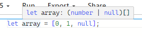
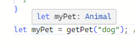
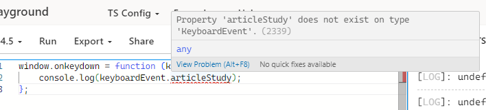

| 추론 | 호환 | 별칭 | 단언 |
| --- | --- | --- | --- |
| 타입스크립트가 코드를 해석해 나가는 동작 | 타입스크립트 코드에서 특정 타입이 다른 타입에 잘 맞는지를 의미 | 특정 타입이나 인터페이스를 참조할 수 있는 타입 변수 | 개발자가 해당 타입에 대해 확신이 있을 때 사용하는 타입 지정 방식 |

# 타입 추론

```tsx
const articleStudy = 'Zzang'
```

- `articleStudy` 라는 변수를 선언할 때 타입을 따로 지정하지 않아도 `string` 으로 간주
- 선언하거나 초기화 할 때 타입이 추론

### 어떻게 추론할까?

- 최적 공통 타입 **(Best Common Type)**
    
    ```tsx
    let array = [0, 1, null]; // (number | null)[]로 추론
    ```
    
       
    
    - 배열 `array`는 `number`와 `null` 요소를 포함하고 타입스크립트는 최적 공통 타입을 찾아 `array`의 타입을 `(number | null)[]`로 추론
    
    ```tsx
    class Animal {
      move() {}
    }
    
    class Dog extends Animal {
      bark() {}
    }
    
    class Cat extends Animal {
      meow() {}
    }
    
    function getPet(pet: string): Animal {
      if (pet === "dog") {
        return new Dog();
      } else if (pet === "cat") {
        return new Cat();
      } else {
        return new Animal();
      }
    }
    
    let myPet = getPet("dog"); // myPet의 타입은 Animal
    ```
    
    
    
    - `getPet` 함수는 입력된 문자열에 따라 `Dog`, `Cat`, 또는 `Animal` 객체를 반환
    - 타입스크립트는 `Dog`, `Cat`, `Animal`의 최적 공통 타입이 `Animal`이라는 것을 추론하여 `getPet` 함수의 반환 타입을 `Animal`로 설정
- 문맥상 타이핑**(Contextual Typing)**
    - 코드의 위치(문맥) 기준으로 타입 결정
        
        ```tsx
        window.onkeydown = function (keyboardEvent) {
          console.log(keyboardEvent.key); //-> ok
          console.log(keyboardEvent.articleStudy); //-> error
        };
        ```
        
         
        
        - 타입스크립트 검사기는 `window.onkeydown` 함수의 타입을 검사해서 `keyboardEvent`로 타입을 추론해 `keyboardEvent`에 `key`속성은 있지만 `articleStudy`속성은 없다고 판단
        
        ```tsx
        const handler = function (keyboardEvent) {
          console.log(keyboardEvent.key);
        };
        ```
        
        - 함수가 문맥상 타입을 유추할 수 없을 때 함수의 매개변수는 암시적으로 `any` 타입
        
        ```tsx
        window.onkeydown = function (keyboardEvent: any) {
        	console.log(keyboardEvent.key); // -> ok
          console.log(keyboardEvent.articleStudy); // undefined
        };
        ```
        
        - 함수의 매개변수에 명시적으로 타입을 주면 컨텍스트 타입을 재정의 할 수 있다.
        - `keyboardEvent` 에는 `articleStudy`라는 프로퍼티가 없으므로 `undefined`

# 타입 호환

- 특정 타입이 다른 타입에 잘 맞는지
    
    ```tsx
    interface Person {
      name: string;
      age: number;
    }
    
    interface Employee {
      name: string;
      age: number;
      position: string;
    }
    
    let person: Person;
    let employee: Employee = { name: "John", age: 30, position: "Developer" };
    
    person = employee; // OK: Employee는 Person의 모든 속성을 가지고 있음
    ```
    
    - `C#`이나 `Java`와 같은 명목적 타입(이름을 기준으로 하는 타입 시스템) 언어는 Employee 타입이 Person 을 상속받지 않았으므로 오류를 발생시킨다.
    - 타입스크립트는 **`구조적 타입 시스템`**을 가지므로 타입의 구조를 기준으로 타입의 호환성을 결정한다.
    
    ### Enum
    
    ```tsx
    enum Status {
        Ready,
        Waiting
    }
    
    enum Color {
        Red,
        Blue,
        Green
    }
    
    let status: Status = Status.Ready;
    
    status = Color.Green;  // Error: Type 'Color.Green' is not assignable to type 'Status'.
    status = 123;
    ```
    
    - `enum` 타입 간의 직접 할당은 허용되지 않는다.
    
    ### Generic
    
    ```tsx
    interface Container<T> {}
    
    let container1: Container<number>;
    let container2: Container<string>;
    
    container1 = container2;  // -> OK
    ```
    
    - `Container` 인터페이스는 어떤 속성도 정의하지 않았으므로, `container1`과 `container2`는 구조적으로 동일하고 서로 호환된다.
    
    ```tsx
    interface Box<T> {
        value: T;
    }
    
    let box1: Box<number> = { value: 42 };
    let box2: Box<string> = { value: "hello" };
    
    box1 = box2;  // Error, because Box<number> is not compatible with Box<string>
    ```
    
    - `Box` 인터페이스는 `value`라는 속성을 가지고 있으며, 이 속성에 제네릭 타입 `<T>`가 할당
    - 따라서 `box1`과 `box2`는 서로 다른 타입으로 간주되고 호환되지 않는다.

# 타입 별칭**(Type Aliases)**

```tsx
// 기본 타입
type StringAlias = string;
let name: StringAlias = "Alice";

// 객체 타입
type User = {
    name: string;
    age: number;
};

let user: User = {
    name: "Alice",
    age: 30
};

// 유니언 타입
type ID = number | string;

let userId: ID;

userId = 123;   // OK
userId = "ABC"; // OK

// 제네릭 타입
type Container<T> = {
    value: T;
};

let numberContainer: Container<number> = { value: 123 };
let stringContainer: Container<string> = { value: "Hello" };
```

### type vs interface

- **확장 가능성**: 인터페이스는 확장(`extends`)이 가능하지만, 타입 별칭은 재정의할 수 없다. 하지만 타입 별칭은 `인터섹션 타입`을 사용하여 유사한 기능을 구현할 수 있다.
- **복잡한 타입 표현**: 타입 별칭은 유니언 타입, 튜플 등 다양한 타입 표현에 유리

```tsx
interface Person {
  name: string;
  age: number;
}

interface Employee extends Person {
  employeeId: number;
}

type ID = number | string; // 인터페이스로는 이런 유니언 타입을 표현하기 어려움
```

# 타입 단언**(Type Assertion)**

- `as` 키워드를 사용한 타입 단언

```tsx
let someValue: any = "this is a string";

// 문자열로 간주하기
let strLength: number = (someValue as string).length;
```

- 각괄호(`< >`)를 사용한 타입 단언
    - JSX 코드에서는 혼란을 줄 수 있기 때문에 주로 TypeScript의 JSX가 아닌 곳에서 사용

```tsx
let someValue: any = "this is a string";

// 문자열로 간주하기
let strLength: number = (<string>someValue).length;
```

### 사용 사례

1. **DOM 요소 캐스팅**
    
    `document.getElementById`로 가져온 요소는 기본적으로 `HTMLElement` 타입을 가지지만, 실제로는 더 구체적인 타입을 가지고 있을 수 있다.
    
    ```tsx
    let inputElement = document.getElementById("myInput") as HTMLInputElement;
    ```
    
2. **JSON 데이터 변환**
    
    서버로부터 받은 JSON 데이터의 타입을 명시적으로 지정할 때 사용될 수 있다.
    
    ```tsx
    let jsonString = '{"name": "Alice", "age": 30}';
    let data: { name: string; age: number } = JSON.parse(jsonString) as { name: string; age: number };
    ```
    

### 주의사항

타입 단언은 컴파일러에게 특정 값의 타입을 강제로 지정하는 것이지만, **실제로 값의 형태를 변경하지 않기 때문에** 잘못된 타입 단언은 타입 호환성 문제를 일으킬 수 있다.

# Ref

[타입스크립트 핸드북](https://joshua1988.github.io/ts/guide/type-inference.html#%ED%83%80%EC%9E%85-%EC%B6%94%EB%A1%A0-type-inference)

[typescriptlang](https://www.typescriptlang.org/)