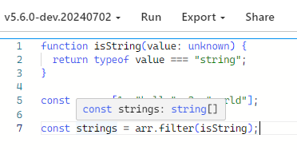

# 타입스크립트 5.5 훑어보기
## 1. **Inferred Type Predicates: 추론된 타입 서술**

```tsx
function isString(value: unknown) {
  return typeof value === "string";
}

const arr = [1, "hello", 3, "world"];

const strings = arr.filter(isString);
```

다양한 타입을 요소로 가지고 있는 배열을 `filter` 메서드를 통해 타입 정제를 해도 원래 배열의 요소 타입을 그대로 유지합니다.


```tsx
const strings = arr.filter(isString) as string[];
```

이를 해결하기 위해 타입단언(Type Assertion)을 사용하거나

```tsx
function isString(value: unknown): value is string {
  return typeof value === "string";
}

const arr = [1, "hello", 3, "world"];

const strings = arr.filter(isString); //const strings: string[]
```

`is` 키워드를 통해 타입 가드(Type Guard) 함수를 수정하거나

```tsx
function isString<T>(value: T): value is Extract<T, string> {
    return typeof value === "string";
}

const strings = arr.filter(isString);  // strings는 string[] 타입
```

제네릭을 사용해 타입 가드를 해야만하는 번거로움이 있었고

```tsx
function isString(value: unknown): value is number{
  return typeof value === "string";
}

const arr = [1, "hello", 3, "world"];

const strings = arr.filter(isString); //const strings: number[]
```

이런 타입 추론의 오류가 발생할 수 있었습니다.



하지만 5.5 버전 부터는 명시적으로 타입을 선언하지 않아도 타입스크립트가 문맥을 읽어 타입을 추론할 수 있습니다.  

## 2. **Control Flow Narrowing for Constant Indexed Accesses : 상수 인덱스 접근에 대한 제어 흐름 좁히기**

객체와 키가 모두 상수일 때, `obj[key]` 형태의 표현식에 대해 타입을 더 정확하게 추론할 수 있게 해줍니다.

```tsx
function foo(obj: Record<string, unknown>, key: string) {
  if (typeof obj[key] === "string") {
    obj[key].toUpperCase();
  }
}
```


## 3. **Regular Expression Syntax Checking: 정규 표현식 구문 검사**

```tsx
let emailRegex = /([a-zA-Z0-9._-]+@[a-zA-Z0-9._-]+\.[a-zA-Z0-9._-]+)***)***/;
// error!
// Unexpected ')'. Did you mean to escape it with backslash?
```


### 역참조(backreference) 문제

```tsx
let myRegex = /@typedef \{import\((.+)\)\.([a-zA-Z_]+)\} \3/u;
//                                                        ~
// error!
// This backreference refers to a group that does not exist.
// There are only 2 capturing groups in this regular expression.
```

이 정규 표현식에는 두 개의 캡처 그룹이 있습니다.

1. `(.+)`: 첫 번째 그룹
2. `([a-zA-Z_]+)`: 두 번째 그룹

정규 표현식 끝에 `\3` 은 세번째 캡처 그룹을 참조하려고 하지만 세번째 그룹은 존재하지 않습니다. 

### 명명된 캡처 그룹(named capturing groups)

```tsx
let myRegex = /@typedef \{import\((?<importPath>.+)\)\.(?<importedEntity>[a-zA-Z_]+)\} \k<namedImport>/;
//                                                                                        ~~~~~~~~~~~
// error!
// There is no capturing group named 'namedImport' in this regular expression.
```

정규 표현식에 정의되지 않은 명명된 그룹을 사용하려 할 때 오류가 발생합니다.

### ECMAScript 버전

```tsx
let myRegex = /@typedef \{import\((?<importPath>.+)\)\.(?<importedEntity>[a-zA-Z_]+)\} \k<importedEntity>/;
//                                  ~~~~~~~~~~~~         ~~~~~~~~~~~~~~~~
// error!
// Named capturing groups are only available when targeting 'ES2018' or later.
```

특정 RegExp 기능이 ECMAScript의 대상 버전보다 최신일 때 오류가 발생합니다. 예를 들어 컴파일러 옵션을 ES5 타겟에서 위와 같이 명명된 캡처 그룹을 사용하면 오류가 발생하게 됩니다.

## 4. The `${configDir}` Template Variable for Configuration Files: **설정 파일의 `${configDir}` 템플릿 변수**

```tsx
{
  "compilerOptions": {
    "baseUrl": "./src",
    "paths": {
      "@app/*": ["./src/*"]
    }
  }
}
```

타입스크립트 5.5 미만에서는 `baseUrl`을 설정하고  `tsconfig.json` 파일이 위치한 디렉터리를 기준으로 상대 경로를 사용하여 모듈의 경로를 지정하는 방식입니다. 따라서 프로젝트 구조가 변경될 경우, `tsconfig.json` 파일 내의 경로를 수동으로 업데이트 했었습니다.

```tsx
{
  "compilerOptions": {
    "typeRoots": [
      "${configDir}/node_modules/@types",
      "${configDir}/custom-types"
    ],
    "outDir": "${configDir}/dist"
  }
}
```

TypeScript 5.5에서는 `${configDir}`라는 템플릿 변수가 도입되어 설정 파일에서 경로를 지정할 때 사용할 수 있습니다.

경로가 항상 현재 설정 파일(`tsconfig.json`)이 있는 디렉토리를 기준으로 해석됩니다. 따라서 공통 설정 파일에서 경로를 지정할 때 `${configDir}`를 사용하면, 이 설정을 상속받는 모든 프로젝트에서 올바르게 경로가 해석되어 설정 파일을 여러 프로젝트에서 쉽게 공유하고 재사용할 수 있게 해줍니다.

## **5. JSDoc `@import` tag**

```tsx
// ./some-module.d.ts
export interface SomeType {
    // ...
}

// ./index.js
import { SomeType } from "./some-module"; // ❌ runtime error!

/**
 * @param {SomeType} myValue
 */
function doSomething(myValue) {
    // ...
}
```

`.js` 파일에서 타입을 지정하기 위해 모듈에서 import 하면 해당 타입이 런타임때 존재하지 않음으로 런타임 에러가 발생합니다. 

```tsx
/**
 * @param {import("./some-module").SomeType} myValue
 */
function doSomething(myValue) {
    // ...
}
```

그래서 런타임 동작에 영향이 없는 `JSDoc` 주석으로 타입을 import 해서 사용해야 했습니다.

```jsx
/**
 * @typedef {import("./some-module").SomeType} SomeType
 */

/**
 * @param {SomeType} myValue
 */
function doSomething(myValue) {
    // ...
}
```

이 타입을 여러곳에서 재사용 하기 위해서 JSDoc에서 타입을 정의할 때 사용하는 `typedef` 키워드로 `import` 를 사용했습니다.

```jsx
/** @import { SomeType } from "some-module" */

/**
 * @param {SomeType} myValue
 */
function doSomething(myValue) {
    // ...
}
```

타입스크립트 5.5 버전 이상부터는 ECMAScript import와 동일한 문법을 사용하는 `@import` 주석 태그를 지원하여 런타임에 영향을 주지 않으면서 타입을 가져오는 과정을 간편하게 처리할 수 있습니다.

## Ref

[타입스크립트 공식문서](https://www.typescriptlang.org/docs/handbook/release-notes/typescript-5-5.html)