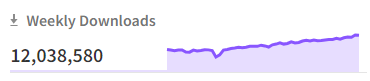
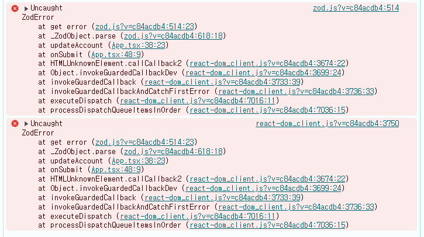
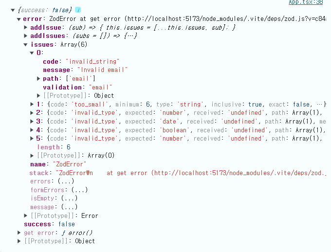
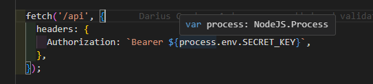
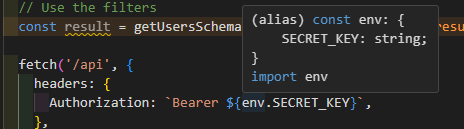

zod에 대해서 알아보기 전에 타입스크립트에 대해서 한번 짚고 넘어가 보겠습니다.

타입스크립트는 코드 작성 단계에서 실시간으로 타입 체킹이 되어 타입 안정성을 높여줍니다.

런타임에는 타입스트립트 컴파일러에 의해서 자바스크립트로 변환되어 타입은 존재하지 않습니다.

```tsx
// .ts
const greet = (name: string): string => {
  return `Hello, ${name}!`;
}

// .js
"use strict";
const greet = (name) => {
    return `Hello, ${name}!`;
};
```

### 타입스크립트의 한계

많은 상황에서 어플리케이션은 사용자의 입력을 받기도하고 외부 api 를 사용하기도 합니다.

이 경우 모두 런타임에 일어나기 때문에 타입스크립트가 오류를 잡아줄 수 없는 한계가 발생합니다.

```jsx
interface Account {
	email: string;
	password: string;
	age: number,
	createdAt: Date,
	marketing: boolean,
	points: number,
}

function updateAccount(account: Account) {
	// account 업데이트 로직
}

processAccount({
  email: "wls@asd", // 이메일 형식에 맞지 않음
	password: "", // 빈 문자열
	age: 10.5, // 소수점 나이
  createdAt: new Date("2024-09-24T11:20:10")
  marketing: true,
  points: 100,
});
```

### 유효성 검증 지옥

```jsx
interface Account {
	email: string;
	password: string;
}

function validateForm(email, password) {
  if (email === "") {
    alert("Email is required.");
    return false;
  }

  if (!email.includes('@')) {
    alert("Email must contain '@'.");
    return false;
  }

  if (!email.includes('.')) {
    alert("Email must contain a '.'.");
    return false;
  }

  const atPosition = email.indexOf('@');
  const dotPosition = email.lastIndexOf('.');

  if (atPosition > dotPosition || atPosition < 1 || dotPosition < atPosition + 2 || dotPosition + 2 >= email.length) {
    alert("Invalid email format.");
    return false;
  }

  if (password === "") {
    alert("Password is required.");
    return false;
  }

  if (password.length < 6) {
    alert("Password must be at least 6 characters long.");
    return false;
  }

  return true;
}
```

- 유효성 검증 로직의 복잡도가 올라가는 것은 물론
- 작성한 유효성 검증 로직이 각 검증 속성 타입과 일치하도록 관리해주어야 합니다.

### 유효성 검증 라이브러리 zod

데이터 구조를 정의하는 **스키마를 생성**하고 해당 스키마에 맞춰서 **데이터가 유효한지 검증**



위클리 다운로드 수가 무려 1200만!

- dependency zero
- 압축시 8kb의 작은 용량
- 최신 브라우저와 Node.js 에서 사용 가능
- 타입스크립트 없이 순수 자바스크립트에서도 실행 가능

```tsx
import { z } from 'zod';

const AccountSchema = z.object({
  email: z.string().email(),
  password: z.string().min(6).max(12),
})

const account = {
	email: 'aaa@aaa',
	password: 'aaa',
}

function updateAccount(account) {
	console.log(AccountSchema.parse(account));
  console.log(AccountSchema.safeParse(account));
}
```



parse()



safeParse()

```tsx
{
	error: ZodError at get error (...)
	success : false
}
```

### 체이닝 검증

```tsx
const AccountSchema = z.object({
  email: z.string().email("이메일 형식 필요").regex(
    /^[a-z0-9]{5,10}$/,
    "영문 소문자 또는 영문+숫자 조합 5~10자리를 입력해주세요."
  ),
})
```

### .transform

- 데이터를 파싱한 후 변형 시킬 수 있습니다.

```tsx
  const birthSchema = z
    .string()
    .refine((date) => !isNaN(Date.parse(date)), {
      message: 'Invalid date format',
    })
    .transform((data) => ({
      birthDate: new Date(data).toISOString(), // ISO 포맷으로 변환
    }));

  const inputData = '1990-01-01';

  console.log(birthSchema.parse(inputData));
  // { "birthDate": "1990-01-01T00:00:00.000Z" }
```

### 편리한 타입 추론

- TypeScript-first schema validation with static type inference
- zod는 스키마를 정의하면 타입스크립트 타입 시스템과 연동되어 타입 정보를 자동으로 추론하여 개발자가 별도로 타입을 선언하지 않고도 zod 스키마를 통해 타입스크립트에서 타입 안정성을 확보할 수 있습니다.

```tsx
const accountSchema = z.object({
  email: z.string().email(),
  password: z.string().min(6).max(12),
  profile: z.object({ // 중첩 스키마
    age: z.number().min(18).int(); // 정수
    bio: z.string().optional(),
  }),
  tags: z.array(z.string()), // 문자열 배열
  publishedAt: z.string().optional(), // 선택적 필드
  status: z.enum(["active", "inactive", "banned"]); // 유니언 타입
})

type Account = z.infer<typeof accountSchema>;

//{ 
//	email:string;
//	password:string;
//	profile: { age: number; bio?: string };
//	tags: string[];
//	publishedAt?: string;
//	status : "active" | "inactive" | "banned";
//}

function processAccount(account: Account){
	//...
}
```

### react-hook-form과 함께 사용하기

- react-hook-form 단독 사용할 때보다
    - 더 다양한 검증 메소드 사용 가능
    - 일관된 검증 로직
    - 타입 안정성
    - 재사용성

```tsx
import { zodResolver } from '@hookform/resolvers/zod';
import { SubmitHandler, useForm } from 'react-hook-form';
import { z } from 'zod';

const schema = z
  .object({
    firstName: z.string().nonempty({ message: 'First name is required' }),
    age: z.string().nonempty({ message: 'Age is required' }),
  })
  .required();

type Person = z.infer<typeof schema>;

export default function App() {
  const {
    register,
    handleSubmit,
    formState: { errors },
  } = useForm<Person>({
    resolver: zodResolver(schema),
  });

  const onSubmit: SubmitHandler<Person> = (data) => {
    console.log(data);
  };

  return (
    <form onSubmit={handleSubmit(onSubmit)}>
      <input {...register('firstName')} />
      <p>{errors.firstName?.message?.toString()}</p>
      <input {...register('age')} />
      <p>{errors.age?.message?.toString()}</p>
      <input type="submit" />
    </form>
  );
}
```

### 환경변수 관리

```tsx
// utils.ts
import { z } from 'zod';

const envSchema = z.object({
  VITE_API_URL: z.string().url(),
});

const env = envSchema.parse(import.meta.env);

export env
```

- 하나의 모듈 내에서 선언한 변수가 아닌 환경 변수를 사용하기 때문에 실제로 사용 가능 한 값인지 보장할 수 없습니다.
- 어플리케이션이 시작되기 전에 필요한 환경 변수들이 올바르게 설정되어있는지 zod를 통해 검증과정을 거칠 수 있습니다.





# Ref

- https://www.daleseo.com/?tag=Zod
- https://www.youtube.com/watch?v=U9PYyMhDc_k&ab_channel=CosdenSolutions